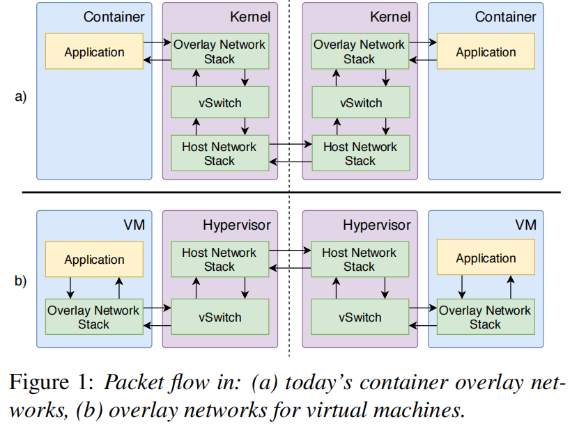

    容器已经成为托管大规模分布式应用程序的实际方法，容器覆盖网络对于为容器提供可移植性至关重要，但它们在吞吐量、延迟和CPU使用率方面造成了巨大的开销。
    参考： https://www.usenix.org/conference/nsdi19/presentation/zhuo

<!--more-->

### 摘要

容器已经成为托管大规模分布式应用程序的实际方法。容器覆盖网络对于为容器提供可移植性至关重要，但它们在吞吐量、延迟和CPU使用率方面造成了巨大的开销。关键问题是依赖于数据包转换来实现网络虚拟化。因此，每个数据包必须在发送方和接收方的主机操作系统内核中同时遍历该网络堆栈两次。我们设计并实现了Slim，这是一个低开销的容器覆盖网络，通过操作（*连接级元数据*）来实现网络虚拟化。我们的解决方案与今天的容器化应用程序保持兼容性。评估结果表明，Slim将内存中key-value存储的吞吐量（throughput）提高了71%，同时减少了42%的延迟（latency）。Slim将内存中key-value存储的CPU使用率降低了56%。Slim还可以将web服务器的CPU使用率降低22%-24%，将数据库服务器降低22%，将流处理框架降低10%。

### 介绍

容器已经迅速成为管理和部署大规模分布式应用程序的实际方法，包括内存中的key-value存储、web服务器、数据库和数据数据处理框架。容器很有吸引力，因为它们又轻又便携。单台物理机器可以轻松托管标准虚拟机十倍以上的容器，从而节省大量成本。

Container overlay networks——为分布式容器应用程序提供可移植性的关键组件——允许一组容器使用自己独立的IP地址和端口号进行通信，无论它们分配在哪里或其他容器放置在同一个物理机器上。overlay network消除了在应用程序开发人员之间协调端口和IP地址的负担，并大大简化了将遗留的企业应用程序向云计算的迁移。今天，容器编排器，如DockerSwarm，需要使用overlay network来托管容器化的应用程序。

a图是今天的容器overlay network，b图是虚拟机的overlay network

然而，容器覆盖网络会带来巨大的开销。我们的基准测试（benchmark）显示，与主机网络连接相比，覆盖网络连接的吞吐量（throughput）降低了23-48%，包级延迟（latency）提高了34-85%，CPU使用率（ CPU utilization）提高了93%。已知的优化技术（例如，数据包转向和对虚拟化的硬件支持）仅部分解决了这些问题。

关键问题是，今天的容器overlay network依赖于操作系统中的多个数据包转换来实现网络虚拟化（图a），这意味着每个数据包必须遍历两次网络堆栈，并且在发送端和接收端都有一个虚拟交换机。以发送一个数据包为例。容器应用程序发送的包首先遍历虚拟网络接口上的覆盖网络堆栈。然后，包穿越一个虚拟交换机进行包转换（例如，添加主机网络头）。最后，数据包遍历主机网络堆栈，并在主机网络接口上发送出去。在接收服务器上，这些图层以相反的顺序重复。

这种设计在很大程度上类似于虚拟机的覆盖网络(图1b)。由于虚拟机有自己的网络堆栈，管理程序必须发送/接收无需网络连接的原始覆盖数据报文，而不需要网络连接的上下文。但是，对于容器，操作系统内核对每个网络连接都有充分的交互。

在本文中，我们问我们是否可以设计和实现一个容器覆盖网络，在那里数据包通过操作系统内核的网络堆栈只有一次。这要求我们从覆盖网络的数据平面上删除数据包转换。我们通过在connection setup时操作连接级元数据、节省CPU周期和减少数据包延迟来实现网络虚拟化。

实现这样一个容器覆盖网络具有挑战性，因为：（1)网络虚拟化必须与今天未修改的容器应用程序兼容；(2)我们需要支持今天容器覆盖网络在数据平面上执行的相同网络策略；(3）我们需要执行与今天容器覆盖网络相同的安全模型。

我们设计并实现了Slim，这是一个低开销的容器覆盖网络，通过操作连接级元数据来提供网络虚拟化。我们的评估表明，与基于包转换的良好容器覆盖网络相比，Slim将内存中key-value存储内存缓存的吞吐量（throughput）提高了71%，延迟（latency）减少了42%。Slim将内存缓存的CPU利用率（CPU utilization）降低了56%。Slim还将Web服务器Nginx的CPU利用率降低了22%-24%；数据库服务器PostgreSQL的降低了22%；而流处理框架ApacheKafka的则降低了10%。但是，Slim增加了connection setup的复杂性，导致connection setup时间延长了106%。Slim的其他限制：Slim支持静态容器迁移，但不支持容器实时迁移；基于连接的网络策略，但不支持基于数据包的网络策略；以及TCP，默认为UDP套接字的标准处理。

本文的贡献如下：

