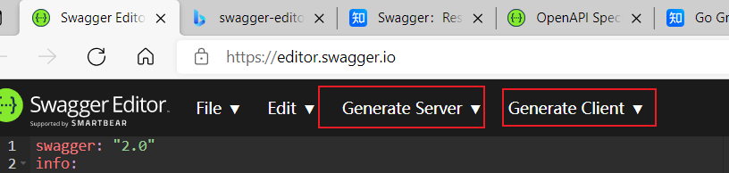

<center>
    1.swagger 2.0学习<br/>2.go-swagger使用实践
</center>


<!--more-->


## Swagger 2.0语法

链接：[OpenAPI Specification - Version 2.0 | Swagger](https://swagger.io/specification/v2/)

说明：swagger3.0语法已经有了，但是go-swagger只支持到2.0


**背景**

swagger是描述restapi的接口描述语言


swagger也提供了swagger-editor网页来描述api

链接：[Swagger Editor](https://editor.swagger.io/)


### spec语法学习

**数据类型**

| Common Name | [`type`](https://swagger.io/specification/v2/#dataTypeType) | [`format`](https://swagger.io/specification/v2/#dataTypeFormat) | Comments                                                     |
| ----------- | ----------------------------------------------------------- | ------------------------------------------------------------ | ------------------------------------------------------------ |
| integer     | `integer`                                                   | `int32`                                                      | signed 32 bits                                               |
| long        | `integer`                                                   | `int64`                                                      | signed 64 bits                                               |
| float       | `number`                                                    | `float`                                                      |                                                              |
| double      | `number`                                                    | `double`                                                     |                                                              |
| string      | ` `                                                         |                                                              |                                                              |
| byte        | `string`                                                    | `byte`                                                       | base64 encoded characters                                    |
| binary      | `string`                                                    | `binary`                                                     | any sequence of octets                                       |
| boolean     | `boolean`                                                   |                                                              |                                                              |
| date        | `string`                                                    | `date`                                                       | As defined by `full-date` - [RFC3339](http://xml2rfc.ietf.org/public/rfc/html/rfc3339.html#anchor14) |
| dateTime    | `string`                                                    | `date-time`                                                  | As defined by `date-time` - [RFC3339](http://xml2rfc.ietf.org/public/rfc/html/rfc3339.html#anchor14) |
| password    | `string`                                                    | `password`                                                   | Used to hint UIs the input needs to be obscured.             |

string的format还可以是`uuid` `email`等 ，参见：

swagger就是通过这些基本类型描述restpai


spec主要由一些spec object组成，例：schema object、parameters defenition object等。

- swagger，指定swagger spec版本，2.0

- info，提供API的元数据

- tags，补充的元数据，在swagger ui中，用于作为api的分组标签

- host，主机，如果没有提供，则使用文档所在的host

- basePath，相对于host的路径

- schemes，API的传输协议，http，https，ws，wss

- consumes，API可以消费的MIME类型列表

- produces，API产生的MIME类型列表

- paths，API的路径，以及每个路径的HTTP方法，一个路径加上一个HTTP方法构成了一个操作。每个操作都有以下内容：

- - tags，操作的标签
  - summary，短摘要
  - description，描述
  - externalDocs，外部文档
  - operationId，标识操作的唯一字符串
  - consumes，MIME类型列表
  - produces，MIME类型列表
  - parameters，参数列表
  - responses，应答状态码和对于的消息的Schema
  - schemes，传输协议
  - deprecated
  - security，安全

- definitions，定义API消费或生产的数据类型，使用json-schema描述，操作的parameter和response部分可以通过引用的方式使用definitions部分定义的schema

- parameters，多个操作共用的参数

- responses，多个操作共用的响应

- securityDefinitions，安全scheme定义

- security，安全声明

- externalDocs，附加的外部文档


**parameter object**

parameter是描述restapi的请求参数，其可能有5中类型

- path - 表示参数在url中以变量的形式替换
- query - 表示参数以?xx=xx的形式拼接在url后
- header - 表示参数在header中
- body - 表示参数在body中
- form - 表示参数在form中， 只有当消息类型为`application/x-www-form-urlencoded`, `multipart/form-data`


例：

```yaml
paths:
  /pet:
    post:
      tags:
      - "pet"
      summary: "Add a new pet to the store"
      description: ""
      operationId: "addPet"
      parameters:
      - in: "body"
        name: "body"
        description: "Pet object that needs to be added to the store"
        required: true
        schema:
          $ref: "#/definitions/Pet"
      responses:
        "405":
          description: "Invalid input"
      security:
      - petstore_auth:
        - "write:pets"
        - "read:pets"
```


## go-swagger实践

https://goswagger.io/

#### go-swagger功能

1.通过yaml/json描述文档生成client/server代码

2.通过对源代码添加注释利用工具生成swagger描述文档


### 通过yaml生成client/server代码

(1)在swagger editor页面通过功能生成代码




(2)可通过工具命令生成

```shell
go get -u github.com/go-swagger/go-swagger/cmd/swagger

swagger generate server -f server.yaml
```


### 使用自动生成代码构建自己的应用

go-swagger只是放便的生成了相关的代码，使用时还要自己写。以go为例


##### client代码：

```go
import (
  "os"
  "log"

  "github.com/myproject/client/operations"
  "github.com/go-openapi/strfmt"
  "github.com/go-openapi/spec"

  apiclient "github.com/myproject/client"
  httptransport "github.com/go-openapi/runtime/client"
)

func main() {

    transport := httptransport.New("1.2.3.4:8080", "", nil)
 
  client := apiclient.New(transport, strfmt.Default)

    resp, err := client.addPet(models.addPetParam{})
  if err != nil {
    log.Fatal(err)
  }
  fmt.Printf("%#v\n", resp.Payload)
}
```

上面就是通过自动生成的代码创建了一个自己的apiclient，然后通过这个client向服务端发起http请求，并拿到返回值。


##### server代码：

```go
todos.AddOneHandlerFunc(func(params todos.AddOneParams, principal interface{}) middleware.Responder {
  created, err := database.Save(params.Body)
  if err != nil {
    return AddOneDefault{models.Error{500, err.Error()}}
  }
  return AddOneCreated{created}
})
```


server端已经架好了每个api实现的handler，但是默认是没有实现的，只会返回501

我们只需要重写handler，然后就可以实现自己的server。


**源码解析**

参考：[[Server Usage · GitBook (goswagger.io)](https://goswagger.io/generate/server.html](https://goswagger.io/generate/server.html)


当请求到达时，服务器会处理

- 路由
- 认证
- 输入验证
- content negotiation
- 参数和body绑定


用一段代码来描述就是以下部分

```go
import (
  "net/http"

  "github.com/go-openapi/errors"
  "github.com/go-openapi/runtime/middleware"
  "github.com/gorilla/context"
)

func newCompleteMiddleware(ctx *middleware.Context) http.Handler {
  return http.HandlerFunc(func(rw http.ResponseWriter, r *http.Request) {
    defer context.Clear(r)

    // use context to lookup routes
    // 查询路由
    if matched, ok := ctx.RouteInfo(r); ok {

      if len(matched.Authenticators) > 0 {
        // 认证处理
        if _, err := ctx.Authorize(r, matched); err != nil {
          ctx.Respond(rw, r, matched.Produces, matched, err)
          return
        }
      }

      // 参数校验
      bound, validation := ctx.BindAndValidate(r, matched)
      if validation != nil {
        ctx.Respond(rw, r, matched.Produces, matched, validation)
        return
      }

      // handler 处理
      result, err := matched.Handler.Handle(bound)
      if err != nil {
        ctx.Respond(rw, r, matched.Produces, matched, err)
        return
      }

      ctx.Respond(rw, r, matched.Produces, matched, result)
      return
    }

    // Not found, check if it exists in the other methods first
    // 路由没找到，尝试其他方法
    if others := ctx.AllowedMethods(r); len(others) > 0 {
      ctx.Respond(rw, r, ctx.spec.RequiredProduces(), nil, errors.MethodNotAllowed(r.Method, others))
      return
    }
    ctx.Respond(rw, r, ctx.spec.RequiredProduces(), nil, errors.NotFound("path %s was not found", r.URL.Path))
  })
}
```


- 在处理请求之前，你需要把handler的具体实现配置到configure_xxx.go文件中

默认这些handler的实现是未实现的

```go
package main

import (
    "github.com/go-openapi/errors"
    "github.com/go-openapi/runtime"
    "github.com/go-openapi/runtime/middleware"

    "github.com/go-openapi/examples/todo-list/restapi/operations"
    "github.com/go-openapi/examples/todo-list/restapi/operations/todos"
)

// This file is safe to edit. Once it exists it will not be overwritten

func configureAPI(api *operations.ToDoListAPI) http.Handler {
    // configure the api here
    api.JSONConsumer = runtime.JSONConsumer()

    api.JSONProducer = runtime.JSONProducer()

    // 未实现
    api.KeyAuth = func(token string) (interface{}, error) {
        return nil, errors.NotImplemented("api key auth (key) x-petstore-token from header has not yet been implemented")
    }

    // 未实现
    api.AddOneHandler = todos.AddOneHandlerFunc(func(params todos.AddOneParams, principal interface{}) middleware.Responder {
        return middleware.NotImplemented("operation addOne has not yet been implemented")
    })

    return setupGlobalMiddleware(api.Serve(setupMiddlewares))
}
```

从上面的代码看到，除了配置handler实现部分，api这个对象还有配置JSONConsumer成员和JSONProducer成员。这两个成员能将别的format类型的文字解析到object中。可以在sepc文档中配置使用的consumer和producer类型也可以在生成的时候使用命令行`--default-consumes --default-produces application/xml`


consumer和produce的是两个接口类型，其定义如下

```go
// ConsumerFunc represents a function that can be used as a consumer
type ConsumerFunc func(io.Reader, interface{}) error

// Consume consumes the reader into the data parameter
// 将数据转换为data
func (fn ConsumerFunc) Consume(reader io.Reader, data interface{}) error {
    return fn(reader, data)
}

// Consumer implementations know how to bind the values on the provided interface to
// data provided by the request body
type Consumer interface {
    // Consume performs the binding of request values
    Consume(io.Reader, interface{}) error
}

// ProducerFunc represents a function that can be used as a producer
type ProducerFunc func(io.Writer, interface{}) error

// Produce produces the response for the provided data
func (f ProducerFunc) Produce(writer io.Writer, data interface{}) error {
    return f(writer, data)
}

// Producer implementations know how to turn the provided interface into a valid
// HTTP response
type Producer interface {
    // Produce writes to the http response
    Produce(io.Writer, interface{}) error
}
```


当你为api配置一个consumer或producer的时候需要确保它支持对应的content type。go-swagger已经提供了consumer和producer支持已知的部分midea type，可以在configure api中注册一个新的consumer/producer 或者重写一个已经存在的consumer/producer，例

```go
func configureAPI(api *operations.ToDoListAPI) http.Handler {
    // other setup code here...

    api.RegisterConsumer("application/pkcs10", myCustomConsumer)
    api.RegisterProducer("application/pkcs10", myCustomProducer)
}
```


- 下一个就是认证部分

默认启用认证是基于token验证的，如果没有token，则请求将被返回401，以下是验证token的handler声明

```go
// UserPassAuthentication authentication function
type UserPassAuthentication func(string, string) (interface{}, error)

// TokenAuthentication authentication function
type TokenAuthentication func(string) (interface{}, error)

// AuthenticatorFunc turns a function into an authenticator
type AuthenticatorFunc func(interface{}) (bool, interface{}, error)

// Authenticate authenticates the request with the provided data
func (f AuthenticatorFunc) Authenticate(params interface{}) (bool, interface{}, error) {
    return f(params)
}

// Authenticator represents an authentication strategy
// implementations of Authenticator know how to authenticate the
// request data and translate that into a valid principal object or an error
type Authenticator interface {
    Authenticate(interface{}) (bool, interface{}, error)
}
```


- 现在可以自定义自己的api实现，我们看下`AddOneHandler`的细节部分


```go
// AddOneHandlerFunc turns a function with the right signature into a add one handler
type AddOneHandlerFunc func(AddOneParams, interface{}) middleware.Responder

// Handle executing the request and returning a response
func (fn AddOneHandlerFunc) Handle(params AddOneParams, principal interface{}) middleware.Responder {
    return fn(params, principal)
}

// AddOneHandler interface for that can handle valid add one params
type AddOneHandler interface {
    Handle(AddOneParams, interface{}) middleware.Responder
}
```


首先定义了一个函数类型，这个函数实现了一个接口的Handle方法

AddOneHandler是一个接口类型，有一个Handle方法。

因为有认证的原因，实现该接口的函数有两个参数，一个是请求的parameter，另一个是安全的principal。

实现功能的handler需要自己配置，go-swagger只保证parameter和principal正确的经过了路由绑定和参数校验。所以使用者可以放心的处理接收到的参数。


对于addOneHandler，它的实现继承了一个`http.Handler`和`middleware.Context`

```go
// NewAddOne creates a new http.Handler for the add one operation
func NewAddOne(ctx *middleware.Context, handler AddOneHandler) *AddOne {
    return &AddOne{Context: ctx, Handler: handler}
}

/*AddOne swagger:route POST / todos addOne

AddOne add one API

*/
type AddOne struct {
    Context *middleware.Context
    Params  AddOneParams
    Handler AddOneHandler
}

func (o *AddOne) ServeHTTP(rw http.ResponseWriter, r *http.Request) {
    route, _ := o.Context.RouteInfo(r)

    uprinc, err := o.Context.Authorize(r, route)
    if err != nil {
        o.Context.Respond(rw, r, route.Produces, route, err)
        return
    }
    var principal interface{}
    if uprinc != nil {
        principal = uprinc
    }

    if err := o.Context.BindValidRequest(r, route, &o.Params); err != nil { // bind params
        o.Context.Respond(rw, r, route.Produces, route, err)
        return
    }

    res := o.Handler.Handle(o.Params, principal) // actually handle the request

    o.Context.Respond(rw, r, route.Produces, route, res)

}
```


它的实现包括认证、路由绑定、用户实现的代码和生成response。对于认证，此请求将放到api上下文对象的处理程序中，当请求经过认证后，它会被绑定，此操作最终需要一个对象，即实现。

```go
// RequestBinder is an interface for types to implement
// when they want to be able to bind from a request
type RequestBinder interface {
    BindRequest(*http.Request, *MatchedRoute) error
}

// AddOneParams contains all the bound params for the add one operation
// typically these are obtained from a http.Request
//
// swagger:parameters addOne
type AddOneParams struct {
    /*
      In: body
    */
    Body *models.Item
}

// BindRequest both binds and validates a request, it assumes that complex things implement a Validatable(strfmt.Registry) error interface
// for simple values it will use straight method calls
func (o *AddOneParams) BindRequest(r *http.Request, route *middleware.MatchedRoute) error {
    var res []error

    var body models.Item
    if err := route.Consumer.Consume(r.Body, &body); err != nil {
        res = append(res, errors.NewParseError("body", "body", "", err))
    } else {
        if err := body.Validate(route.Formats); err != nil {
            res = append(res, err)
        }

        if len(res) == 0 {
            o.Body = &body
        }
    }

    if len(res) > 0 {
        return errors.CompositeValidationError(res...)
    }
    return nil
}
```


AddOneParams有一个绑定request的方法，这个方法实现了RequestBinder的BindRequest接口，


对于响应，go-swagger定义了responder接口，谁实现了这些接口，就可以写response返回。

```go
// Responder is an interface for types to implement
// when they want to be considered for writing HTTP responses
type Responder interface {
    WriteResponse(http.ResponseWriter, runtime.Producer)
}

/*AddOneCreated Created

swagger:response addOneCreated
*/
type AddOneCreated struct {

    // In: body
    Payload *models.Item `json:"body,omitempty"`
}

// WriteResponse to the client
func (o *AddOneCreated) WriteResponse(rw http.ResponseWriter, producer runtime.Producer) {

    rw.WriteHeader(201)
    if o.Payload != nil {
        if err := producer.Produce(rw, o.Payload); err != nil {
            panic(err) // let the recovery middleware deal with this
        }
    }
}

/*AddOneDefault error

swagger:response addOneDefault
*/
type AddOneDefault struct {

    // In: body
    Payload *models.Error `json:"body,omitempty"`
}

// WriteResponse to the client
func (o *AddOneDefault) WriteResponse(rw http.ResponseWriter, producer runtime.Producer) {

    rw.WriteHeader(500)
    if o.Payload != nil {
        if err := producer.Produce(rw, o.Payload); err != nil {
            panic(err) // let the recovery middleware deal with this
        }
    }
}
```


因此，要实现`AddOneHandler`,你可以这样

```go
todos.AddOneHandlerFunc(func(params todos.AddOneParams, principal interface{}) middleware.Responder {
  created, err := database.Save(params.Body)
  if err != nil {
    return AddOneDefault{models.Error{500, err.Error()}}
  }
  return AddOneCreated{created}
})
```


// TODO

整理一个流程图：

