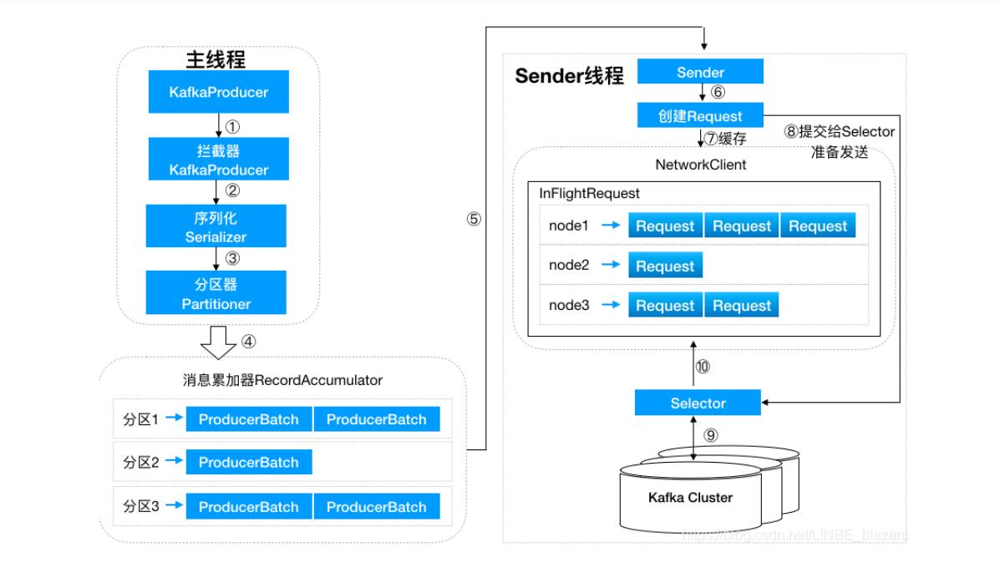

kafka角色：

- 消息系统：Kafka和传统的消息系统都具备系统解耦性、冗余存储、流量削峰、缓冲、异步通信、扩展性、可恢复性等功能。Kafka还提供大多数消息系统难以实现的消息顺序性保障和回溯消费功能
- 存储系统：Kafka把消息持久化到磁盘，相比于其他基于内存存储的系统而言，有效地降低了数据丢失的风险。也正是得益于Kafka的消息持久化功能和多副本机制，我们可以吧Kafka作为长期对的数据存储系统来使用。
- 流式处理平台：Kafka不仅为每个流行的流式处理框架提供了可靠的数据来源，还提供了一个完整的流式处理类库

# 初识Kafka

## 基本概念

- Producer：生产者，也就是发送消息的一方，生产者负责创建消息，然后将其投递到Kafka中
- Consumer：消费者，也就是接收消息的一方。消费者连接到Kafka上并接收消息，进而进行相应的业务逻辑处理
- Broker：服务代理结点：对于Kafka而言，Broker可以简单的看做一个独立的Kafka服务结点或Kafka服务实例。
- 主题：Kafka中的消息以主题为单位进行归类，生产者负责将消息发送到特定的主题，而消费者负责订阅主题并进行消费
- 分区：一个分区只属于单个主题，同一主题下不同分区包含的消息是不同的，分区在存储层面可以看做一个可追加的日志文件，消息在被追加到分区日志文件的时候都会分配一个特定的偏移量。如果一个主题只对应一个文件，那么这个文件所在的机器IO将会成功这个主题的性能瓶颈，而通过增加分区的数量可以实现水平扩展。
- Offset偏移量：offset是消息在分区中的唯一标识，Kafka通过它来保证消息在分区内的顺序性，不过offset并不跨越分区，Kafka保证分区有序而不是主题有序
- 副本因子：副本个数；通过增加副本数量可以提升容灾能力，leader副本负责处理读写请求，follower副本负责与leader副本消息同步。当leader副本出现故障时，从follower副本中重新选举leader副本对外提供服务。kafka通过多副本机制实现了故障的自动转移。
- AR：分区内所有副本(assigned replicas)
- ISR:所有与leader副本保持一定程度同步的副本(in-sync replicas)
- OSR:与leader副本同步滞后过多的副本 (out-of-sync replicas)
- HW:高水位：标识一个特定的offset，消费者只能拉取到这个offset之前的消息 (high watermark)
- LEO: 标识当前日志文件中下一条待写入消息的offset (Log End Offset)

新产生的消息会先写入leader副本，然后follower副本会发送拉取请求来拉取落后的消息来进行消息同步。
当同步完成后，消费者才可以消费这条消息(为了防止leader副本宕机造成消息丢失)
kafka的复制机制既不是完全的同步复制，也不是单纯的落后复制。同步复制要求所有能工作的follower副本都复制完，这条消息才会被确认为已成功提交，这种方式极大的影响了性能。而在异步复制方式下，follower副本异步的从leader副本中复制数据，数据只要被leader副本写入就认为已经成功提交。(在这种情况下，如果follower副本都还没有复制完而落后与leader副本，突然leader副本宕机，则会造成数据丢失)。


## 生产与消费

```
./bin/kafka-topics.sh --zookeeper localhost:2181/kafka --create --topic topic-demo --replication-factor 3 --partitions 4


./bin/kafka-topics.sh --zookeeper localhost:2181/kafka --describe --topic topic-demo 

./bin/kafka-console-consumer.sh --bootstrap-server localhost:9092 --topic topic-demo

./bin/kafka-console-producer.sh --broker-list localhost:9092 --topic topic-demo
```

`zookeeper.connect`  zk集群服务地址
`listeners` broker监听客户端连接的地址列表
`broker.id` broker的唯一标识
`log.dir` kafka日志文件存放的目录，默认/tmp/kafka-logs
`log.dirs` 优先级高
`message.max.bytes` broker所能接收消息的最大值

# 生产者

## 生产者客户端开发

步骤：

1. 配置生产者客户端参数及创建相应的生产者实例
2. 构建待发送的消息
3. 发送消息
4. 关闭生产者实例

```java
public static Properties initConfig() {
    Properties props = new Properties();
    props.put(ProducerConfig.BOOTSTRAP_SERVERS_CONFIG, brokerList);
}

public static void main(String[] args) {
    Properties props = initConfig();
    KafkaProducer<String, String> producer = new KafkaProducer<>(props);
    ProducerRecord<String, String> record = new ProducerRecord<>(topic, "Hello, Kafka");

    try {
        producer.send(record);
    } catch (Exception e) {
        e.printStackTrace();
    }
}
```

消息对象ProducerRecord 并不是单纯意义上的消息，包含了多个属性

```java
public class ProducerRecord<K, V> {
    private final String topic;
    private final Integer paitition;
    private final Headers headers;
    private final K key;
    private final V value;
    private final Long timestamp;
}
```

`bootstrap.servers` 指定生产者客户端连接kafka所需的broker地址清单
`key.serializer` 序列化成字节数组
`value.serializer`

- KafkaProducer是线程安全的，可以在多个线程中共享单个KafkaProducer实例，也可以将KafkaProducer实例进行池化来供其他线程调用

- 构建ProducerRecord 对象，topic属性和value属性是必填，其他选填

### 发送消息

发送消息的三种模式
发后即忘：send方法不指定Callback，性能最高，可靠性最差

同步：send方法利用返回的Future对象，阻塞等待Kafka响应

异步：send方法，指定Callback回调函数

可重试异常和不可重试异常

对于可重试异常，如果配置了retries参数，那么只要在规定的重试次数内自行恢复，就不会抛出异常

对于不可重试的异常，则直接抛出异常，不进行重试

对于同一个分区而言，如果消息record1先与record2发送，那么KafkaProducer就可以保证对应的callback1先与callback2调用

### 序列化器

生产者需要使用序列化器将对象转换成字节数组，才能通过网络发送给Kafka，在对端消费者使用反序列化器把Kafka转换成相应的对象

序列化器实现了org.apache.kafka.common.serialization.Serializer接口

一般要实现

```java
public void configure(Map<String, ?>configs,boolean isKey)
public byte[]serialize(String topic, T data)
public void close()
```

可以使用Avro、JSON、Thrift、Protobuf、Protostuff等通用工具来实现

### 分区器

```java
public int partition(String topic, Object key,byte[] keyBytes, Object Value, byte[] valueBytes,Cluster cluster);
public void close();
```

- 如果ProducerRecord中指定了partition字段，则不需要分区器，partition字段就是要发往的分区号

- 如果没有指定分区器，就需要分区器根据key字段来计算partition值。Kafka的默认分区器实现了 xx.Partitioner接口，接口中有partition方法和close方法
  默认分区器会判断key不为null，则对key进行哈希，最终根据得到的哈希值来计算分区号，拥有相同key的消息会被写入同一个分区。如果key为null，那么消息会以轮询的方式发往主题内的某一个可用分区
  
  自定义分区器也只需实现上述接口即可

### 生产者拦截器

消息发送前做一些过滤，修改等等

需要自定义实现ProducerInterceptor接口

KafkaProducer会在消息被应答之前或消息发送失败时调用拦截器的onAcknowledgement方法，优于用户设定的Callback之前执行。

```java
public ProducerRecord<K, V> onSend(ProducerRecord<K, V> record);
public void onAcknowledgement(RecordMetadata metadata, Exception exception);
public void close();
```

可以指定一个拦截链，KafkaProducer按照interceptor.classes参数配置的拦截器的顺序来一一执行（各个拦截器按逗号隔开）

## 原理分析

### 整体架构



生产者客户端有两个线程，主线程和Sender线程。主线程生产消息经过拦截器、序列化器、分区器缓存到消息累加器中，Sender线程从RecordAccumulator中获取消息并发往Kafka中

`buffer.memory`： 指定RecordAccumulator缓存的大小

`max.block.ms`：指定生产者发送太快，缓冲区满了，阻塞的最大时间

RecordAccumulator缓存的大小由buffer.memory配置；如果生产者发送消息的速度超过发送到服务器的速度，则会导致生产者空间不足，这时候producer的send方法调用要么被阻塞，要么抛出异常，这个取决于参数max.block.ms的设置。

RecordAccumulator为每个分区维护一个双端队列，队列内容为ProducerBatch，ProducerBatch为一个至多个ProducerRecord；可以使得生产者创建的消息组成一个批次，更为紧凑。

消息在网络上传输是以字节传输的，发送之前要创建内存区域。kafka生产者中，通过java.io.ByteBuffer实现消息内存创建和释放。RecordAccumulator内部还有一个BufferPool，实现ByteBuffer的复用。BufferPool只针对特定大小的ByteBuffer进行管理，这个大小由`batch.size`指定。

`batch.size` 指定ByteBuffer的大小

ProducerBatch的大小和batch.size相关。当一条ProducerRecord消息到了RecordAccumulator，会先寻找与分区对应的双端队列(如果没有则新建)，再从尾部获取一个ProducerBatch，查看该ProducerBatch中是否还可以写入这个ProducerRecord，可以写入则写入，不可以写入则新建ProducerBatch。

新建ProducerBatch时，判断这条ProducerRecord消息大小是否超过batch.size没超过，则就以batch.size的大小新建ProducerBatch，这段内存还可以由ByterBuffer复用；如果超过了则以评估的大小新建ProducerBatch，这段内存不会被复用。

Sender从RecordAccumulator获取缓存的消息后，进一步将原本的`<分区，Deque<ProducerBatch>>` 转换为 `<Node, List<ProducerBatch>>`Node表示kafka集群的结点。生产者向具体的broker结点发消息。

Sender还会进一步封装为`<Node, Request>`才发往各个Node，请求在从Sender发往kafka之前会保存到InFlightRequests中，保存形式为`Map<NodeId, Deque<Request>>`主要作用是缓存了已经发出去，但是还没有收到响应的请求。

这里限制了每个连接最多缓存的请求数，由`max.in.flight.requests.per.connecttion`指定，默认为5

### 元数据的更新

Node中未确认的请求越多，则认为负载越大。

选择leastLoadedNode发送请求可以使它能尽快发出，避免网络拥塞等异常的影响。
leastLoadedNode，即所有Node中负载最小的。

leastLoadedNode还可以用于**元数据请求**、**消费者组播协议的交互**

如果发送一个很简单的消息

```
ProducerRecord<string, string> record = new ProducerRecord<>(topic, "hello");
```

这里只有主题和消息
KafkaProducer需要将消息追加到指定主题的某个分区的对应leader副本之前。需要知道分区数目，计算出目标分区，需要知道目标分区的leader副本所在broker结点的地址、端口信息。这些需要的信息都属于**元数据信息**。

bootstrap.servers参数只需要配置部分broker结点的地址，客户端可以发现其他broker结点的地址，这一过程属于元数据更新。

客户端没有元数据信息时，会先选出leastLoadedNode，然后向这个Node发送MetadataRequest请求来获取具体的元数据信息。这个更新操作由Sender线程发起，在创建完MetadataRequest后同样会存入inFlightRequests。元数据虽然由Sender线程负责更新，但是主线程也需要读取这些信息，这里数据同步通过synchronized 和 final关键字保障。

### 重要的生产者参数

`acks`：指定分区中必须要有多少副本收到这条消息，之后生产者才会认为这条消息是成功写入的。

默认acks = 1

acks = 0 生产者发送消息之后不需要等待任何服务端响应

`max.request.size` 客户端能发送消息的最大值

retries 和 retry.backoff.ms

`retries`是生产者重试的次数

`retry.backoff.ms` 两次重试之间的间隔，默认100ms

`compression.type` 默认值为none，指定消息压缩

`connections.max.idle.ms` 指定在多久之后关闭闲置的连接

`linger.ms` 指定生产者发送ProducerBatch之前等待更多ProducerRecord加入的时间

`receive.buffer.bytes` 设置Socket接收消息缓冲区大小  默认32kb

`send.buffer.bytes` Socket发送消息缓冲区大小

`request.timeout.ms` 配置Producer等待请求响应的最长时间，默认30000ms

# 消费者

## 消费者与消费者组

每个消费者都有一个对应的消费者组。当消息发布到主题后，只会被投递给订阅它的每个消费组中的一个消费者。

每个消费组消费全部分区的消息。

消费者与消费组这种模型又可以让整体的消费能力具备横向伸缩性，我们可以增加消费者的个数来提高整体的消费能力。对于分区数固定的情况，一直增加消费者，到消费者个数超过分区数，就会有消费者分配不到分区。

消息投递模式：
点对点模式：基于队列，消息生产者发送消息到队列，消费者从消息队列中接收消息。

发布订阅模式：定义了如何想一个内容节点发布和订阅消息，这个内容节点叫做主题，主题可以认为是消息传递的中介，消息发布者将消息发布到某个主题，而消息订阅者从主题中订阅消息。主题使得消息的订阅者和发布者互相保持独立，不需要进行接触即可保证消息的传递，发布订阅模式在消息的一对多广播时采用。

kafka同时支持两种消息投递模式。

- 如果所有的消费者隶属于一个消费者组，那么所有的消息都会被均衡的投递给每一个消费者，即每条消息只会被一个消费者处理，这相当于点对点。
- 如果所有的消费者隶属于不同的消费组，那么所有的消息都会被广播给所有的消费者，即每条消息都会被所有的消费者处理，相当于发布订阅模式应用。

消费组是一个逻辑概念，每个消费者在消费前需要指定所属消费组的名称，由`group.id`指定。消费者是实际的应用实例，可以是一个线程，也可以是一个进程，同一个消费组的消费者既可以部署在同一机器上，也可以部署在不同机器上。

## 客户端开发

1. 配置消费者客户端参数以及创建相应的消费者实例
2. 订阅主题
3. 拉取消息并消费
4. 提交消费位移
5. 关闭消费者实例

```java
public class KafkaConsumerAnalysis {
    public static final String brokerList = "";
    ...

    public static Properties initConfig() {
        Properties props = new Properties();
        props.put("bootstrap.servers", brokerList);
    }

    public static void main() {
        Properties props = initConfig();
        KafkaConsumer<String, String> consumer = new KafkaConsmer<>(props);
        consumer.subscribe(Arrays.asList(topic));

        try {
            while(isRunning.get()) {
                ConsumerRecrds<String, String> records = consumer.poll(Duration.ofMillis(1000));

            } catch (Exception e) {
                log.error("");
            } finally {
                consumer.close();
            }
        }
    }
}
```

### 必要的参数配置

`bootstrap.servers` 集群broker地址

`group.id` 消费者组名称

`key.deserializer`  反序列化

`value.deserializer`

参数众多，直接使用org.apache.kafka.clients.consumer.ConsumerConfig

每个参数在ConsumerConfig类中都有对应的名称

如ConsumerConfig.GROUP_ID_CONFIG

### 订阅主题与分区

一个消费者可以订阅一个或多个主题，subscribe的几个重载方法

```java
public void subscribe(Collection<String> topics, ConsumerRebalanceListener listener);
public void subscribe(Collection<String> topics);
public void subscribe(Pattern pattern, ConsumerRebalanceListener listener);
public void subscribe(Pattern pattern);
```

1.集合方式，`subscribe(Collection<String> topics)`订阅了什么就消费什么主题的消息。

2.正则表达式，如果采用正则表达式的方式，在之后如果有人创建了新的主题，且主题名字与正则表达式匹配，那么这个消费者就可以消费到新添加的主题中的消息。
例 `cosumer.subscribe(Pattern.compile("topic.*"))`
参数类型`ConsumerRebalanceListener`，设置的是再均衡监听器

3.消费者还能直接订阅某些主题的特定分区

```java
public void assign(Collection<TopicPartition> partitions);
```

例：`public List<PartitionInfo> partitionsFor(String topic)`

TopicPartition类表示分区

```java
public final class TopicPartition implements Serializable {
    private final int partition; //分区
    private final String topic; //主题
    ...
}
```

如果事先不知道主题中有多少分区，则使用partitionsFor()方法查询指定主题的元数据信息

```java
public List<PartitionInfo> partitionsFor(String topic)

public class PartitionInfo {
    private final String topic;
    private final int paitition;
    private final Node leader;
    private final Node[] replicas;  //AR
    private final Node[] inSyncReplicas; //ISR
    private final Node offlineReplicas;  //OSR
}
```

取消订阅

```java
consumer.unsubscribe()
```

如果没有订阅任何主题或分区，那么继续执行消费程序会报异常IllegalStateException

订阅状态:
集合订阅  `AUTO_TOPICS`
正则表达式订阅 `AUTO_PATTERN`
指定分区订阅 `USER_ASSIGNED`

通过subscribe()方法订阅主题具有消费者自动再均衡的功能，在多个消费者的情况下，可以根据分区分配策略来自动分配各个消费者与分区的关系。

### 反序列化

反序列化器也实现了Deserializer接口，这个接口有以下三个方法：

```java
public void configure(Map<String, ?> configs, boolean isKey)
public T deserialize(String topic, byte[] data)
public void close()
```

### 消息消费

消费模式：推模式和拉模式
推模式：服务端主动将消息推送给消费者
拉模式：消费者主动向服务端发起请求来拉取消息

poll方法定义:

```java
public ConsumerRecords<K, V> poll(final Duration timeout) 
```

timeout参数用来控制poll方法的阻塞时间，在消费者的缓冲区里没有可用数据时会发生阻塞。

ConsumerRecord定义

```java
public class ConsumerRecord<K, V> {
  private final String topic;
  private final int partition; 
  private final long offset; // 消息所属分区的偏移量
  private final timestamp; 
  private final TimestampType timestampType;
  private final int serializedKeySize;
  private final int serializedValueSize;
  private final Headers headers; // 消息的头部内容
  private final K key;
  private final V value;
  private volatile Long checksum; // CRC32的校验值
  // ...
}
```

它提供了iterator方法来循环遍历消息集内部的消息

`public Iterator<ConsumerRecord<K, V>> iterator()`

它提供了获取消息集中指定分区消息的方法
`public List<ConsumerRecord<K, V>> records(TopicPartition partition)`

它还提供了按照主题维度来进行消费的方法
`public Iterable<ConsumerRecord<K, V>> records(String topic)`

### 位移提交

对于kafka中的分区而言，它的每条消息都有唯一的offset，用来表示消息在分区中对应的位置。
笔者对于消息在分区中的位置，这个offset称为‘偏移量’
对于消费者消费到的位移，这个offset称为‘消费位移’

在每次调用poll方法时，它返回的是还没有被消费过的消息集，要做到这一点就要记录上一次消费时的消费位移。
消费位移要持久化保存，这个消费位移存储在kafka内部主题 `_consumer_offsets`中。消费者在消费完消息后需要执行消费位移的提交。

当前消费到的位移x，即lastConsumedOffset；已经提交过的消费位移，即commited offset
需要提交的位移 x + 1，表示下条需要拉去的消息的位置，即position
position = commited offset = lastConsumedOffset + 1

```java
public long position(TopicPartition partition)
public OffsetAndMetadata committed(TopicPartition partition)
```

位移提交的时机需要把握，否则很容易引入消费混乱现象
例：x 上一次提交的消费位移，[x, x+8]本次poll到的消息
重复消费：
如果是消费完所有拉取到的消息之后才执行提交，那么当消费到中间x+5消费者发生异常重启，则会重复从x开始拉取消费

 消息丢失：
如果拉取到消息之后就进行了位移提交x+8，那么当消费到中间x+5消费者发生异常重启，则直接从x+8开始消费，发生了消息丢失

在kafka中默认的消费位移提交为自动提交，由参数`enable.auto.commit`配置；这个默认提交是定期提交，由参数`auto.commit.interval.ms`配置，自动位移提交的动作是在poll方法的逻辑里完成的。

自动提交消费位移也可能造成消费混乱现象：
重复消费：假设刚刚提交完消费位移，然后拉取一批消息进行消费，在下一次自动提交消费位移之前，消费者重启了，那么又得从上一次位移提交的地方重新开始消费。

消息丢失；假设拉取线程A不断拉取存入本地缓存，消费线程B从缓存中读取，当已经提交的消费位移大于消费线程B消费到的消息，且发生重启时，就会发生消息丢失。

手动提交方式：
同步提交：
`public void commitSync`
`public void commitSync(final Map<TopicOartition, OffsetAndMetadata> offsets)`

异步提交：
`public void commitAsync`
`public void commitAsync(OffsetCommitCallback callback)`
`public void commitAsync(final Map<TopicPartition, OffsetAndMetadata> offsets, OffsetCommitCallback callback)`

commitSync方法会根据poll方法拉取的最新位移来进行提交，只有没有发生不可恢复的错误，它就会阻塞消费者线程直至位移提交完成。

带参数的commitSync方法提供了offsets参数，用来提交指定分区的位移。

异步提交的方式在执行的时候消费者线程不会被阻塞，可能在提交消费位移的结果还未返回之前就开始了新一次的拉去操作。它提供的异步方法中支持指定回调函数，它会在位移提交完成后回调OffsetCommitCallback中的onComplete()方法。

异步提交的时候同样会发生失败，如果消费位移提交了x失败， 下一次提交了x+y成功了，而这里前一步的提交x重试成功，那么消费位移又变成了x，这里消费者重启就会发生重复消费。
要避免这个问题可以在位移提交失败需要重试的时候检查提交位移和前一个位移的大小，当发现小于前一个提交的位移大小，则说明有更大的位移已经提交了，可以不用本次重试。

### 控制或关闭消费

pause和resume来分别实现暂停某些分区在拉取操作时返回数据给客户端和恢复某些分区向客户端返回数据的操作。

```java
public void pause(Collection<TopicPartition> partitions)
public void resume(Collection<TopicPartition> partitions)
```

还可以检查被暂停的分区集合
`public Set<TopicPartition> paused()`

kafka consumer提供了close方法来实现关闭

```java
public void close()
public void close(Duration timeout)
public void close(long timeout, TimeUnit timeUnit)
```

第一种方法没有timeout参数，并不意味着会无限制的等待，它内部设定了最长等待时间30s

### 指定位移消费

当一个新的消费组建立的时候，它根本没有可以查找的消费位移。或者消费组内的一个消费者订阅了一个新的主题，它也没有可以查找的消费位移。当_consumer_offsets主题中有关这个消费组的位移信息过期而被删除后，它没有可以查找的消费位移。

`auto.offset.reset`参数配置当消费者查不到所记录的消费位移时，就会根据该配置来决定从何处开始消费
可配置的值：
`latest` ：从分区末尾开始消费消息
`earliest` ：从起始处开始消费消息
`none` ： 不从末尾也不从开始处开始消费，报NoOffsetForPartitionException异常

seek方法提供了从特定位移处开始拉去消息的功能

```java
public void seek(TopicPartition partition, long offset)
```

seek方法只能重置消费者分配到的分区的消费位置，而分区的分配是在poll方法的调用过程中实现的，也就是说，在执行seek方法之前需要先执行一次poll方法。

```java
KafkaConsumer <String String> consumer= new KafkaConsumer<> (props); 
cosumer.subscribe(Arrays asList(topic));
consumer.poll(Duratio ofMillis(10000) ; 
Set<TopicPartition> assignment = consumer.assignment(); 
for (Top cPartition tp : assignment) { 
consumer.seek(tp , 10); 
while (true) { 
ConsumerRecords<String , String> records = consumer.poll(DurationofMllis(1000)); 
//consume the record .
}
```

如果我们将代码清单 中第①行 poll （）方法的参数设置为 ，即这 行替换为
`consumer poll(Duration.ofMillis(0)) ;`

此之后， 会发现 seek（） 方法并未有任何作用。因为当 poll （）方法中 参数为0时，此方法立刻返回，那么 poll （） 方法内部进行分区分配的逻辑就会来不及实施。

如果对未分配到的分区执行 seek（） 方法 那么会报出IllegalStateException 的异常。类似在调用 subscrib （） 方法之后直接调用 seek（） 方法

```java
consumer.subscribe(Arrays.asList(topic)) ; 
consumer.seek(new TopicPartition(topic, 0), 10 );
```

会报出如下的异常
java.lang.I llegalStateException: No current assignment for partition topic- demo - 0

seek的几个方法定义

```java
public Map<Top cPartition Long> endOffsets( Collection<TopicPartition> partitions) 
public Map<TopicPartition , Long> endOffsets( Collection<Top cPartit on> part tions
Duration timeout)

public Map<TopicPartition , Long> beginningOff sets (Collection<TopicPartition> partitions) 
public Map<TopicPart tion Long> beginningOffsets(Collection<TopicPartition> partitions, 
Duration timeout)

public void seekToBeginning(Collection<TopicPartition> partitions) 
public void seekToEnd Collection<TopicPartition> partitions)

public Map<TopicPartition , OffsetAndTimestamp> offsetsForTimes(Map<TopicPartition, Long> timestampsToSearch) 
public Map<TopicPartition OffsetAndTimestamp> offsetsForTimes(Map<TopicPartition, Long> t imestampsToSearch,Duration timeout )
```

### 再均衡

再均衡是指分区的所属权从一个消费者转移到另一消费者的行为。在再均衡发生期间，消费组内的消费者是无法读取消息的。 就是说，在再均衡发生期间的这一小段时内，消费组会变得不可用 。

比如消费者消费完某个分区中的一部分消息时还没有来得及提交消费位移就发生了再均衡操作 之后这个分区又被分配给了消费组 的另一个消费者，原来被消费完的那部分消息又被重新消费一遍，也就是发生了重复消费。

再均衡监听器

```java
void onPartitionsRevoked(Collection<TopicPartition> partitions)
void onPartitionsAssigned(Collection<TopicPartition> partitions)
```

```java
Map<TopicPartition, OffsetAndMetadata> currentOffsets =new HashMap<>() ; 
consumer.subscribe(Arrays.asList(topic) , new ConsumerRebalanceListener () { 
@Override 
public void onPartitionsRevoked(Collection<TopicPartition> part tions) { 
consumer.commitSync(currentOffsets) ; 
currentOffsets.clear(); 
@Override
public void onPartitionsAssigned(Collection<TopicPartition partitions) { 
//do nothing . 
}) .,
```

### 消费者拦截器

消费者拦截器需要自定义实现 org.apache.kafka.clients.consumer.Consumerlnterceptor 接口。

```java
public ConsumerRecords<K, V> onConsume(ConsumerRecords<K , V> records);
public void onCommit(Map<TopicPartition, OffsetAndMetadata> offsets);
public void close();
```

Kafkaconsumer 会在 poll （）方法返回之前调用拦截器的 Consume（） 方法来对消息进行相应
的定制 操作，KafkaConsumer 会在提交完消费位移之后调用拦截器的 onCommit（） 方法

在消费者中也有拦截链的概念，和生产者的拦截链一样， 也是按照工interceptor classes参数配置的拦截器的顺序来一一执行的（配置的时候，各个拦截器之间使用逗号隔开）。同样也要提防“副作用”的发生 如果在拦截链中某个拦截器执行失败，那么下一个拦截器会接着从上一个执行成功的拦截器继续执行。

### 多线程实现

KatkaProducer 是线程安全的，然而 KafkaConsumer 却是非线程安全 KafkaConsumer定义了 acquire （） 方法，用来检测当前是否只有 个线程在操作，若有其他线程正在操作则会抛出 ConcurrentModifcationException 异常

```java
private final AtomicLong currentThread = new Atom cLong(NO CURRENT THREAD ); //Kaf aConsumer 中的成员变量

private void acquire() { 
long threadid = Thread.currentThread().getid();
if (threadid != currentThread.get() && !currentThread.compareAndSet(NO_CURRENT THREAD, threadid) ) 
throw new ConcurrentModificationException 
("KafkaConsumer is not safe for multi- threaded access ") ; 
refcount.incrementAndGet();
}
```

acquire（）方法和 release （）方法成对出现，表示相应的加锁和解锁操作。

```java
private void release() 
if (refcount.decrementAndGet () == 0) {
    currentThread.set(NO CURRENT THREAD);
}
```

多线程的目的就是为了提高整体的消费能力。多线程的实现方式有多种，第一种也是最常见的方式 线程封闭，即为每个线程实例化一个 KafkaConsumer 对象。


一个消费线程可消费一个或多个分区中的消息，所有的消费线程都隶属于同一个消费组。这种实现方式的并发度受限于分区的实际个数，当消费线程的个数大于分区数时 就有部分消费线程一直处于空闲的状态。

多个消费线程同时消费同一个分区 ，这个通过 assign（）、 seek （）等方法实现，这样可以打破原有的消费线程的个数不能超过分区数的限制，进一步提高了消费的能力 。不过这种实现方式对于位移提交和顺序控制的处理就会变得非常复杂，

```java
public static void main(String[] args) { 
    Properties props = itConfig (); 
    int consumerThreadNum = 4 ; 
    for(int i=O;i<consumerThreadNum;i++) { 
    new KafkaConsumerThread(props,topic).start();
    }
}

public static class KafkaConsumerThread extends Thread{
    private KafkaConsumer<String , String> kafkaConsumer;
    public KafkaConsumerThread(Properties props, String topic) { 
    this.kafkaConsumer =new KafkaConsumer<>(props); 
    this.kafkaConsumer.subscribe(Arrays asList(topic));
}

    @Override 
    public void run() {
    try { 
        while (true) { 
        ConsumerRecords<String, String> records = 
        kafkaConsumer.poll (Duration.ofMill (1 00)) ; 
        for (ConsumerRecord<String, Stri g> record : records) { 
        // 处理消息模块 ① 
        }
    }
    } catch (Exception e) { 
        e.printStackTrace(); 
    } finally { 
        kafkaConsumer.close();
    }
    }
```

上面这种多线程的实现方式和开启多个消费进程的方式没有本质上的区别， 优点是每个线程可以按顺序消费各个分区中的消息。缺点也很明显，每个消费线程都要维护一个独立的TCP 连接 如果分区数和 consumerThreadNum 的值都很大，那么会造成不 的系统开销。

这里的处理速度取决于处理消息模块，。一般 言， poll（）拉取消息的速度是相当快的 ，而整体消费的瓶颈是在处理消息这一块， 通过－定的方式来改进这一部分，那么就能带动整体消费性能提升。


```java
    @Override 
    public void run() {
    try { 
        while (true) { 
        ConsumerRecords<String, String> records = 
        kafkaConsumer.poll(Duration.ofMill (1 00)) ; 
        if (!records.isEmpty () ) { 
            executorService.submit(new RecordsHandler(records));  // 调用各个hander处理消息
        }
    }
    } catch (Exception e) { 
        e.printStackTrace(); 
    } finally { 
        kafkaConsumer.close();
    }
    }

    public static class RecordsHandler extends Thread{ 
    public final ConsumerRecords<String, String> records;

    public RecordsHandl er (ConsumerRecords<String, String> records) ( 
        this.records =records;
    }

    @Override 
    public void run() {
        // 处理records
    }
    }
```

RecordHandler 类是用来处理消息的，而 KafraConsumerThread 类对应的是一个消费线程，里面通过线程池的方式来调用 RecordHandler 处理一批批的消息。

引入一个共享
变量 offsets 来参与提交


每一个处理消息的 RecordHandler 类在处理完消息之后都将对应的消费位移保存到共享变量offsets 中， KafraConsumerThread 在每一次 poll （）方法之后都读取 offsets 中的内容并对其进行位移提交。

```java
for (TopicPartition tp : records .partitions()) { 
    List<ConsumerRecord<String , String> tpRecords = records . records(tp); 
    // 处 tpRec ords
    long lastConsumedOffset = tpRecords . get (tpRecords. size() - 1) . offset() ; 
    synchronized (offsets) { 
        if offsets.co ta 工口 sKey (tp)) { 
            offsets.put(tp, new OffsetAndMetadata(lastConsumedOffset + l)) ; 
        } else { 
            long position = offsets . get(tp) .offset() ; 
            if (position < lastConsumedOffset + 1) { 
            offsets.put(tp, new OffsetAndMetadata(lastConsumedOffset + l))
            }
        }
    }
}
```

```java
synchronized (offsets) { 
if (!offsets. isEmpty () ) { 
    kafkaConsumer.commitSync(offsets); 
    offsets.clear();
    }
}
```

假设一个处理线程 RecordHand erl 正在处理 offset 99消息，而另一个处理线程 RecordHand er2 己经处理完了 offset 100 99 的消息并进行了位移提交，此时如果 RecordHandler 发生异常，则之后的消费只能从 200 开始而无法再次消费 99的消息，从而造成了消息丢失的现象。这里虽然针对位移覆盖做了一定的处理，但还没有解决异常情况下的位移覆盖问题。

通过消费者拉取分批次的消息，然后提交给多线程进行处理，而这里的滑动窗口式的实现方式是将拉取到的消息暂存起来， 多个消费线程可以拉取暂存的消息，这个用于暂存消息的缓存大小即为滑动窗口的大小， 总体上而言没有太多的变化 不同的是对于消费位移的把控。


startOffset标注的是当前滑动 口的起始位置 endOffset 注的是末尾位置。每当 startOffset 指向的方格中的消息被消 费完成，就可以提交这部分的位移，与此同时，窗 口向 前滑动一格， 除原来startOffset 所指方格中对应的消息 并且拉取新的消息进入窗口。

滑动窗口的大小固定，所对应的用来暂 消息的缓存大小也就固定了，这部分内存开销可控。方格大小和滑动窗口的大小同决定了消费线程的并发数。

如果 个方格内的消 息无法被标记为消费完成，那么就会造成 startOffset 悬停。为了使窗口能够继续向前滑动 那么就需要设定 个闹值，当 startOffset 悬停一定的时间后就对这部分消息进行本地重试消费，如果重试失败就转入重试队列，如果还不奏效就转入死信队列。

### 重要的消费者参数

`fetch.min.bytes`：Consumer 在一次拉取请求（调用 poll （） 方法）中能从 Kafka 中拉取的最小
数据量，默认值为 1B。

`fetch .max.bytes`：配置 Consumer 在一次拉取请求中从 Kafka中拉取的最大数据 ，默认值为 52428800 ，也就是 50MB

`fetch.max.wait.ms`：于指定 Kafka 的等待时间，默认值为 500ms

`max.partition.fetch.bytes`：配置从每个分区里返回给 Consumer的最大数据 ，默认值为 1048576 (B)

`max.poll.records`：配置 Consumer 次拉取请求中拉取的最大消息数，默认值为 500 （条）

`connections.max.idle.ms`：指定在多久之后关闭限制的连接，默认值是 540000 (ms ），即 分钟。

`exclude.internal.topics`：Kafka 中有两个内部的主题：_consumer_offsets 和 _transaction_state。 exclude.internal.topics用来指定 Kafka 中的内部主题是否可以向消费者公开，默认值为 true 。

`receive.buffer.bytes`：这个参数用来设置 Socket 接收消息缓冲区的大小，默认值为 65536 (B)

`send.buffer.bytes`：设置 Socket 发送消息缓冲区的大小，默认13 1072 (B)

`request.timeout.ms`：来配置 Consumer 等待请求响应的最长时间，默认值为 30000ms

`metadata.max.age.ms`：用来配置元数据的过期时间，默认值为 300000 ms

`reconnect.backoff.ms`：配置尝试重新连接指定主机之前的等待时间，默认值为50ms

`retry.backo ms`：配置尝试重新发送失败的请求到指定的主题分区之前的等待（退避〉时间，

`isolation.level`：配置消费者的事务隔离级别。有效值为“read uncommitted ，，和
“ read committed ＂


