分区的划分不仅为 Kafka 提供了可伸缩性、水平扩展的功能，还通过多副本机制来为 Kafka 提供数据冗余以提高数据可靠性。

# 主题的管理

主题的管理包括创建主题、 查看主题信息、修改主题和删除主题等操作。

## 创建主题

如果 broker 端配置参数 auto.create.topics.enable 设置 true （默认值就是 true) , 那么当生产者向一个尚未创建的主题发送消息时，会自动创建一个分区数为 num.partitions（默认值为1 ）、副本因子为 default.replication.factor （默认值为1 ）的主题。

例：

```
bin/kafka-top cs .sh - zookeeper localhost: 2181/kafka 
--create --topic top create --partitions 4 --replication-factor 2
```

在执行完脚本之后， Kafka 会在 log.dir log.dirs 参数所配置的目录下创建相应的主题分区，默认情况下这个目录为／tmp/kafka-logs／
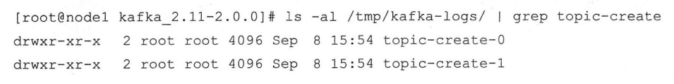

topic-create-0 topic-create-1对应了主题的两个分区，其余两个分区被创建到了别的节点
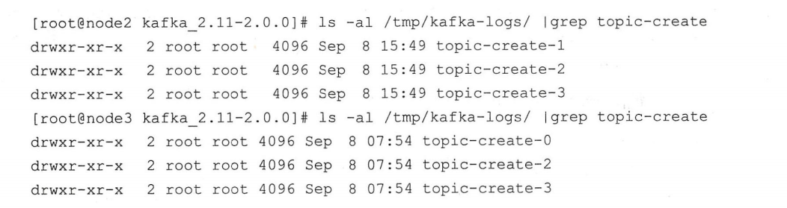

主题、分区、副本和 Log （日志）的关系如下
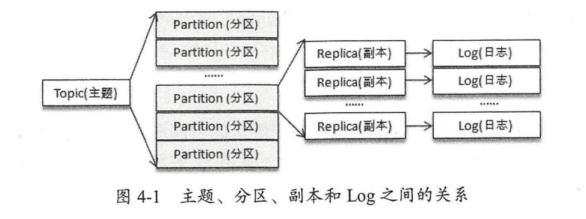

我们不仅可以通过日志文件的根目录来查看集群中各个 broker 的分区副本的分配情况，还可以通过 ZooKeeper 客户端来获取。
当创建一个主题时会在 zooKeeper 的／ brokers/topics/ 目录下创建一个同名的实节点，该节点记录了该主题的分区副本分配方案。
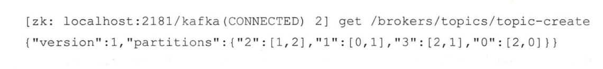

示例数据中的 "2"：[1, 2] 表示分区2 分配了2个副本，分别在 brokerld 1和 brokerId 2节点中。

kafka topics脚本中还提供了 replica-assignment 参数来手动指定分区副本的分配方案。
replica assignment 参数的用法归纳如下：
`-- replica-assignment <String : broker_id_ for_part1_replica1: broker_id for 
partl_replica2 , broker_id _for_part2_replica1: broker_ id_ for _part2_replica2 , ... >`
这种方式根据分区号的数值大小按照从小到大的顺序进行排列 分区与分区 逗号 “，”
隔开，分区内多个副本用冒号“：”隔开

创建主题时不能存在同名的主题，如果指定参数`if-not-exists`则在冲突时不做处理。
内部主题一般以双下划线开头'__'

## 分区副本的分配

分区分配是指为集群制定创建主题时的分区副本分配方案，即在哪个 broker 中创建哪些分区的副本。

在创建主题时，如果使用了 replica assignment 参数，那么就按照指定的方案来进分区副本的创建；如果没有使用 replica-assignment 参数，那么就需要按照内部的逻辑来计算分配方案了

使用 kafka-topics.sh 脚本创建主题时的内部分配逻辑按照机架信息划分成两种策略 朱指定机架信息和指定机架信息 如果集群中所有的 brok 节点都没有配置broker.rack 参数，或者使用 disable-rack aware 参数来 建主题，那么采用的就是未指定机架信息的分配策略，否则采用的就是指定机架信息的分配策略。

```java
private def assignRepl casToBrokersRackUnaware(
  nPartit ons: Int , ／／分区数
  replicat on Factor: Int , ／／副本 因子
  brokerList : “ q[Int] , ／／；集群中 broker 列表
  fixedStartindex: Int , ／／起始索 引，即 一个副本分自己的位置，默认值为
  startPartitionid: Int): ／／起始分 编号，默认值为
  Map[Int, Seq[Int]] = { 
    val ret = mutable.Map[Int, Seg[Int]] () ／／保存分自己结果的集合
    val brokerArray = brokerList.toArray //brokerid 的列表
    ／／如果起始索 fixedStartindex 小于0 ，则根据 broker 列表长度随机生成一个，以此来保证是
    ／／；有效的 broker Id 
    val startIndex = if (fixedStartindex >= 0) fixedStartindex 
      else rand.nextint(brokerArray.length) 
    ／／确保起始分区号不小于0
    var currentPartitionId = math.max(O , startPartitionid)
    ／／指定了副本的间隔，目的是为了更均匀地将副本分配到不同的 broker
    var nextReplicaShift = if xedStartindex >= 0) fixedStartindex
      else rand.nextint(brokerArray.length) 
    ／／轮询所有分区， 将每个分区的副本分配到不同的 broker
    for (_ <- 0 until nPartitions) ( 
      if (currentPartitionid > 0 && (currentPartitonId % brokerArray. length == 0) ) 
      nextReplicaShift += 1 
      val firstReplicaindex = (currentPartitionid + startindex ）% brokerArray.length
      val replicaBuffer = mutable . ArrayBuffer(brokerArray(firstReplicaindex)) 
      ／／保存该分区所有副本分自己的 br oker集合
      for (j <- 0 until replicatFactor - 1) 
        replicaBuffer += brokerArray ( 
        replicaIndex(firstReplicaIndex ，nextReplicaShift
        j, brokerArray.length)) ／／ 为其余的副本分配 broker
        ／／保存该分区所有副本的分配信息
        ret.put(currentPartitionid, replicaBuffer) 
        ／／继续为 下一个分区分配副本
        currentPartitionid += 1
      }
    ret
    }
```

## 查看主题

kafka-topics. 脚本有4种指令类型： create list describe alter
其中list describe 指令可用来方便地查看主题信息

增加 topics-with-overrides 参数可以找 所有 含覆盖配置 主题 它只会列出包含了与集群不一样配置的主题

under-replicated-partitions 和 unavai able-partitions 参数可以找出有问题的分区。

## 修改主题

当一个主题被创建之后 依然允许对其做一定的修改，比如修改分区个数、修改配置。这是由alert指令提供的

增加主题的分区数目后，当主题中的消息包含 key 时（即 key 不为 null 根据 key计算分区的行为就会受到影响。

## 配置管理

kafka-configs 脚本是专门用来对配置进行操作的，这里的操作是指在运行状态下修改原有的配置，如此可以达到动态变更的目的。

kafka configs.sh 脚本不仅可以支持操作主题相关的配置，还支持操作broker 、用户和客户端这三个类型 配置。

## 主题端参数

与主题相关的所有配置参数在 broker 层面都有对应参数， 
比如主题端参数 cleanup.policy 对应 broker 层面的 log.cleanup policy

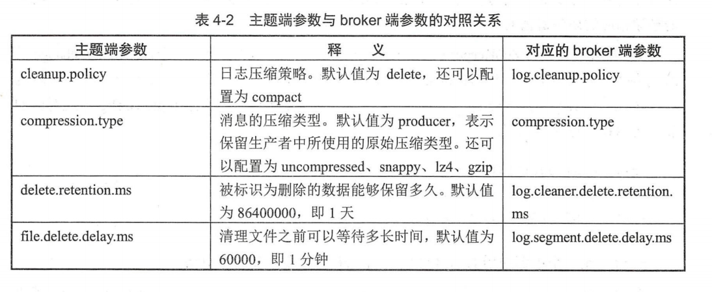

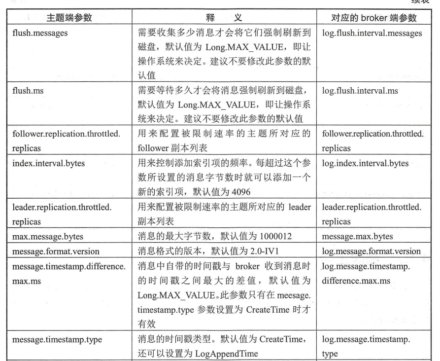

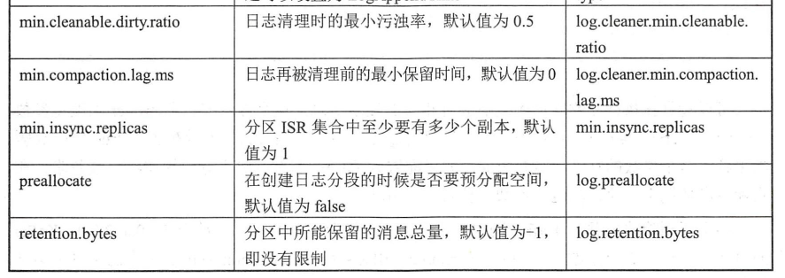

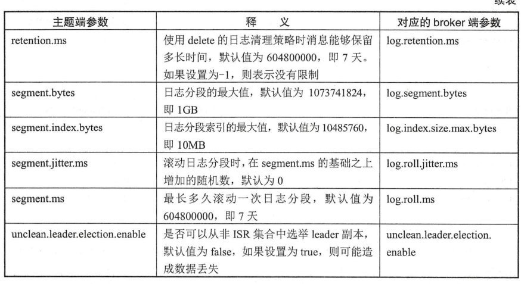

## 删除主题

kafka-topics.sh 脚本中的 delete 令就可以用来删除主题

使用 kafka_topics.sh 脚本删除主题的行为本质上只是在 ZooKeeper 中的 /admin/delete_topics 路径下 建一个与待删除主题同名的节点，以 标记该主题为待删除的状态。与创建主题相同的是，真正删除主题的动作也是由 Kafka 的控制器负责完成的。

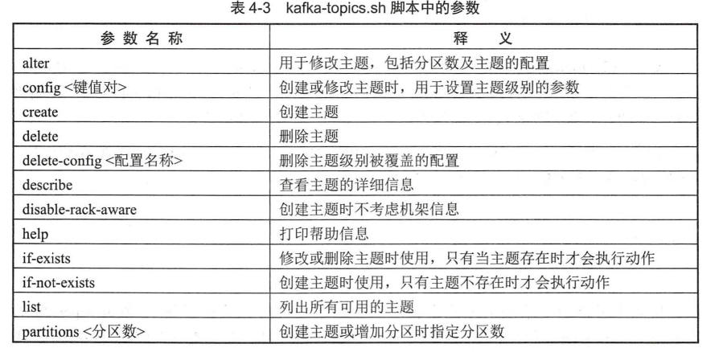

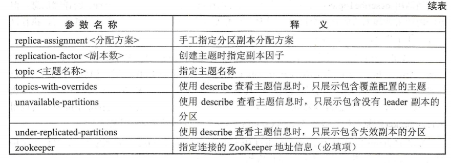

# 初识 KafkaAdminClient

## 基本使用

和脚本类似，可以使用Topicommand类创建主题等。

- 创建主题 CreateTopicsResult createTopics(Collection<NewTopic> newTopics)
- 删除主题 DeleteTopicsResult deleteTopics(Collection<String> topics)
- 列出所有可用的主题： ListTopicsResult listTopics()
- 查看主题的信息： DescribeTopicsResult describeTopics(Collection<String> topicNames)
- 查询配置信息 escribeConfigsResult describeConfigs(Collection<ConfigResource> resources)
- 修改配置信息： AlterConfigsResult alterConfigs(Map<ConfigResource, Config> configs)
- 增加分区 CreatePartitionsResult createPartitions(Map<String, NewPartitions> new Partitions)

## 主题合法性验证

Kafka broker 端有－个这样的参数 create.topic.policy.class.name，默认值为null
它提供了一个入口用来验证主题创建的合法性。使用方式很简单，只需要自定义实现org.apache.kafka.server.policy.CreateTopicPolicy 接口

例：
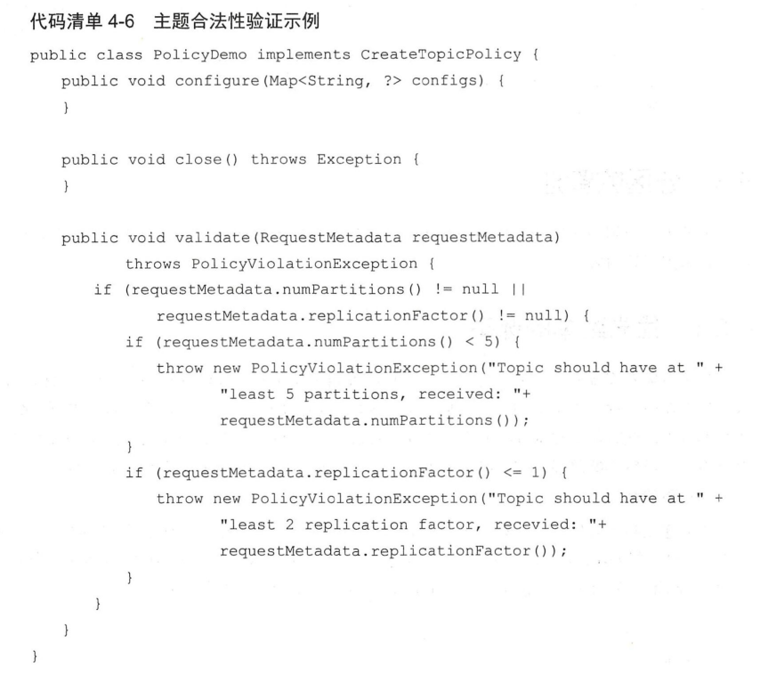

# 分区的管理

## 优先副本的选举

分区使用多副本机制来提升可靠性，但只有 leader 副本对外提供读写服务，而 follower本只负责在内部进行消息的同步。

优先副本选举是指通过一定的方法促使副本选举为 leader ，以此来促进集群负载均衡 行为 可以称为“分区平衡”

Kafka 中可以提供分区自动平衡的功能，与此对应的 broker 端参数是 auto.leader.rebalance.enable ，此参数的默认值为 true。Kafka 的控制器会启动一个定时任务，默认5分钟执行一次，这个定时任务会轮询所有的 broker节点，计算每个 broker 节点的分区不平衡率是否超过默认值10%

kafka-perferred-replica election.sh 脚本提供了对分区 leader 副本进行重新平衡的功能。

## 分区重分配

当集群中的一个节点突然若机下线时，如果节点上的分区是单副本的，那么这些分区就变得不可用了，在节点恢复前，相应的数据也就处于丢失状态；如果节点上的分区是多副本的，那么位于这个节点上的 leader 副本的角色会转交到集群的其他 follower 副本 。

当集群中新增 roker 节点时，只有新创建的主题分区才有可能被分配到这个节点上，而之前的主题分区并不会自动分配到新加入的节点中，因为在它们被创建时还没有这个新节点，这样新节点的负载和原先节点的负载之间严重不均衡。

Kafka提供了 kafka-reassin-partitions.sh 脚本来执行分区重分配的工作，它可以在集群扩容、broker节点失效的场景下对分区进行迁移。

## 复制限流

分区重分配本质在于数据复制，先增加新的副本，然后进行数据同步，最后删除旧的副本来达到最终的目的。

副本间的复制限流有两种实现方式： kafka-config.sh 脚本和 kafka-reassign-partitions.sh脚本

- kafka-config.sh脚本主要 以动态配置的方式来达到限流的目的，在 broker 级别有两个与复制限流相关的配置参数 follower.replication.throttled.rate 和 leader.replication.throttled.rate ，前者用于设置 follower 副本复制的速度，后者用于设置 leader 副本传输的速度，它们的单位都是B/s 。

- kafka reassign-partitions.sh 脚本本身也提供了限流的功能，只需一个 throttle 参数即可，

## 修改副本因子

修改副本因子的功能也是通过重分配所使用的 kafka-reassign-partition.sh 脚本实现的

# 如何选择合适的分区数

## 性能测试工具

Kafka 本身提供的用于生产者性能测试 kafka-producer-perf-test.sh 和用于消费者性能测试的kafka-consumer-perf-test.sh

## 分区数越多吞吐量就越高吗

对生产者而言，每一个分区的数据写入是完全可以并行
对消费者而言， Kafka 只允许单个分区中的消息被一个消费者线程消费， 一个消费组的消费并行度完全依赖于所消费的分区数

消息中间件的性能 般是指吞吐量（广义来说还包括延迟）。抛开硬件资源的影响，消息
写入的吞吐量还会受到消息大小、消息压缩方式、消息发送方式（同步 异步）、消息确认类型
acks、副本因子等参数影 响， 消息消费 吞吐量还会受到应用逻辑、处理速度的影响

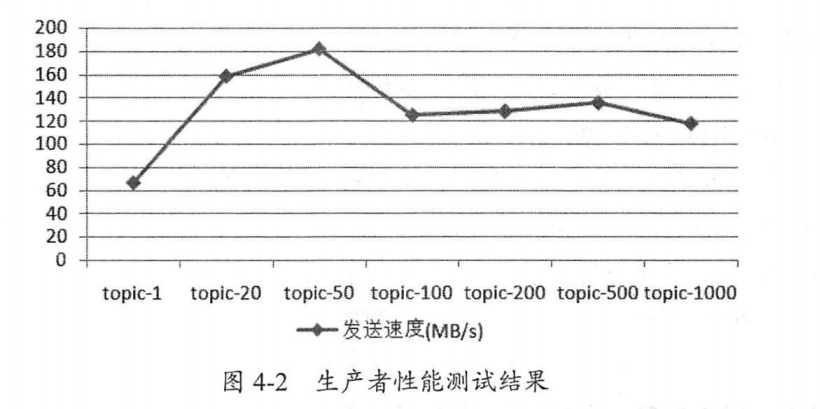
分区数为1时吞吐量最低，随着分区数的增长，相应的吞吐量跟着上涨。一旦分区数超过了某个阔值之后，整体的吞吐量是不升反降的。

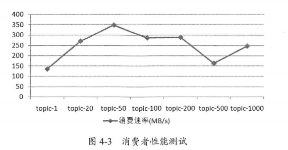
随着分区数的增加，相应的吞吐量也会有所增长。一旦分区数超过了某个阈值之后，整体的吞吐量也是不升反降的

## 分区数的上限

一味的增加分区数并不能使吞吐量一直得到提升，并且分区数也并不能一直增加，如果超默认配置值，还会引起 Kafka 进程的崩溃

创建过多分区会有异常，最关键的信息是“Too many open flies ”，这是一种常见的 Linux 系统错误，通常意文件描述符不足，它一般发生在创建线程、创建 Socket 、打开文件这些场景下 Linux系统的默认设置下，这个 件描述符的个数不是很 ，通过 ulimit 命令可以查看。

ulimit 是在系统允许的情况下，提供对特定 shell 可利用的资源的控制。-H和-S选项指定资源的硬限制和软限制

## 考量因素

从吞吐方面考虑，增加合适的分区数可以在一定程度上提升整体吞吐量，但超过对应的阈值之后吞吐量不升反降。如果应用对吞吐量有一定程度上的要求 则建议在投入生产环境之前对同款硬件资源做一个完备的吞吐量相关的测试，以找到合适的分区数阈值区间。