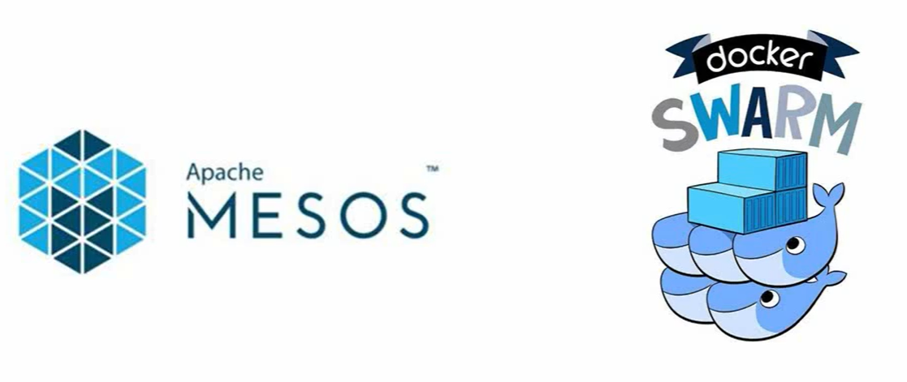
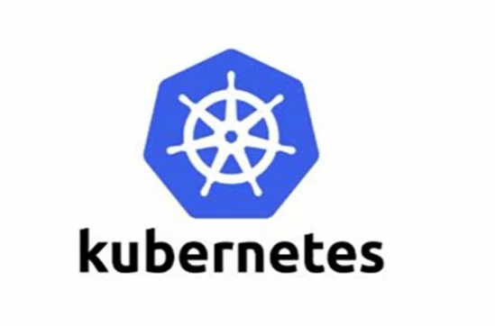
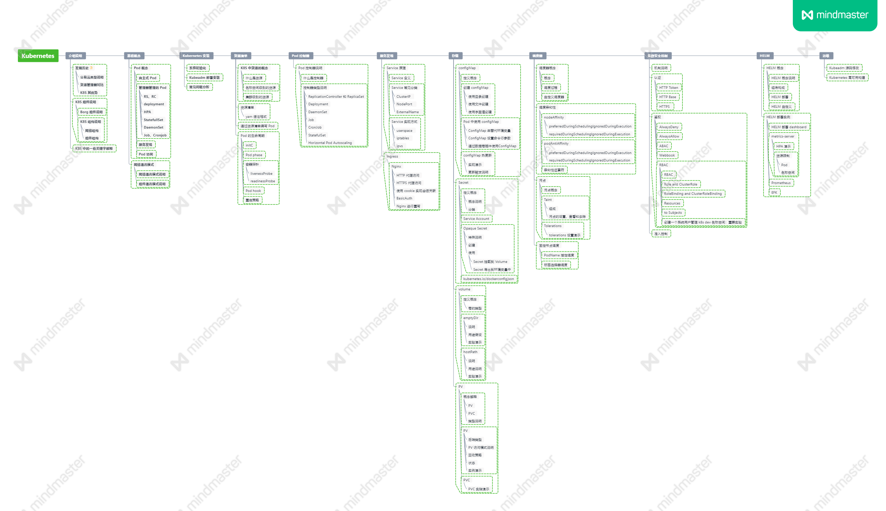
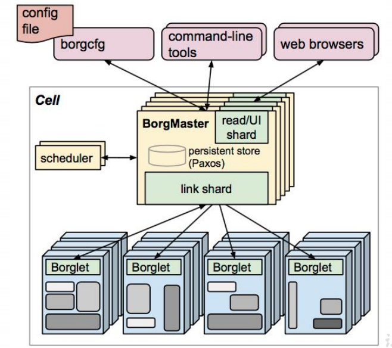
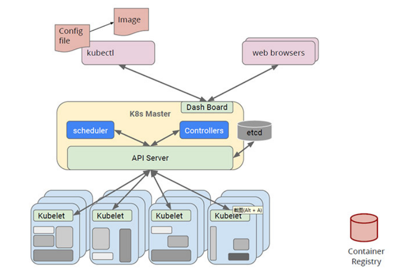

   1.发展经历  
   2.知识图谱  
   3.组件说明  

<!--more-->

kubernetes简称k8s，即k和s之间刚好8个字母。

## 发展经历

云计算服务分类：Iaas Paas Saas

资源管理器发展：

**apache mesos**：2009年由加利福尼亚大学发起，在twitter公司生产环境使用过，不过，twitter公司2019年宣布不使用mesos，切换到kubernetes。

**docker swarm**：docker 绑定的集群管理工具，缺点：可能不支持其他的容器化组件。

 图1 mesos 和 docker swarm logo 

**kubernetes**：google发出的开源集群资源管理器，由谷歌内部的容器化资源管理框架borg发展而来。特点是轻量级、开源、弹性伸缩、负载均衡IPVS。

图2 kubernetes logo

## 知识图谱

- **介绍说明**
- **基础概念**
- **kubernetes安装**
- **资源清单**
- **Pod控制器**
- **服务发现**
- **存储**
- **调度器**
- **集群安全机制**
- **HELM**
- **运维**

### 组件说明

kubernetes前身是borg系统，borg系统的架构如下图。

图3 borg组件说明

主要组件：

borgmaster：处理客户端RPC请求，比如创建Job，查询Job等，维护系统组件和服务的状态，比如服务器、Task等， 
负责与borglet通信。

borglet：部署在所有节点上的agent，负责接收borgmaster进程的指令。

scheduler：调度器，将数据写入paxos数据库，borglet会监控paxos的数据变化，进行拉取消息进行消费。

对应于kubernetes结构如下。

 图4 kubernetes结构 

​	主要组件：

apiserver：和用户交互的组件，对外暴露restful api。

etcd：集群的键值存储。

controllers：控制器维护副本数目等

scheduler：调度器会监控新建的pods并将其分配给节点

kubelet：节点上的agent，维持容器的生命周期

kube-proxy：负责为service提供cluster内部的服务发现和负载均衡
