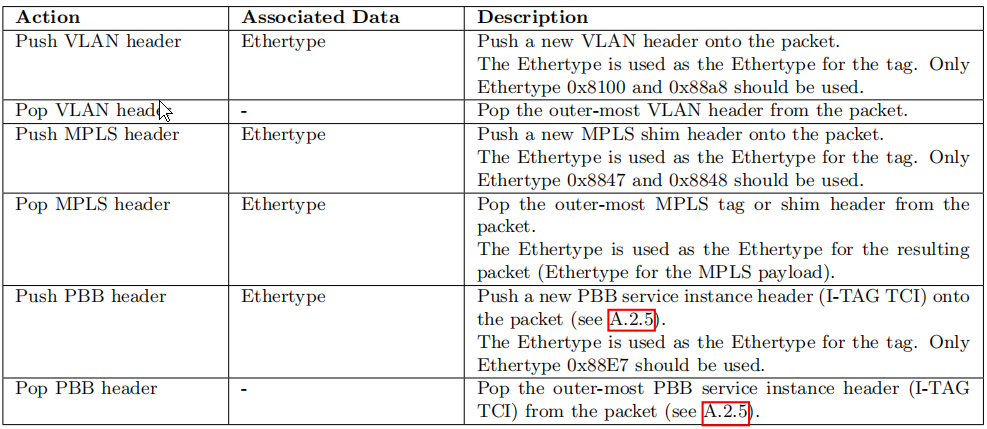

<center>
Openflow spec v1.3.0
</center>

<!--more-->

## Introduction

本文档描述了一个OpenFlow switch的要求。我们建议您在阅读本规范之前，先阅读最新版本的OpenFlow白皮书。这份白皮书可以在开放网络基金会的网站 (https://www.opennetworking.org/standards/open-flow) 上找到本规范涵盖了交换机的组件和基本功能，以及从远程控制器管理OpenFlow交换机的OpenFlow协议。


**图1 openflow switch 的主要组成部分**

## Switch Components

OpenFlow switch由一个或多个执行数据包查找和转发流表和组表组成，Openflow交换机还有一个到外部控制器的OpenFlow通道（图1）。交换机与控制器通信以及控制器管理交换机都通过OpenFlow协议。

控制器可以使用OpenFlow协议在流表中添加、更新和删除流条目，包括反应式（响应于数据包）和主动式。交换机中的每个流表都包含一组流条目；每个流条目都包含匹配字段、计数器和一组要应用于匹配数据包的指令（请参见5.2）

匹配从第一个流表开始，并可以继续匹配到其他流表（参见5.1）。流条目按优先级顺序匹配数据包，并使用每个表中的第一个匹配到的条目（参见5.3）。如果找到匹配的条目，则会执行与该流条目关联的指令。如果在流表中没有找到匹配，结果取决于table-miss流条目的配置：例如，数据包可以通过OpenFlow channel转发到控制器，丢弃，或者继续转发到下一个流表（参见5.4）

与每个流条目相关的指令包含操作或修改pipeline处理（参见5.9）。指令中包含的操作描述了包转发、包修改和组表处理，pipeline处理指令允许将数据包发送到后续的表中进行进一步处理，并允许以metadata的形式在表之间传递信息。当与匹配的流条目相关联的指令集中未指定下一个表时，表pipeline处理将停止；此时，数据包通常会被修改和转发（参见5.10）。

流条目可以转发到一个端口。这通常是一个物理端口，但它也可以是由交换机定义的逻辑端口或由本规范定义的保留端口（参见4.1）。保留端口可以指定通用转发操作，例如向控制器发送、flooding或使用非openflow方法进行转发，如“normal”交换机处理（见4.5），而交换机定义的逻辑端口可以指定链路聚合组、隧道或环回接口（见4.4）。

与流条目相关联的操作也可以将数据包引导到组(group)，该组指定附加处理（参见5.6）。组表示flooding发生的操作集，以及更复杂的转发语义（例如，多路径、快速重新路由和链路聚合）。作为间接层，组还允许多个流条目转发到单个标识符（例如IP转发到一个公共的下一跳）。这种抽象允许有效地更改跨流条目的公共输出操作。

组表包含组条目；每个组条目都包含一个操作桶列表，其特定语义依赖于组类型（请参见5.6.1）。一个或多个操作桶中的操作将应用到发送到组的数据包。

switch设计者可以自由地以任何方便的方式实现内部结构，只要保留了正确的匹配和指令语义。例如，虽然流条目可以使用所有组转发到多个端口，但交换机设计器可以选择在硬件转发表格中作为单个位掩码实现。另一个例子是匹配；由OpenFlow switch暴露的pipeline可以用不同数量的硬件表来物理实现。

## Glossary

本节描述了关键的OpenFlow规范术语：

Byte:8位字节

Packet:一个以太网帧，包括报头和有效载荷

Port:其中数据包进入和退出OpenFlow pipeline（参见4.1）。可以是物理端口、由交换机定义的逻辑端口，或由OpenFlow协议定义的保留端口

Pipeline:在OpenFlow switch中提供匹配、转发和数据包修改的链接流表集。

Flow Table:pipeline的一个阶段，包含流条目

Flow Entry:流表中用于匹配和处理数据包的一个条目。它包含一组用于匹配包的匹配字段、匹配优先级的优先级、一组用于跟踪数据包的计数器以及一组要应用的指令。

Match Field:与数据包匹配的字段，包括数据包头、ingress_port和metadata值。匹配字段可以是通配符（匹配任何值），在某些情况下是位掩码的。

Metadata:一个可掩码的寄存器值，用于将信息从一个表传输到下一个表。

Instruction:说明附加到流条目，并描述当包与流条目匹配时发生的OpenFlow处理。指令要么修改pipeline处理，例如将包引导到另一个流表，要么包含一组要添加到操作集的操作，或者包含一个要立即应用于包的操作列表。

Action:将数据包转发到端口或修改数据包的操作，例如减少TTL字段。操作可以指定为与流条目相关的指令集的一部分，或与组条目相关的操作桶中。操作可以在数据包的操作集中积累，或者立即应用到数据包中。

Action Set:每个表处理包时累积的动作，与包相关联，当指令集指示包退出处理pipeline时执行。

Group:操作桶的列表，以及选择按每个包应用的一个或多个桶的一些方法。

Action Bucket:为组定义的一组操作和相关参数

Tag:一种可以通过推送和弹出操作从数据包中插入或删除的报头

Outermost Tag:显示在最接近数据包开头位置的标记

Controller:一个使用OpenFlow协议与OpenFlow switch交互的实体

Meter:一种可以测量和控制数据包速率的交换机元件。如果通过meter的数据包率或字节率超过了一个预定义的阈值，则meter表就会触发一个meter band。如果meter drop数据包，则称为速率限制器。

## Openflow Ports

本节介绍OpenFlow端口抽象以及OpenFlow支持的各种类型的OpenFlow端口。

### openflow ports

OpenFlow端口是用于在OpenFlow进程和网络的其他部分之间传递数据包的网络接口。OpenFlow switch通过它们的OpenFlow端口连接。一个OpenFlow switch使许多OpenFlow端口可用于OpenFlow 进程。OpenFlow端口集可能与交换机硬件提供的网络接口集不相同，OpenFlow可能禁用一些网络接口，OpenFlow交换机可能定义额外的OpenFlow端口。OpenFlow数据包在一个ingress_port上接收，并由OpenFlow管道（见5.1）进行处理，该管道可以将它们转发到一个output_port。包的ingress_port是整个OpenFlow管道的属性，表示进入OpenFlow交换机的OpenFlow端口。可在匹配数据包时可以使用ingress_port（见5.3）。OpenFlow管道可以决定使用output操作在output_port上发送数据包，见5.12)，这定义了数据包如何返回网络。OpenFlow交换机必须支持三种类型的OpenFlow端口：physical port、logical port和reserved port。

### **Standard port**

OpenFlow标准端口定义为physical port、logical port和受支持的本地reserved port（不包括其他保留端口)。标准端口可用作ingress_port和output_port，它们可分组使用（参见5.6），并且它们具有端口计数器（参见5.8）。

### Physical port

OpenFlow physical port是交换机定义的端口，它们对应于交换机的硬件接口。例如，在以太网交换机上，物理端口会一对一地映射到以太网接口。在某些部署中，OpenFlow交换机可以通过交换机硬件进行虚拟化。在这些情况下，OpenFlow physical端口可以表示交换机的相应硬件接口的虚拟。

### Logical Port

OpenFlow logical port是交换机定义的端口，它们不直接对应于交换机的硬件接口。逻辑端口是可以在交换机中使用非openFlow方法（例如链路聚合组、隧道、环回接口）。逻辑端口可以包括数据包封装，并可以映射到各种物理端口。逻辑端口所做的处理必须对OpenFlow处理是透明的，并且这些端口必须与OpenFlow 进程交互，如OpenFlow物理端口。物理端口和逻辑端口之间的唯一区别是，与逻辑端口相关联的数据包可能有一个与之相关联的称为Tunnel-ID的额外metadata数据字段(请参见当在逻辑端口上接收到的包A.2.3.7)发送到控制器时，其逻辑端口和底层物理端口都报告给控制器(参见A.4.1)

### Reserved ports

OpenFlow保留端口由本规范定义。它们指定通用的转发操作，如发送到控制器、flooding或使用非openflow方法进行转发，如“normal”交换机处理

一个switch不需要来支持所有保留端口，只有下面标记为“required”的端口

Required: ALL:表示交换机可用于转发特定数据包的所有端口。只能用作输出端口。在这种情况下，包的副本被发送到所有标准端口，不包括包进入端口和配置为OFPPC_NO_FWD的端口

Required: CONTROLLER:表示使用OpenFlow控制器的控制通道。可用作入口端口或输出端口。当用作输出端口时，将包封装在包内消息中，并使用OpenFlow协议发送包(参见A.4.1)。当用作入口端口时，识别来自控制器的数据包。

Required: TABLE:表示OpenFlow pipeline的开始位置。此端口仅在包packet-out消息的操作列表中的输出操作中有效，并将包提交到第一个流表，以便可以通过常规的OpenFlow pipeline处理包。

Required: IN_PORT:表示数据包的进入端口。只能作为输出端口，通过其入口发送包。

Required: ANY:在没有指定端口时，在某些OpenFlow命令中使用的特殊值（端口通配符值）。不能用作入口端口或输出端口

Optional: LOCAL:表示交换机的本地网络堆栈及其管理堆栈。可用作入口端口或输出端口。本地端口使远程实体能够通过OpenFlow网络与交换机及其网络服务进行交互，而不是通过一个单独的控制网络。通过一组适当的默认流条目，它可以用于实现in-band控制器连接。

Optional: NORMAL:表示交换机的传统非Openflowpipeline（参见5.1）。只能用作输出端口，并使用普通pipeline处理数据包。如果交换机无法将数据包从OpenFlow pipeline转发到normal pipeline，则必须表明它不支持此操作。

Optional: FLOOD:表示使用交换机的正常管道发生的flood（参见5.1）。只能作为输出端口使用，通常会发送数据包的所有标准端口，但不能发送到进入端口，或处于OFPPS_BLOCKED状态的端口。交换机还可以使用数据包VLAN ID来选择要flood的端口。

OpenFlow-only的交换机不支持NORMAL端口和FLOOD端口，而支持OpenFlow-hybrid(Openflow的混合交换机)可能支持它们（参见5.1）。将数据包转发到FLOOD端口取决于交换机的实现和配置，而使用组类型的转发则使控制器能够更灵活地实现洪水（见5.6.1）。

## OpenFlow Tables

本节介绍流表和组表的组件，以及匹配和操作处理的机制

### Pipeline Processing

兼容Openflow的交换机有两种类型：OpenFlow-only和OpenFlow-hybrid。仅支持OpenFlow的switch只支持OpenFlow操作，在这些switch中，所有的数据包都由OpenFlow pipeline进行处理，否则不能进行处理。

OpenFlow-hybrid:OpenFlow-混合交换机同时支持OpenFlow操作和正常的以太网交换操作，即传统的L2以太网交换、VLAN隔离、L3路由(IPv4路由、IPv6路由……)、ACL和QoS处理。这些交换机应该提供OpenFlow之外的分类机制，该机制将流量路由到OpenFlow pipeline或normal pipeline。例如，交换机可以使用包的VLAN标签或输入端口来决定是否使用一个pipeline或另一个pipeline来处理包，或者它可以将所有包引导到OpenFlow pipeline。此分类机制超出了本规范的范围。OpenFlow混合交换机也可以允许数据包通过normal pipeline和OpenFlow pipeline保留端口到normal pipeline.

每个OpenFlow switch的OpenFlow pipeline包含多个流表，每个流表包含多个流表项。OpenFlow pipeline处理定义了数据包如何与这些流表交互（请参见图2）。一个OpenFlow switch需要至少有一个流表，并且可以选择有更多的流表。只有一个流表的OpenFlow switch是有效的，在这种情况下，pipeline处理被大大简化了。


**图2 pipeline处理时的数据包路径**

OpenFlow switch的流表按顺序编号，从0开始。pipeline处理总是从第一个流表开始：数据包首先与流表0的流条目进行匹配。根据第一个表中的结果，可以匹配跳转到其他流表。

当有流表处理时，数据包与流表的流条目进行匹配，以选择流条目（参见5.3）。如果找到一个流条目，则执行该流条目中包含的指令集，这些指令可以显式地将数据包指向另一个流表(使用Goto指令，见5.9)，在另一个流表再次重复相同的过程。一个流条目只能将一个数据包指向一个大于其自身的流表号的流表号，换句话说，pipeline处理只能向前进行，而不能向后进行。显然，pipeline的最后一个表的流条目不能包含Goto指令。如果匹配的流条目没有将数据包引导到另一个流表，则pipeline处理将在此表中停止。当pipeline处理停止时，数据包与其关联的动作集(action set)一起被处理，并且通常被转发（见5.10）

如果数据包与流表中的流条目不匹配，则是table-miss。table-miss的行为取决于表配置（参见5.4）。流表中的table-miss流条目可以指定如何处理不匹配的数据包：选项包括：删除它们、将它们传递给另一个表或通过packet-in消息通过控制通道将它们发送到控制器（参见6.1.2）。

### Flow Table

流表由流条目组成。

每个流表条目（见表1）都包含了


**表1 流表中流条目的主要组件**

match fields:与数据包匹配。它们包括入口端口和数据包头，以及由前一个表指定的选择性metadata。

priority:流条目的匹配优先级

counters:来更新匹配的数据包

instructions:修改操作集或pipeline处理

timeouts:flow在switch上过期前的最大时间或空闲时间

cookie:由控制器选择的不透明的数据值。控制器可用于过滤流统计信息、流修改和流删除，但在处理数据包时不使用。

流表条目由其匹配字段和优先级标识：匹配字段和优先级组合在一起，标识流表中唯一的流条目。用通配符表示所有字段（所有字段都被省略）且优先级等于0的流条目称为table-miss流条目

### Matching


**图3 通过OpenFlow Switch的流程图**

在收到数据包后，OpenFlow Switch将执行图3所示的功能。switch首先在第一个流表中执行表查找，并且基于pipeline处理，可以在其他流表中执行表查找（参见5.1）

数据包匹配字段将从数据包中提取出来。用于在表中查找的包匹配字段取决于包类型，并且通常包括各种包头字段，如以太网源地址或IPv4目标地址（参见A.2.3）。除了数据包头之外，还可以对入口端口和metadata字段执行匹配。metadata可用于在交换机中的表之间传递信息。包匹配字段表示处于当前状态的包，如果使用apply-actions操作在前面的表中应用的操作更改了包头，那么这些更改将反映在包匹配字段中。

如果用于查找的数据包匹配字段中的值与流表条目中定义的值匹配，则数据包与流表条目匹配。如果流表输入字段的值为ANY（字段省略），则它将匹配标头中的所有可能的值。如果switch支持特定匹配字段上的任意位掩码，则这些掩码可以更精确地指定匹配。

数据包与表匹配，必须选择与数据包匹配的最高优先级流条目。必须更新与所选流条目相关联的计数器，并且必须应用所选流条目中包含的指令集。如果有多个具有相同最高优先级的匹配流项，则选定的流项显式未定义。只有当控制器写入器从不对流模式消息设置OFPFF_CHECK_OVERLAP位并添加重叠的条目时，才会出现这种情况。

如果交换机配置包含OFPC_FRAG_REASM标志(请参见A.3.2)，那么在pipeline处理之前必须重新组装IP片段。

此版本的规范没有定义当switch接收到格式错误或损坏的包时的预期行为。

### Table-miss

每个流表都必须支持一个针对处理table-miss的流条目。table-miss条目指定如何处理与流表中的其他流条目不匹配的数据包（见5.1），并且可以，例如，将数据包发送到控制器，将数据包丢弃或直接将数据包转发到后续的表。

table-miss条目通过其匹配优先级（参见5.2）标识，它用通配符表示所有匹配字段（省略所有字段），并且其优先级最低的（0）。table-miss条目的匹配可能超出了流表支持的正常匹配范围，例如，精确匹配表不支持其他流条目的通配符，但必须支持table-miss条目通配符梳理所有字段。table-miss入口可能没有与常规流入口相同的功能（请参见A.3.5.5）。鼓励实现支持table-miss项，至少具有与OpenFlow以前版本的table-miss处理相同的功能：将数据包发送到控制器，丢弃数据包或将数据包直接发送到后续的表。

table-miss项在大多数方面与其他流项类似：默认不存在，控制器可以随时添加或删除（见6.4），并且可能过期（见5.5）。table-miss流条目根据表中的匹配字段和优先级匹配数据包（见5.3），它匹配流表中其他流条目不匹配的数据包。table-miss流输入指令应用于匹配表table-miss输入的数据包（参见5.9）。如果table-miss流条目使用控制器端口直接向控制器发送包（见4.5），则包输入原因必须识别table-miss（见A.4.1）

如果table-miss流条目不存在，默认情况下，流条目不匹配的数据包将被丢弃（丢弃）。交换机配置，例如使用OpenFlow配置协议，可以覆盖此默认值并指定其他行为。

### Flow-Removel

流表项通过两种方式从流表中删除，要么应控制器的要求，要么通过switch流到期机制

switch流过期机制，由switch独立于控制器运行，并基于流入口的状态和配置。每个流条目都有一个idle_timeout和一个与之关联的hard_timeout。如果其中任何一个值是非零的，则switch必须记录流条目的到达时间，因为它可能需要稍后删除该条目。一个非零的hard_timeout字段会导致流条目在给定的秒数之后被删除，而不管它匹配了多少个数据包。非零idle_timeout字段会导致流条目在给定秒内没有匹配数据包时被删除。switch必须实现流条目过期，并在超过一个时间从流表中删除流表项。

控制器可以通过发送删除流表修改消息（OFPFC_DELETE或OFPFC_DELETE_STRICT-参见6.4）主动删除流项

当通过控制器或流表项到期机制删除流项时，switch必须检查流入口的OFPFF_SEND_FLOW_REM标志。如果设置了此标志，switch必须向控制器发送流删除的消息。每个被流删除的消息都包含流输入的完整描述、删除的原因（过期或删除）、删除时的流输入持续时间以及删除时的流统计信息。

### Group Table

一个组表由一个组条目组成。流条目跳转到组的能力使OpenFlow能够表示其他转发方法（例如，select和all）。


**表2 组表中的组条目的主要组件**

每个组条目（见表2）都由其组标识符标识，并包含

group identififier:一个唯一标识该组的32位无符号整数

group type: 要确定组语义（请参见第5.6.1节）

counters：在一个组处理数据包时进行更新

action buckets：操作桶的顺序列表，其中每个操作桶包含一组要执行的操作和相关的参数

#### Group Types

不需要switch来支持所有组类型，只有下面标记为“Required”的类型。该控制器还可以查询该交换机是否支持哪种“Optional”组类型。

Required: all：执行组中的所有存储桶。此组用于多播或广播转发。为每个桶有效地复制数据包；为组中的每个桶处理一个数据包。如果桶将数据包明确地指向ingress port，则此数据包复制将被丢弃。如果控制器写入器想要转发到ingress port，该组应该包括一个额外的桶，其中包括一个输出到OFPP_IN_PORT保留端口的output action。

Optional: select：在组中执行一个桶。数据包由组中的单个桶处理，基于交换机计算的选择算法（例如，对一些用户配置的元组进行散列或简单的轮询）。选择算法的所有配置和状态都在OpenFlow的外部。该选择算法应该实现等效的负载共享，并可以选择基于桶的权重。当选定组中的桶中指定的端口关闭时，交换机可能会将桶选择限制为剩余的集合（那些将操作转发到活动端口的集合），而不是丢弃发送到该端口的数据包。这种行为可以减少对链路或交换机的中断。

Required: indirect：在此组中执行一个已定义的桶。此组只支持一个桶。允许多个流条目或组指向一个通用的组标识符，从而支持更快、更有效的收敛（例如，IP转发的下一跳）。此组类型实际上与具有一个桶的所有组相同。

Optional: fast failover：执行第一个活动桶。每个操作桶都与控制其活动性的特定端口或组相关联。桶按照组定义的顺序进行评估，并选择与活动端口/组关联的第一个桶。此组类型使交换机能够更改转发，而不需要往返到控制器。如果存存活的数据桶，数据包将被丢弃。此组类型必须实现一个活动机制（请参见6.5）

### Meter Table

meter表由meter项组成，定义每个流量meter。每个流量的meter计数使OpenFlow能够实现各种简单的QoS操作，如速率限制，并可以与每个端口队列（见5.12）结合起来来实现复杂的QoS框架，如DiffServ。

一个meter分配给它的数据包的速率，并能够控制这些数据包的速率。meter直接连接到流表项上（与连接到端口上的队列相反）。任何流量入口都可以在其指令集中指定一个meter（见5.9），该meter可以测量和控制它所附的所有流量入口的总速率。多个meter表可以在同一个表中使用，但以排他的方式（不相交的流项集）。通过在连续的流表中使用它们，可以在同一组数据包上使用多个meter。


**表3 meter表meter entry的主要部件**

每个meter项（见表3）由其meter identififier标识，并包含

meter identififier：一个唯一标识meter的32位无符号整数

meter bands：meter band的无序列表，其中每个meter band指定meter band的速率和处理数据包的方式

counters：当用meter处理数据包时进行更新

#### Meter Bands

每个meter可以有一个或多个meter band。每个band指定应用band的速率和处理数据包的方式。数据包根据当前测量的meter速率由单个meter band处理，当最高配置速率低于当前测量速率，则应用meter限制速率。如果当前速率低于任何指定的meter band速率，则不使用meter band。

每个meter band（见表4）按其速率确定，其中包括：


**表4 meter entry中的meter band的主要部件。**

band type：定义了如何处理数据包

rate：meter用来选择meter band，定义了该band可以应用的最低速率

counters：当数据包被meter band 限制速率处理时更新

type specifific arguments：一些band类型有可选的参数

本规范中没有band类型为“Required”。控制器可以查询switch所支持的“Optional”meter band type

Optional: drop：删除（丢弃）数据包。可以用来定义一个速率限制器的band。

Optional: dscp remark：减少数据包IP头中DSCP字段的删除优先级。可以用来定义一个简单的DiffServ策略

### Counters

为每个flow table、flow entry, port, queue, group, group bucket, meter、meter band维护计数器，符合openflow标准的计数器可以在软件中实现，并通过使用更有限范围的轮询硬件计数器来维护。表5包含了由OpenFlow规范定义的计数器集。一个switch不需要支持所有的计数器，只有那些在表5中标记为“Required”的计数器。

持续时间是指在交换机中安装了flow entry, a port, a group, a queue or a meter，必须以第二精度跟踪的时间量。接收错误(The Receive Errors)字段是表5中定义的所有接收和碰撞错误的总数，以及表中未调用的任何其他错误。

计数器是无符号的，环绕，没有溢出指示器。如果switch中没有特定的数字计数器，则必须将其值设置为最大字段值（无符号对应值为-1）。

### Instructions

每个流条目包含一组指令，当数据包与条目匹配时执行。这些指令会导致对数据包、操作集或管道处理的更改。

一个switch不需要支持所有的指令类型，只有那些在下面标记的“Required Instruction”。该控制器还可以查询该switch是否支持哪个“Optional Instruction”

Optional Instruction: Meter meter id:直接发送数据包到指定的meter。由于meter的结果，数据包可能会被丢弃
Optional Instruction: Apply-Actions action:立即应用特定操作(s)，而无需对操作集进行任何更改。此指令可用于修改两个表之间的数据包或执行相同类型的多个操作。这些操作被指定为一个操作列表。
Optional Instruction: Clear-Actions:立即清除操作集中的所有操作。
Required Instruction: Write-Actions action:将指定的动作(s)合并到当前动作集（参见5.10）。如果当前集中存在给定类型的操作，请将其覆盖，否则将其添加
Optional Instruction: Write-Metadata metadata / mask:将带掩码的元数据值写入到元数据字段中。掩码指定应该修改的元数据寄存器的哪些位（即新的元数据=旧的元数据和˜掩码|值和掩码）
Required Instruction: Goto-Table next-table-id:指示处理pipeline中的下一个表。表iD必须大于当前的表iD。pipeline的最后一个表的流条目不能包含此指令（请参见5.1）


**表5 计数器列表**

与流条目相关联的指令集包含每种类型的最多一条指令。该集合的指令按照上述列表所指定的顺序执行。在实践中，唯一的约束是Meter指令在Apply-Actions操作指令之前执行，Clear-Actions操作指令在Write-Actions操作指令之前执行， Goto-Table最后执行。

如果switch无法执行与流输入相关联的指令，则该switch可能会拒绝流输入。在这种情况下，switch必须返回不支持的流错误（参见6.4）。流表可能不支持每一个匹配、每一条指令和每一个操作。

### Action Set

一个操作集与每个数据包相关联，这个操作集默认为空，流条目可以使用Write-Action指令或与特定匹配关联的Clear-Action操作指令来修改操作集。操作集将在流表之间进行传送。当流条目的指令集不包含Goto-Table指令时，pipeline处理将停止，并执行数据包的操作集中的操作。

操作集包含每种类型的最多一个操作，set-field操作由其字段类型标识，因此每个字段类型最多包含一个set-field操作（即可以设置多个字段）。当需要多个相同类型的操作时，例如推送多个MPLS标签或弹出多个MPLS标签时，可以使用Apply-Actions指令（参见5.11）。

copy TTL inwards：对数据包应用复制TTL向内的操作。

pop：将所有标记弹出操作应用到数据包中

push-MPLS：对数据包应用push MPLS标签操作

push-PBB：应用push PBB标签操作

push-VLAN：对数据包应用push VLAN标签操作

copy TTL outwards：对数据包应用复制TTL向外操作

decrement TTL：对报文应用递减TTL操作

set：将所有设置字段操作应用到数据包中

qos：应用所有QoS操作，例如为数据包set_queue

group：如果指定了group操作，请按照此列表指定的顺序应用相关组桶的操作

output:如果没有指定group操作，则在output操作指定的端口上转发数据包

操作集中的output操作将在最后一次执行。如果在操作集中同时指定了output动作和group操作，则output操作将被忽略，并且group动作将优先。如果在操作集中没有指定output操作和group操作，则会删除数据包。如果交换机支持，则group的执行可以递归；组桶可以指定另一个组，在这种情况下，操作的执行遍历组配置指定的所有组。

### Action List

Apply-Actions操作指令和Packet-out消息包括一个操作列表。操作列表的语义与OpenFlow1.0规范相同。操作列表的操作按照列表指定的顺序执行，并立即应用到数据包中。

操作列表的执行从列表中的第一个动作开始，每个动作依次在数据包上执行。这些操作的效果是累积的，如果操作列表包含两个PushVLAN操作，则两个VLAN头将被添加到数据包中。如果操作列表包含一个output操作，则数据包的副本将以其当前状态转发到所需的端口。如果列表包含group操作，则相关的组桶将处理处于当前状态的数据包的副本。

在Apply-Actions指令中执行操作列表后，在修改后的数据包上继续执行pipeline（参见5.1）。数据包的操作集随操作列表的执行而保持不变。

### Actions

不需要交换机来支持所有操作类型，只需要下面标记为“Required Action”的类型。该控制器还可以查询该switch是否支持哪一个“Required Action”。

Required Action: Output.“output”操作会将数据包转发到指定的OpenFlow端口（请参见4.1）。OpenFlow交换机必须支持转发到物理端口、交换机定义的逻辑端口和所需的预留端口（参见4.5）。

Optional Action: Set-Queue.set-queue操作将设置数据包的队列ID。当使用output操作将数据包转发到一个端口时，队列id将确定连接到此端口的哪个队列用于调度和转发数据包。转发行为由队列的配置决定，并用于提供基本的服务质量(QoS）支持（请参见第A.2.2节）

Required Action: Drop.没有明确的动作来表示drop。，那些操作集没有输出操作的数据包应该drop。此结果可能来自pipeline中的空指令集或空操作桶，或者在执行Clear-Actions指令之后。

Required Action: Group.通过指定的group处理数据包。确切的解释取决于group类型。

Optional Action: Push-Tag/Pop-Tag.交换机可能支持push/pop.标签的能力，如表6所示。为了帮助与现有网络的集成，我们建议支持push/pop VLAN标签的能力

新push的标签应该总是作为该标签的最外层标签的最外层有效位置插入。当一个新的VLAN标签被push时，它应该是插入的最外层的标签，在以太网报头之后和其他标签之前。同样地，当一个新的MPLS标记被push时，它应该是插入的最外层标记，在以太网报头之后和其他标记之前。

当多个push动作被添加到包的动作集时，它们按照动作集规则定义的顺序应用于包，首先是MPLS，然后是PBB，最后VLAN(se5.10)。当操作列表中包含多个push操作时，它们将按列表顺序应用于数据包（请参见5.11）。

注意：有关默认字段值的信息，请参见第5.12.1节。


**表6 push/pop标签操作**

Optional Action: Set-Field.各种set-field操作通过其字段类型标识，并修改包中各个头字段的值。虽然不是严格要求的，但对使用set-field操作重写各种头字段的支持极大地提高了OpenFlow实现的有用性。为了帮助与现有网络的集成，我们建议支持VLAN的修改操作。set-field操作应该始终应用于最外层可能的标头(例如，“set VLAN ID”操作总是设置最外层VLAN标记的ID)，除非字段类型另有指定。

Optional Action: Change-TTL:各种Change-TTL操作会修改数据包中的IPv4TTL、IPv6 hop limit或MPLSTTL的值。虽然不是严格要求的，但表7中所示的操作极大地增加了OpenFlow实现对实现路由功能的有用性。Change-TTL操作应该始终应用于最外层可能的头.


**表7: Change-TTL actions**

OpenFlow switch检查具有无效IP TTL或MPLSTTL的数据包并拒绝它们。不需要对每个包检查TTL是否有效，但必须在每次向包应用递减TTL操作时进行检查。可以更改交换机的异步配置（见6.1.1），通过packet-in消息通过控制信道将具有无效TTL的包发送给控制器（见6.1.2）

#### Default values for fields on push

在执行push操作时，应该将表8中指定的所有字段的字段值从现有的包头复制到新的包头。表8中列出的没有相应现有字段的新字段应该设置为零。不能通过OpenFlow set-field操作修改字段被初始化的协议值。


表8 在push操作时复制现有字段到新字段。

在push操作之后，可以通过为字段指定一个“set”操作来覆盖新标头中的字段。

## OpenFlow Channel

OpenFlow通道是将每个OpenFlow switch连接到一个控制器的接口。通过这个接口，控制器配置和管理交换机，从交换机接收事件，并向交换机发送数据包。

在datapath和OpenFlow通道之间，接口是特定于实现的，但是所有的OpenFlow通道消息都必须根据OpenFlow协议进行格式化。OpenFlow通道通常使用TLS进行加密，但也可以直接在TCP上运行。

### OpenFlow Protocol Overview

OpenFlow协议支持三种消息类型，即controller-to-switch消息、asynchronous消息和symmetric消息，每种消息类型都有多个子类型。controller-to-switch消息由控制器启动并用于直接管理或检查switch的状态，Asynchronous消息由交换机发起，用于更新网络事件的控制器和更改交换机状态。对称消息由交换机或控制器发起，不发送请求就发出。消息类型使用OpenFlow的。

#### Controller-to-Switch

控制器/交换机消息由控制器发起，可能需要或不需要交换机的响应。

Features:控制器可以通过发送feature请求来请求交换机的功能；交换机必须以指定交换机功能的feature reply进行响应。这通常会在建立OpenFlow通道时执行

Configuration:控制器能够在交换机中设置和查询配置参数。该交换机只响应来自控制器的查询。

Modify-State:modify-state息由控制器发送来管理交换机上的状态。它们的主要目的是添加、删除和修改Openflow表中的flow/group条目，并设置交换机端口属性。

Read-State:控制器使用read-state消息从交换机收集各种信息，如当前配置、统计信息和功能

Packet-out:控制器将数据包从交换机上的指定端口发送，并转发通过packet-in消息接收到的数据包。packet-out消息必须包含一个完整的数据包或一个引用存储在交换机中的数据包的缓冲区ID。packet-out消息还必须包含要按指定顺序应用的操作列表；空操作列表将删除数据包。

Barrier:控制器使用barrier request/reply消息来确保已完成或接收已完成操作的通知。

Role-Request:role-request消息被控制器用于设置其OpenFlow通道的role，或查询该role。当交换机连接到多个控制器时非常有用（参见6.3.4）

Asynchronous-Configuration:异步配置消息用于在其OpenFlow通道上接收的异步消息上设置额外的过滤器，或查询该过滤器。当交换机连接到多个控制器（见6.3.4），并且通常在建立openflow channel时执行时，这一点非常有用

#### Asynchronous

发送异步消息时，没有控制器从交换机请求它们。交换机向控制器发送异步消息，以表示数据包到达、交换机状态更改或错误。下面描述了四种主要的异步消息类型。

Packet-in:将数据包的控制传递给控制器。对于使用流条目或table-miss流条目转发到控制器保留端口的所有包，packet-in事件总是发送到控制器（参见5.12）。其他处理，如TTL检查，也可以使用packet-in事件将包发送到控制器。

packet-in事件可以配置为缓冲数据包。对于由flow entry或组桶中的output操作生成的packet-in，可以在ouput操作中单独指定（请参见A.2.5)，对于其他数据包，它可以配置在交换机配置(参见A.3.2)。如果packet-in事件配置为缓冲包并且交换机有足够的内存来缓冲它们，则packet-in事件只包含包头的一部分和控制器在准备转发包时使用的缓冲区ID。对于不支持内部缓冲的交换机，配置为不为packet-in事件缓存数据包，或者内部缓冲耗尽的交换机，必须将完整的包作为事件的一部分发送给控制器。缓存的数据包通常通过控制器的packet-out消息进行处理，或者在一段时间后自动过期。

如果缓存数据包，可以配置包中的原始包的字节数。默认情况下，它是128字节。对于由流项或组桶中的output操作生成的packet-in，可以在输出操作中单独指定（请参见A.2.5)，对于其他数据包，它可以配置在交换机配置(参见A.3.2).

Flow-Removed:通知控制器如何从流表中删除流。flow-removed消息只发送给设置了OFPFF_SEND_FLOW_REM标志的流条目。当其中一个流超时时，它们是作为控制器流删除请求或交换机流到期流程而产生的结果（见5.5）。

Port-status:通知控制器一个端口上的更改。该交换机应在端口配置或端口状态更改时，向控制器发送port-status消息。这些事件包括端口配置事件中的更改，例如如果它是由用户直接关闭的，以及端口状态更改事件，例如如果连接关闭了。

Error:该交换机能够使用错误消息通知控制器交换机中出现的问题

#### Symmetric

symmetric消息在没有请求的情况下向任何一个方向发送

Hello:在连接启动时，交换机和控制器之间交换Hello消息。

Echo:可以从交换机或控制器发送，并且必须返回一个回复。它们主要用于验证控制器-交换机的连接，也可以用于测量其延迟或带宽。

Experimenter:experimenter消息为OpenFlow交换机提供了一种标准的方式，可以在OpenFlow消息类型空间中提供额外的功能。这是一个用于未来OpenFlow修订的特性的staging区域。

### Message Handling

OpenFlow协议提供了可靠的消息传递和处理，但不自动提供确认或确保有序的消息处理。本节中描述的OpenFlow消息处理行为是在使用可靠传输的主连接和辅助连接上提供的，但是在辅助连接上使用不可靠传输不支持（见6.3.5）。

Message Delivery:消息可以保证被传递，除非OpenFlow通道完全失败，在这种情况下，控制器不应该假设有关于交换机状态的任何信息(例如，交换机可能已经进入“fail standalone mode”

Message Processing:交换机必须完整地处理从控制器接收到的每条消息，并可能产生一个应答。如果交换机不能处理从控制器接收到的消息，则必须返回错误消息。对于packet-out消息，处理消息并不能保证数据包实际上退出交换机。由于在交换机、QoS策略上的拥塞，或者被发送到一个被阻塞或无效的端口，openflow可能会将数据包丢弃。

此外，交换机必须向控制器发送由OpenFlow状态更改生成的所有异步(asynchronous)消息，如流删除、端口状态或packet-in消息，以便交换机的控制器视图与实际状态一致。这些消息可能会根据异步配置被过滤掉（请参见6.1.1）。此外，触发OpenFlow状态更改的条件可能会在这种更改之前被过滤。例如，在应该转发到控制器的数据端口上接收到的包可能会由于交换机内的拥塞或QoS策略而被丢弃，并且不会生成packet-in消息。对于对控制器具有显式output操作的数据包，可能会被丢弃。当数据包与表中的任何条目不匹配，并且该表的默认操作是发送到控制器时，也可能被丢弃。建议使用QoS操作或速率限制对到达控制器的数据包进行监管，以防止控制器连接被拒绝服务，并且超出了本规范的范围。

控制器可以自由地忽略他们接收到的消息，但应该响应echo消息，以防止交换机终止连接。

Message Ordering:可以通过使用barrier消息来确保排序。在没有barrier消息的情况下，交换机可以任意地重新排序消息以最大化性能；因此，控制器不应依赖于特定的处理顺序。特别地，流条目可以以与交换机接收的流模式消息不同的顺序插入表中。不能通过barrier消息重新对消息进行排序，并且只有在处理了所有之前的消息后才能处理barrier消息。 更准确来说

1. 处理barrier消息之前的消息必须对所有barrier消息进行完全处理，包括发送任何由此产生的回复或错误
2. 必须处理barrier消息，并发送barrier回复
3. 在barrier消息之后的消息就可以开始处理了

如果来自控制器的两个消息相互依赖(例如，一个流mod添加与以下packet-out到OFPP_TABLE)，它们应该被一个barrier消息分隔。

### OpenFlow Channel Connections

OpenFlow通道用于在OpenFlow交换机和OpenFlow控制器之间交换OpenFlow消息。一个典型的OpenFlow控制器管理多个OpenFlow channel，每个channel管理到一个不同的OpenFlow 交换机。一个OpenFlow交换机可以有一个到控制器的OpenFlow通道，或多个可靠性通道，每个通道到一个不同的控制器（见6.3.4）

OpenFlow控制器通常通过一个或多个网络远程管理OpenFlow交换机。用于OpenFlow通道的网络规范超出了本规范的范围。它可以是一个单独的专用网络，或者OpenFlow通道可以使用由OpenFlow交换机（in-band控制器连接）管理的网络。唯一的要求是它应该提供TCP/IP连接。

OpenFlow通道通常被实例化为单个网络连接，使用TLS或纯TCP（参见6.3.3）。OpenFlow通道可以由多个网络连接来组成，OpenFlow交换机启动后总是与OpenFlow控制器的连接（参见6.3.1）

#### Connection Setup

交换机必须能够使用用户指定的端口，在用户可配置的（但在其他方面是固定的）IP地址上与控制器建立通信。如果交换机知道控制器的IP地址，则交换机将启动到控制器的标准TLS或TCP连接。进出OpenFlow通道的流量不会通过OpenFlow pipeline运行。因此，交换机在根据流表检查传入的流量之前，必须将其标识为本地流量。

当第一次建立OpenFlow连接时，连接的每一边都必须立即发送一条OFPT_HELLO消息，其version字段设置为发送方支持的最高OpenFlow协议版本。在收到此消息后，收件人可以计算要使用的OpenFlow协议版本，作为它发送的版本号和它接收的版本号中较小的版本。

如果收件人支持协商后的版本，则连接将继续进行。否则，收件人必须使用OFPET_HELLO_FAILED类型字段、OFPHFC_COMPATIBLE类型字段代码字段以及解释数据中情况的ASCII字符串回复OFPT_ERROR消息，然后终止连接。

#### Connection Interruption

如果交换机由于echo request超时、TLS会话超时或其他断开而与所有控制器失去联系，则交换机应立即进入“fail secure mode”或“fail standalone mode”，这取决于交换机的实现和配置。在“fail secure mode”中，对交换机行为的唯一改变是丢弃指向控制器的数据包和消息。流条目应根据其在“fail secure mode”下的超时时间继续过期。在“fail standalone mode”中，交换机使用OFPP_NORMAL保留端口来处理所有数据包；换句话说，交换机充当传统的以太网交换机或路由器。“fail standalone mode”通常只在Hybrid交换机上可用（见5.1）。

再次连接到控制器时，现有的流条目将保留。然后，如果需要，控制器就可以选择删除所有的流条目。

当交换机第一次启动时，它将以“fail secure mode”或“fail standalone mode”模式运行，直到它成功连接到控制器。要在启动时使用的默认流条目集的配置超出了OpenFlow协议的范围。

#### Encryption

交换机和控制器可以通过TLS连接进行通信。TLS连接由交换机发起，该控制器默认位于TCP端口6633上。交换机和控制器通过交换由特定于站点的私钥签名的证书来进行相互验证。每个交换机必须可由用户配置，其中一个证书用于验证控制器（控制器证书），另一个证书用于验证控制器（交换机证书）。

交换机和控制器可选择使用普通TCP进行通信。在使用普通TCP时，建议使用其他安全措施来防止窃听、控制器模拟或对OpenFlow通道的其他攻击。

#### Multiple Controllers

该交换机可以与单个控制器建立通信，也可以与多个控制器建立通信。拥有多个控制器可以提高可靠性，因为如果一个控制器down或一个控制器连接失败，交换机可以继续在OpenFlow模式下运行。控制器之间的切换完全由控制器本身管理，从而实现了从故障中快速恢复和控制器负载平衡。控制器通过本规范范围之外的机制来协调交换机之间的管理，而多控制器功能的目标只是为了帮助同步由控制器执行的控制器切换。多控制器功能只处理控制器的故障转移和负载平衡问题，而不处理可以在OpenFlow协议之外完成的虚拟化问题。

当启动OpenFlow操作时，交换机必须连接到其配置的所有控制器，并尝试同时保持与所有控制器的连接。许多控制器可以向交换机发送controller-to-switch命令，与这些命令相关的回复或错误消息必须只在与该命令相关的控制器连接上发送。异步消息可能需要发送到多个控制器，为每个合格的OpenFlow通道复制该消息，并在各自的控制器连接允许时发送每个消息。

控制器的默认角色是OFPCR_ROLE_EQUAL。在此角色中，控制器对交换机具有全部的访问权限，并且等于相同角色中的其他控制器。默认情况下，控制器接收所有交换机异步消息（例如packet-int消息、flow-removed消息）。控制器可以发送controller-to-switch的命令来修改交换机的状态。该交换机不在控制器之间执行任何仲裁或资源共享。

控制器可以请求将其角色更改为OFPCR_ROLE_SLAVE。在此角色中，控制器对交换机具有只读访问权限。默认情况下，除了port-status消息外，控制器也不接收交换机异步消息。控制器无法执行controller-to-switch的命令，以修改交换机、OFPT_PACKET_OUT、OFPT_FLOW_MOD、OFPT_GROUP_MOD、OFPT_PORT_MOD和OFPT_TABLE_MOD的状态。如果控制器发送其中一个命令，交换机必须回复一个OFPT_ERROR消息，其type字段为OFPET_BAD_REQUEST，其code字段为OFPBRC_IS_SLAVE。其他控制器到交换机的消息，如OFPT_MULTIPART_REQUEST和OFPT_ROLE_REQUEST，应正常处理。

控制器可以请求将其角色更改为OFPCR_ROLE_MASTER。此角色与OFPCR_ROLE_EQUAL类似，并且对该交换机有完全的访问权限，不同之处在于，该交换机确保它是此角色中的唯一控制器。当一个控制器将其角色更改为OFPCR_ROLE_MASTER时，该交换机将具有角色OFPCR_ROLE_MASTER的所有其他控制器更改为角色OFPCR_ROLE_SLAVE。当交换机执行此类角色更改时，不会向控制器生成已更改角色的消息（在大多数情况下，该控制器不可再访问）

一个交换机可以同时连接到处于相同状态的多个控制器、多个处于slave状态的控制器，以及最多一个处于master状态的控制器。每个控制器可以通过一条OFPT_ROLE_REQUEST消息将其角色通信给交换机，并且交换机必须记住每个控制器连接的角色。控制器可以随时更改角色。

控制器还可以控制通过其OpenFlow通道发送哪些类型的交换机异步消息，并更改上述默认值。这是通过一个异步配置消息（见6.1.1）来完成的，它列出了在特定的OpenFlow通道中需要启用或过滤掉的每种消息类型的所有原因(见A.3.10)。使用这个功能，不同的控制器可以接收不同的通知，master模式的控制器可以有选择地禁用它不关心的通知，而slave模式的控制器可以启用它想要监视的通知。

为了在主/从转换期间检测无序消息，OFPT_ROLE_REQUEST消息包含一个64位序列号字段generation_id，它用于标识给定的主控器视图。作为主选举机制的一部分，控制员（或代表他们的第三方）协调generation_id的分配。generation_id是一个单调递增的计数器：每次主视图发生变化时，都分配一个新的（更大的）generation_id，例如当指定一个新的主时。generation_id也被指定。

在接收到一个角色等于OFPCR_ROLE_MASTER或OFPCR_ROLE_SLAVE的OFPT_ROLE_REQUEST时，交换机必须将消息中的generation_id与迄今为止所看到的最大的generation_id进行比较。generation_id小于以前看到的generation_id的消息必须被认为已过时并被丢弃。交换机必须响应带有类型为OFPET_ROLE_REQUEST_FAILED和代码为OFPRRFC_STALE的错误消息。

下面的伪代码描述了该交换机在处理generation_id时的行为

**On switch startup:**

generation_is_defined = false;

**当接收到角色等于OFPCR_ROLE_MASTER或OFPCR_ROLE_SLAVE和给定generation_id的OFPT_ROLE_REQUEST时，比如GEN_ID_X：**

```
if (generation_is_defined AND
distance(GEN_ID_X, cached_generation_id) < 0) {
<discard OFPT_ROLE_REQUEST message>;
<send an error message with code OFPRRFC_STALE>;
} else {
cached_generation_id = GEN_ID_X;
generation_is_defined = true;
<process the message normally>;
}
```

其中，distance()是包装序列数的距离运算符，定义如下：

`distance(a, b) := (int64_t)(a - b)`

即distance()是id之间的无符号差，解释为2的补符号值。如果a大于b（在圆形意义上），但小于“id空间的一半”，这就会产生一个正的距离。当a<b, 它导致负距离.

如果OFPT_ROLE_REQUEST中的角色是OFPCR_ROLE_EQUAL，则交换机必须忽略generation_id，因为generation_id是专门用于消除主/从转换中的种族条件的歧义的。

#### Auxiliary Connections

默认情况下，OpenFlow交换机和OpenFlow控制器之间的OpenFlow通道是单个网络连接。OpenFlow通道也可以由一个主连接和多个auxiliary连接组成。auxiliary连接是由OpenFlow交换机创建，有助于提高交换机的处理性能，并利用大多数交换机实现的并行性。

从交换机到控制器的每个连接都由交换机Datapath ID和Auxiliary ID进行标识（请参见A.3.1）。主连接必须将其Auxiliary ID设置为零，而Auxiliary连接必须具有非零的Auxiliary ID和相同的Datapath ID。

Auxiliary连接必须使用与主连接相同的源IP地址，但也可以使用不同的传输方式，例如TLS、TCP、DTLS或UDP，具体情况取决于交换机的配置。

Auxiliary连接应具有与主连接相同的目的地IP地址和相同的传输目标端口，除非交换机配置另有规定。控制器必须识别具有非零Auxiliary ID的传入连接作为Auxiliary连接，并将它们绑定到具有相同DatapathID的主连接上。

交换机在完成主连接上的连接设置之前不得启动Auxiliary连接（见6.3.1），它必须仅在相应的主连接激活时设置和维护与控制器的Auxiliary连接。Auxiliary连接的连接设置与主连接相同（见6.3.1）。如果交换机检测到与控制器的主连接断开，它必须立即关闭与该控制器的所有Auxiliary连接，以使控制器能够正确地解决Datapath ID冲突。

OpenFlow交换机和OpenFlow控制器都必须接受所有连接上的任何OpenFlow消息类型和子类型：主连接或Auxiliary连接不能被限制为特定的消息类型或子类型。但是，不同的消息类型或子类型在不同的连接上的处理性能可能会有所不同。使用DTLS或UDP的Auxiliary连接可能会丢失或重新订阅消息，OpenFlow不为这些连接提供订阅或交付保证（见6.2）。对OpenFlow请求的答复必须在相同的连接上进行。连接之间不存在同步，通过不同连接发送的消息可以按任何顺序进行处理。barrier消息仅适用于使用它的连接（参见6.2）。如果消息必须按顺序处理，则必须通过同一连接发送它们，请使用不重新排序数据包的连接，并使用barrier消息。

控制器可以自由地使用各种交换机连接来发送OpenFlow消息，但是为了使大多数交换机的性能最大化，建议遵循以下指南:

- 所有不是packet-out的OpenFlow控制器消息（流模式、统计请求……）都应该通过主连接发送。
- 所有包含来自packet-in消息的packet-in消息都应该在packet-in消息来自的连接上发送。
- 所有其他packet-out消息应该分布在各种auxiliary连接中，使用一种机制，保持相同流的包映射到同一连接。
- 如果所需的auxiliary连接不可用，则控制器应使用主连接。

该交换机可以自由地使用各种控制器连接来发送OpenFlow消息，但是建议使用以下指导方针:

- 所有没有packet-in的OpenFlow消息都应该通过主连接发送。
- 所有的packet-in消息分布在各种auxiliary连接中，使用一种机制，保持相同流的包映射到同一连接。

### Flow Table Modification Messages

流表修改消息可以具有以下类型:

```
enum ofp_flow_mod_command {
OFPFC_ADD = 0, /* New flow. */
OFPFC_MODIFY = 1, /* Modify all matching flows. */
OFPFC_MODIFY_STRICT = 2, /* Modify entry strictly matching wildcards and
priority. */
OFPFC_DELETE = 3, /* Delete all matching flows. */
OFPFC_DELETE_STRICT = 4, /* Delete entry strictly matching wildcards and
priority. */
};
```

对于设置了OFPFF_CHECK_OVERLAP标志的添加请求(OFPFC_ADD)，交换机必须首先检查请求表中的任何重叠的流项。如果一个数据包可能同时匹配，则两个流条目重叠，并且两个条目具有相同的优先级。如果现有的流条目和添加请求之间存在重叠冲突，则交换机必须拒绝添加，并使用具有OFPET_FLOW_MOD_FAILED类型和OFPFMFC_OVERLAP代码的ofp_error_msg进行响应。

对于不重叠的添加请求或没有重叠检查的添加请求，交换机必须在请求的表中插入流条目。如果具有相同匹配字段和优先级的流条目已经驻留在所请求的表中，则必须从该表中清除该条目，包括其持续时间，并添加新的流条目。如果设置了OFPFF_RESET_COUNTS标志，则必须清除流条目计数器，否则应该从替换的flow entry中复制它们。作为添加请求中消除的流条目不生成流删除消息；如果控制器想要流删除消息，则应在添加新流条目之前显式地向旧流条目发送删除请求。

对于修改请求(OFPFC_MODIFY或OFPFC_MODIFY_STRICT)，如果表中存在匹配的条目，则该条目的指令字段将使用该请求中的值进行更新，而它的cookie、idle_timeout、hard_timeout、标志、计数器和持续时间字段将保持不变。如果设置了OFPFF_RESET_COUNTS标志，则必须清除流条目计数器。对于修改请求，如果当前位于请求表中的流条目没有与请求条目匹配，则不会记录错误，也不会发生流表修改。

对于删除请求(OFPFC_DELETE或OFPFC_DELETE_STRICT)，如果表中存在匹配的条目，则必须删除它，如果该条目设置了OFPFF_SEND_FLOW_REM标志，则它应该生成一个流删除的消息。对于删除请求，如果当前位于请求表中的流条目没有与请求匹配，则不会记录错误，也不会发生流表修改。

修改和删除flow_mod命令具有非严格版本（OFPFC_MODIFY和OFPFC_DELETE）和严格版本（OFPFC_MODIFY_STRICT或OFPFC_DELETE_STRICT）。在严格版本中，匹配字段集、所有匹配字段，包括它们的掩模和优先级，都与条目严格匹配，并且只修改或删除一个相同的流条目。例如，如果的删除消息没有匹配字段，OFPFC_DELETE命令将从表中删除所有流条目，而OFPFC_DELETE_STRICT命令将只删除适用于指定优先级的所有数据包的流条目。

对于非严格的修改和删除命令，所有匹配到的流条目都被修改或删除。在非严格版本中，当流条目完全匹配或比flow_mod命令中的描述更具体时，就会发生匹配；在flow_mod中，缺失的匹配字段是通配符的，字段掩码是活动的，而其他flow_mod字段，如优先级则是被忽略的。例如，如果OFPFC_DELETE命令说要删除具有目标端口为80的所有流条目，那么用通配符表示所有匹配字段的流条目将不会被删除。但是，通配符匹配字段的OFPFC_DELETE命令将删除与所有端口80流量匹配的条目。对混合通配符和精确匹配字段的相同解释也适用于单个和聚合流统计数据请求。

删除命令可以根据目标组或输出端口进行选择进行过滤。如果out_port字段包含OFPP_ANY以外的值，则在匹配时引入约束。此约束是，每个匹配的流条目必须包含一个指向与该流条目相关联的操作中的指定端口的输出操作。此约束仅限于与流条目直接关联的操作。

换句话说，交换机不能通过指向组，这可能有匹配的输出操作。

如果out_group与OFPG_ANY不同，则会对组动作引入类似的约束。OFPFC_ADD、OFPFC_MODIFY和OFPFC_MODIFY_STRICT消息会忽略这些字段。

如果cookie_mask字段包含的值不是0，那么也可以通过cookie值来过滤修改和删除命令。此约束是，cookie_mask在flow_mod的cookie字段和流项的cookie值中指定的位值必须相等。换句话说，(flow entry.cookie & flow mod.cookie mask) == (flow mod.cookie & flow mod.cookie mask).

Delete命令可以使用表id的OFPTT_ALL值来指示要从所有流表中删除匹配的流条目。

如果流修改消息指定了一个无效的表id，那么交换机应该发送一个具有OFPET_FLOW_MOD_FAILED类型和OFPFMFC_BAD_TABLE_ID代码的ofp_error_msg。如果流修改消息在添加或修改请求中为表id指定了OFPTT_ALL，则交换机应发送相同的错误消息。

如果交换机在请求的表中找不到添加传入流条目的空间，交换机应该发送带有OFPET_FLOW_MOD_FAILED类型和OFPFMFC_TABLE_FULL代码的ofp_error_msg。

如果流修改消息中请求的指令未知，交换机必须返回具有OFPET_BAD_INSTRUCTION类型和OFPBIC_UNKNOWN_INST代码的ofp_error_msg。如果流修改消息中请求的指令不受支持，则交换机必须返回具有OFPET_BAD_INSTRUCTION类型和OFPBIC_UNSUP_INST代码的ofp_error_msg。

如果请求的指令包含一个Goto-Table，而next-table-id引用了一个无效的表，那么交换机必须返回一个具有OFPET_BAD_INSTRUCTION类型和OFPBIC_BAD_TABLE_ID代码的ofp_error_msg。

如果请求的指令包含一个Write-Metadata，并且元数据值或元数据掩码值不受支持，那么交换机必须返回一个具有OFPET_BAD_INSTRUCTION类型和OFPBIC_UNSUP_METADATA或OFPBIC_UNSUP_METADATA_MASK代码的ofp_error_msg。

如果flow_mod消息中的匹配指定了表中不支持的字段，则交换机必须返回一个带有OFPET_BAD_MATCH类型和OFPBMC_BAD_FIELD代码的ofp_error_msg。如果flow_mod消息中的匹配多次指定一个字段，则交换机必须返回一个带有OFPET_BAD_MATCH类型和OFPBMC_DUP_FIELD代码的ofp_error_msg。如果flow_mod消息中的匹配指定了一个字段，但未能指定其关联的先决条件，例如，指定了一个IPv4地址，而不将OFPET_BAD_MATCH类型匹配到0x800，则交换机必须返回一个带有OFPET_BAD_MATCH类型和OFPBMC_BAD_PREREQ代码的ofp_error_msg

如果flow_mod中的匹配为交换机无法支持的数据链或网络地址指定了任意位掩码，则交换机必须返回一个具有OFPET_BAD_MATCH类型和OFPBMC_BAD_DL_ADDR_MASK或OFPBMC_BAD_NW_ADDR_MASK的ofp_error_msg。如果不支持在数据链和网络地址中同时指定的位掩码，则应该使用OFPBMC_BAD_DL_ADDR_MASK。如果flow_mod中的匹配为交换机不能支持的另一个字段指定了任意位掩码，则交换机必须返回一个带有OFPET_BAD_MATCH类型和OFPBMC_BAD_MASK代码的ofp_error_msg

如果flow_mode消息中的匹配指定了不能匹配的值，例如，VLANID大于4095而不是一个保留值，或者具有两个更高位集之一的DSCP值，交换机必须返回具有OFPET_BAD_MATCH类型和OFPBMC_BAD_VALUE代码的ofp_error_msg。

如果任何操作引用的端口在交换机上永远不会是有效的，那么交换机必须返回一个带有OFPET_BAD_ACTION类型和OFPBAC_BAD_OUT_PORT代码的ofp_error_msg。如果引用端口在将来可能有效，例如当将线卡添加到机箱交换机或将端口动态添加到软件交换机时，交换机可以无声地丢弃发送到引用端口的数据包，或者立即返回OFPBAC_BAD_OUT_PORT错误并拒绝流模块。

如果flow_mod消息中的操作引用了当前未在交换机上定义的组，或者是保留组，例如OFPG_ALL，则交换机必须返回带有OFPET_BAD_ACTION类型和OFPBAC_BAD_OUT_GROUP代码的ofp_error_msg。

如果flow_mod消息中的操作具有无效的值，例如一个值大于4095的设置VLANID操作，或一个带有无效以太类型的Push操作，交换机应该返回一个带有OFPET_BAD_ACTION类型和OFPBAC_BAD_ARGUMENT代码的ofp_error_msg。

如果flow_mode消息中的操作执行与匹配不一致的操作，例如，匹配没有VLAN而操作是弹出VLAN，或匹配通配符而操作是设置IPv4地址，交换机可以选择拒绝flow mode消息并立即返回具有OFPET_BAD_ACTION类型和OFPBAC_MATCH_INCONSISTENT代码的ofp_error_msg。任何不一致的操作对匹配数据包的影响。我们强烈鼓励控制器避免生成可能产生不一致操作的表条目组合。

如果操作列表包含交换机按指定顺序不能支持的一系列操作序列，则交换机应该返回一个带有OFPET_BAD_ACTION类型和OFPBAC_UNSUPPORTED_ORDER代码的ofp_error_msg。

如果在处理flow_mode消息过程中出现其他错误，交换机可能返回带有OFPET_FLOW_MOD_FAILED类型和OFPFMC_UNKNOWN代码的ofp_error_msg。

### Group Table Modification Messages

组表修改消息可以具有以下类型：

```
/* Group commands */
enum ofp_group_mod_command {
OFPGC_ADD = 0, /* New group. */
OFPGC_MODIFY = 1, /* Modify all matching groups. */
OFPGC_DELETE = 2, /* Delete all matching groups. */
};
```

组可以由零个或更多个桶组成。没有数据桶的组将不会更改与数据包关联的操作集。一个组还可以包括桶，如果交换机支持它，这些桶本身可以转发给其他组。

每个桶的操作集必须使用与flow mods相同的规则进行验证（第6.4节），并进行其他特定于组的检查。如果其中一个桶中的操作无效或不受支持，交换机应该返回一个OFPET_BAD_ACTION类型和错误代码的ofp_error_msg（参见6.4）。

对于添加请求(OFPGC_ADD)，如果具有指定组标识符的组条目已经存在于组表中，则交换机必须拒绝添加组条目，并且必须发送带有OFPET_GROUP_MOD_FAILED类型和OFPGMFC_GROUP_EXISTS代码的ofp_error_msg。

对于修改请求(OFPGC_MODIFY)，如果具有指定组标识符的组条目已经驻留在组表中，则必须删除该条目，包括其类型和操作桶，并添加新的组条目。如果带有指定组标识符的组条目不存在，那么交换机必须拒绝组修改，并发送带有OFPET_GROUP_MOD_FAILED类型和OFPGMFC_UNKNOWN_GROUP代码的ofp_error_msg。

如果指定的组类型无效（例如：包括对指定的组类型未定义的权重等字段），那么交换机必须拒绝添加组条目，并且必须发送一个带有OFPET_GROUP_MOD_FAILED类型和OFPGMFC_INVALID_GROUP代码的ofp_error_msg。

如果交换机不支持与选定组（重量不大于1的桶）进行不平等的负载共享，则必须拒绝添加组项，并且必须发送具有OFPET_GROUP_MOD_FAILED类型和OFPGMFC_WEIGHT_UNSUPPORTED代码的ofp_error_msg。

如果交换机由于缺少空间而无法添加传入的组项，则交换机必须发送具有OFPET_GROUP_MOD_FAILED类型和OFPGMFC_OUT_OF_GROUPS代码的ofp_error_msg。

如果交换机由于限制（硬件或其他方式）限制了组桶的数量而无法添加传入的组项，则必须拒绝添加组项，并且必须发送带有OFPET_GROUP_MOD_FAILED类型和OFPGMFC_OUT_OF_BUCKETS代码的ofp_error_msg。

如果交换机因为不支持活动性配置而不能添加incoming组，则交换机必须发送具有OFPET_GROUP_MOD_FAILED类型和OFPGMFC_WATCH_UNSUPPORTED代码的ofp_error_msg。这包括为不支持存活的组指定watch_port或watch_group，或指定在watch_port中不支持存活的端口，或指定在watch_group中不支持存活的组。

对于删除请求(OFPGC_DELETE)，如果组表中当前不存在具有指定组标识符的组条目，则不会记录错误，也不会发生组表修改。否则，该组将被删除，并且在组操作中包含该组的所有流项也将被删除。不需要为删除请求指定组类型。删除也与添加或修改不同，因为将来尝试添加组标识符不会导致组存在错误。如果希望有效地删除一个组，但仍使用它留在流条目中，则可以通过发送没有指定桶的修改来清除该组。

若要删除具有单个消息的所有组，请指定OFPG_ALL为组值

如果交换机支持组，当至少有一个组转发到另一个组时，或在更复杂的配置中，则可以链接组。例如，一个快速重新路由的组可能有两个桶，其中每个桶都指向一个选定的组。如果交换机不支持组，则必须发送具有OFPET_GROUP_MOD_FAILED类型和OFPGMFC_CHAINING_UNSUPPORTED代码的ofp_error_msg

交换机可能支持检查链接组时是否没有创建循环：如果发送组mod以便创建转发循环，交换机必须拒绝组mod，并且必须发送带有OFPET_GROUP_MOD_FAILED类型和OFPGMFC_LOOP代码的ofp_error_msg。如果交换机不支持此类检查，则未定义转发行为。

交换机可能支持检查其他组转发到的组是否没有被删除：如果交换机不能删除一个组，因为它被其他组引用，则必须拒绝删除组项，并且必须发送具有OFPET_GROUP_MOD_FAILED类型和OFPGMFC_CHAINED_GROUP代码的ofp_error_msg。如果交换机不支持此类检查，则未定义转发行为。

快速故障转移组支持需要进行活动监控，以确定要执行的特定桶。其他组类型不需要实现活动监视，但可以选择性地实现它。如果交换机不能对组中的任何桶实现活动检查，它必须拒绝组mod并返回一个错误。确定活性的规则包括：

- 如果端口的端口状态设置了OFPPS_LIVE标志，则认为端口是活动的。端口活动可以通过交换机的OpenFlow部分之外的代码来管理，代码在openFlow规范之外定义(例如生成树或KeepAlive机制)。至少，如果端口配置位OFPPC_PORT_DOWN表示端口关闭，或者端口状态位OFPPS_LINK_DOWN表示链路关闭，则不认为端口是活的。
- 如果watch_port不是OFPP_ANY，并且port watched是实时的，或者watch_group不是OFPG_ANY，并且group watched是实时的，则认为桶是实时的
- 如果一个组至少有一个桶是活的，那么它就被认为是活的。

控制器可以通过监视各个端口的状态来推断组的活动状态。

### Meter Modification Messages

meter修改消息可以具有以下类型：

```
/* Meter commands */
enum ofp_meter_mod_command {
OFPMC_ADD, /* New meter. */
OFPMC_MODIFY, /* Modify specified meter. */
OFPMC_DELETE, /* Delete specified meter. */
};
```

对于添加请求(OFPMC_ADD)，如果已经存在具有指定meter表标识符的meter项，则交换机必须拒绝添加meter表项，并且必须发送具有OFPET_METER_MOD_FAILED类型和OFPMMFC_METER_EXISTS代码的ofp_error_msg。

对于修改请求(OFPMC_MODIFY)，如果已经存在具有指定meter表标识符的meter条目，则必须删除该条目，包括其bands，并添加新的meter条目。如果具有指定meter标识符的meter项还不存在，则交换机必须拒绝meter模块，并发送具有OFPET_METER_MOD_FAILED类型和OFPMMFC_UNKNOWN_METER代码的ofp_error_msg

如果交换机由于空间不足而无法添加输入的meter项，则交换机必须发送具有OFPET_METER_MOD_FAILED类型和OFPMMFC_OUT_OF_METERS代码的ofp_error_msg。

如果交换机由于限制而不能添加incoming meter项，则必须拒绝添加meter项，并且必须发送具有OFPET_METER_MOD_FAILED类型和OFPMMFC_OUT_OF_BANDS代码的ofp_error_msg

对于删除请求(OFPMC_DELETE)，如果当前没有具有指定meter标识符的meter项，则不会记录错误，也不会发生meter修改。否则，meter将被移除，所有在其指令集中包含meter的流量也将被移除。只需要为删除请求指定meter标识符，就可以省略其他字段，如bands。

要删除具有单一消息的所有meter，请指定OFPM_ALL为meter值。虚拟meter永远不能删除，也不删除时，删除所有meter
