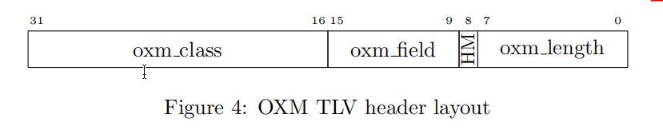
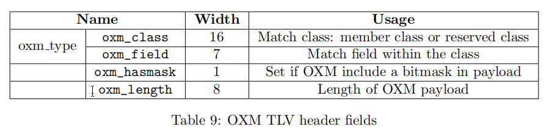
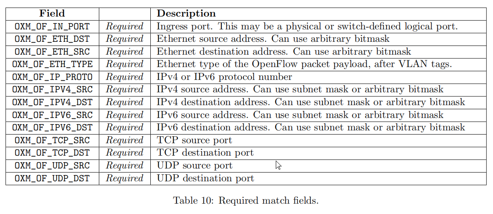
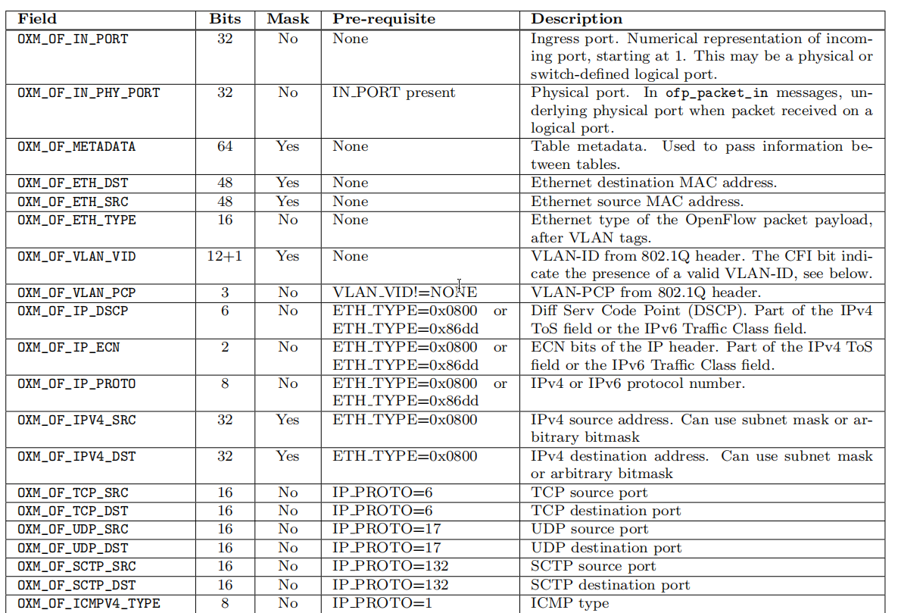
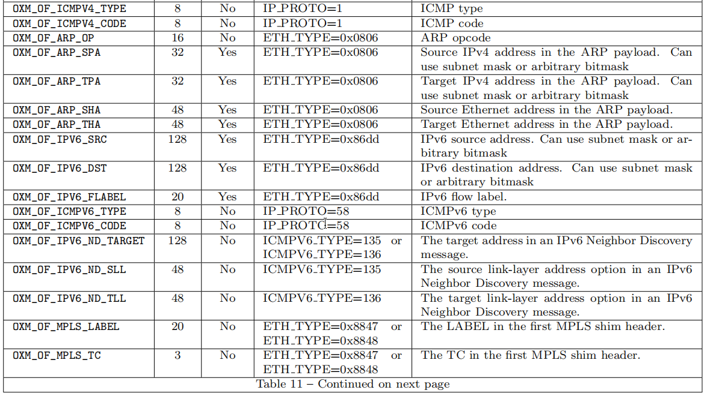
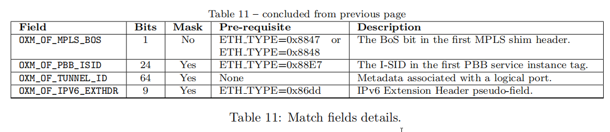
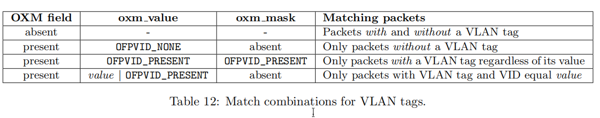

<center>
Openflow spec v1.3.0 the openflow protocol
</center>

<!--more-->

## The OpenFlow Protocol

OpenFlow swicth规范的核心是用于OpenFlow协议消息的一组结构。

下面描述的结构、定义和枚举来自于include/openflow/openflow.h的文件，这是标准OpenFlow规范分布的一部分。所有结构都装有偏移和8字节对齐，由断言语句检查。所有的OpenFlow消息都以大端格式发送。

### OpenFlow Header

每个OpenFlow消息都以OpenFlow的标题开头：

```
/* Header on all OpenFlow packets. */
struct ofp_header {
uint8_t version; /* OFP_VERSION. */
uint8_t type; /* One of the OFPT_ constants. */
uint16_t length; /* Length including this ofp_header. */
uint32_t xid; /* Transaction id associated with this packet.
Replies use the same id as was in the request
to facilitate pairing. */
};
OFP_ASSERT(sizeof(struct ofp_header) == 8);
```

version指定了正在使用的OpenFlow协议版本。在OpenFlow协议的早期起草阶段，最重要的位被设置为表示一个实验版本。下面的位表示协议的修订号。当前版本为0x04。

length字段表示消息的总长度，因此不使用额外的框架来区分一帧和下一帧。该类型可以具有以下值：

```
enum ofp_type {
/* Immutable messages. */
OFPT_HELLO = 0, /* Symmetric message */
OFPT_ERROR = 1, /* Symmetric message */
OFPT_ECHO_REQUEST = 2, /* Symmetric message */
OFPT_ECHO_REPLY = 3, /* Symmetric message */
OFPT_EXPERIMENTER = 4, /* Symmetric message */
/* Switch configuration messages. */
OFPT_FEATURES_REQUEST = 5, /* Controller/switch message */
OFPT_FEATURES_REPLY = 6, /* Controller/switch message */
OFPT_GET_CONFIG_REQUEST = 7, /* Controller/switch message */
OFPT_GET_CONFIG_REPLY = 8, /* Controller/switch message */
OFPT_SET_CONFIG = 9, /* Controller/switch message */
/* Asynchronous messages. */
OFPT_PACKET_IN = 10, /* Async message */
OFPT_FLOW_REMOVED = 11, /* Async message */
OFPT_PORT_STATUS = 12, /* Async message */
/* Controller command messages. */
OFPT_PACKET_OUT = 13, /* Controller/switch message */
OFPT_FLOW_MOD = 14, /* Controller/switch message */
OFPT_GROUP_MOD = 15, /* Controller/switch message */
OFPT_PORT_MOD = 16, /* Controller/switch message */
OFPT_TABLE_MOD = 17, /* Controller/switch message */
/* Multipart messages. */
OFPT_MULTIPART_REQUEST = 18, /* Controller/switch message */
OFPT_MULTIPART_REPLY = 19, /* Controller/switch message */
/* Barrier messages. */
OFPT_BARRIER_REQUEST = 20, /* Controller/switch message */
OFPT_BARRIER_REPLY = 21, /* Controller/switch message */
/* Queue Configuration messages. */
OFPT_QUEUE_GET_CONFIG_REQUEST = 22, /* Controller/switch message */
OFPT_QUEUE_GET_CONFIG_REPLY = 23, /* Controller/switch message */
/* Controller role change request messages. */
OFPT_ROLE_REQUEST = 24, /* Controller/switch message */
OFPT_ROLE_REPLY = 25, /* Controller/switch message */
/* Asynchronous message configuration. */
OFPT_GET_ASYNC_REQUEST = 26, /* Controller/switch message */
OFPT_GET_ASYNC_REPLY = 27, /* Controller/switch message */
OFPT_SET_ASYNC = 28, /* Controller/switch message */
/* Meters and rate limiters configuration messages. */
OFPT_METER_MOD = 29, /* Controller/switch message */
};
```

### Common Structures

本节描述了多种消息类型所使用的结构。

#### Port Structures

OpenFlow pipeline通过端口接收和发送数据包。交换机可以定义物理端口和逻辑端口，而OpenFlow规范定义了一些保留端口（参见4.1）。

物理端口、交换机定义的逻辑端口和OFPP_LOCAL保留端口的结构描述如下:

```
/* Description of a port */
struct ofp_port {
uint32_t port_no;
uint8_t pad[4];
uint8_t hw_addr[OFP_ETH_ALEN];
uint8_t pad2[2]; /* Align to 64 bits. */
char name[OFP_MAX_PORT_NAME_LEN]; /* Null-terminated */
uint32_t config; /* Bitmap of OFPPC_* flags. */
uint32_t state; /* Bitmap of OFPPS_* flags. */
/* Bitmaps of OFPPF_* that describe features. All bits zeroed if
* unsupported or unavailable. */
uint32_t curr; /* Current features. */
uint32_t advertised; /* Features being advertised by the port. */
uint32_t supported; /* Features supported by the port. */
uint32_t peer; /* Features advertised by peer. */
uint32_t curr_speed; /* Current port bitrate in kbps. */
uint32_t max_speed; /* Max port bitrate in kbps */
};
OFP_ASSERT(sizeof(struct ofp_port) == 64);
```

port_no字段可唯一地标识交换机内的一个端口。hw_addr字段通常是该端口的MAC地址；OFP_MAX_ETH_ALEN为6。名称字段是一个以空结尾的字符串，其中包含接口的可读名称。OFP_MAX_PORT_NAME_LEN的值是16。

config字段描述了端口管理设置，其结构如下：

```
/* Flags to indicate behavior of the physical port. These flags are
* used in ofp_port to describe the current configuration. They are
* used in the ofp_port_mod message to configure the port’s behavior.
*/
enum ofp_port_config {
OFPPC_PORT_DOWN = 1 << 0, /* Port is administratively down. */
OFPPC_NO_RECV = 1 << 2, /* Drop all packets received by port. */
OFPPC_NO_FWD = 1 << 5, /* Drop packets forwarded to port. */
OFPPC_NO_PACKET_IN = 1 << 6 /* Do not send packet-in msgs for port. */
};
```

OFPPC_PORT_DOWN位表示端口已经被关闭，不应该被OpenFlow使用。OFPPC_NO_RECV位表示应该忽略在该端口上接收到的数据包。OFPPC_NO_FWD位表示OpenFlow不应该向该端口发送数据包。OFPPFL_NO_PACKET_IN位表示，该端口上生成table-miss的包永远不会触发发送给控制器的packet-in消息。

一般来说，端口配置位是由控制器设置的，而不是由交换机改变的。这些位可能对控制器实现诸如STP或BFD等协议很有用。如果交换机通过另一个管理接口更改了端口配置位，则交换机将发送一条OFPT_PORT_STATUS消息，通知控制器该更改。

state字段描述了端口的内部状态，其结构如下：

```
/* Current state of the physical port. These are not configurable from
* the controller.
*/
enum ofp_port_state {
OFPPS_LINK_DOWN = 1 << 0, /* No physical link present. */
OFPPS_BLOCKED = 1 << 1, /* Port is blocked */
OFPPS_LIVE = 1 << 2, /* Live for Fast Failover Group. */
};
```

端口状态位表示在OpenFlow之外的物理链路或交换机协议的状态

OFPPS_LINK_DOWN位表示物理link不存在。OFPPS_BLOCKED位表示是一个OpenFlow之外的交换机协议，如802.1D生成树，正在阻止使用OFPP_FLOOD使用该端口。

所有端口状态位都是只读的，控制器不能更改。当端口标志更改时，交换机发送OFPT_PORT_STATUS消息通知控制器更改。

端口号使用以下约定：

```
/* Port numbering. Ports are numbered starting from 1. */
enum ofp_port_no {
/* Maximum number of physical and logical switch ports. */
OFPP_MAX = 0xffffff00,
/* Reserved OpenFlow Port (fake output "ports"). */
OFPP_IN_PORT = 0xfffffff8, /* Send the packet out the input port. This
reserved port must be explicitly used
in order to send back out of the input
port. */
OFPP_TABLE = 0xfffffff9, /* Submit the packet to the first flow table
NB: This destination port can only be
used in packet-out messages. */
OFPP_NORMAL = 0xfffffffa, /* Process with normal L2/L3 switching. */
OFPP_FLOOD = 0xfffffffb, /* All physical ports in VLAN, except input
port and those blocked or link down. */
OFPP_ALL = 0xfffffffc, /* All physical ports except input port. */
OFPP_CONTROLLER = 0xfffffffd, /* Send to controller. */
OFPP_LOCAL = 0xfffffffe, /* Local openflow "port". */
OFPP_ANY = 0xffffffff /* Wildcard port used only for flow mod
(delete) and flow stats requests. Selects
all flows regardless of output port
(including flows with no output port). */
};
```

curr、advertised、supported和peer字段表示链路模式（速度和重复性）、链路类型（铜/光纤）和链路特性（自动协商和暂停）。端口特征由以下结构表示：

```
/* Features of ports available in a datapath. */
enum ofp_port_features {
OFPPF_10MB_HD = 1 << 0, /* 10 Mb half-duplex rate support. */
OFPPF_10MB_FD = 1 << 1, /* 10 Mb full-duplex rate support. */
OFPPF_100MB_HD = 1 << 2, /* 100 Mb half-duplex rate support. */
OFPPF_100MB_FD = 1 << 3, /* 100 Mb full-duplex rate support. */
OFPPF_1GB_HD = 1 << 4, /* 1 Gb half-duplex rate support. */
OFPPF_1GB_FD = 1 << 5, /* 1 Gb full-duplex rate support. */
OFPPF_10GB_FD = 1 << 6, /* 10 Gb full-duplex rate support. */
OFPPF_40GB_FD = 1 << 7, /* 40 Gb full-duplex rate support. */
OFPPF_100GB_FD = 1 << 8, /* 100 Gb full-duplex rate support. */
OFPPF_1TB_FD = 1 << 9, /* 1 Tb full-duplex rate support. */
OFPPF_OTHER = 1 << 10, /* Other rate, not in the list. */
OFPPF_COPPER = 1 << 11, /* Copper medium. */
OFPPF_FIBER = 1 << 12, /* Fiber medium. */
OFPPF_AUTONEG = 1 << 13, /* Auto-negotiation. */
OFPPF_PAUSE = 1 << 14, /* Pause. */
OFPPF_PAUSE_ASYM = 1 << 15 /* Asymmetric pause. */
};
```

可以同时设置多个这些标志。如果没有设置任何端口速度标志，则会使用max_speed或curr_speed。

curr_speed和max_speed字段表示链路的当前和最大比特率（原始传输速度），单位为kbps。数字应该舍入以匹配常用用法。例如，一个光学10Gb的以太网端口应该将此字段设置为10000000（而不是10312500），而一个OC-192端口应该将该字段设置为10000000（而不是9953280）。

max_speed字段表示链路的最大配置容量，而curr_speed则表示当前容量。如果端口有3个1Gb/s个容量的链接，LAG的一个端口关闭，一个端口以1Gb/s自动协商，1个端口以100Mb/s自动协商，max_speed为3Gb/s，curr_speed为1.1Gb/s。

#### Queue Structures

OpenFlow交换机通过一个简单的排队机制提供了有限的服务质量支持(QoS)。一个（或多个）队列可以附加到一个端口，并用于在该端口上映射流条目。映射到特定队列的流条目将根据该队列的配置（例如，分钟速率）进行处理。

一个队列由ofp_packet_queue结构来描述。

```
/* Full description for a queue. */
struct ofp_packet_queue {
uint32_t queue_id; /* id for the specific queue. */
uint32_t port; /* Port this queue is attached to. */
uint16_t len; /* Length in bytes of this queue desc. */
uint8_t pad[6]; /* 64-bit alignment. */
struct ofp_queue_prop_header properties[0]; /* List of properties. */
};
OFP_ASSERT(sizeof(struct ofp_packet_queue) == 16);
```

每个队列都由一组属性进一步描述，每个属性都具有特定的类型和配置

```
enum ofp_queue_properties {
OFPQT_MIN_RATE = 1, /* Minimum datarate guaranteed. */
OFPQT_MAX_RATE = 2, /* Maximum datarate. */
OFPQT_EXPERIMENTER = 0xffff /* Experimenter defined property. */
};
```

每个队列属性描述都以一个公共标头开头：

```
/* Common description for a queue. */
struct ofp_queue_prop_header {
uint16_t property; /* One of OFPQT_. */
uint16_t len; /* Length of property, including this header. */
uint8_t pad[4]; /* 64-bit alignemnt. */
};
OFP_ASSERT(sizeof(struct ofp_queue_prop_header) == 8);
```

最小速率队列属性使用以下结构和字段：

```
/* Min-Rate queue property description. */
struct ofp_queue_prop_min_rate {
struct ofp_queue_prop_header prop_header; /* prop: OFPQT_MIN, len: 16. */
uint16_t rate; /* In 1/10 of a percent; >1000 -> disabled. */
uint8_t pad[6]; /* 64-bit alignment */
};
OFP_ASSERT(sizeof(struct ofp_queue_prop_min_rate) == 16);
```

最大速率队列属性使用以下结构和字段：

```
/* Max-Rate queue property description. */
struct ofp_queue_prop_max_rate {
struct ofp_queue_prop_header prop_header; /* prop: OFPQT_MAX, len: 16. */
uint16_t rate; /* In 1/10 of a percent; >1000 -> disabled. */
uint8_t pad[6]; /* 64-bit alignment */
};
OFP_ASSERT(sizeof(struct ofp_queue_prop_max_rate) == 16);
```

实验者队列属性使用以下结构和字段：

```
/* Experimenter queue property description. */
struct ofp_queue_prop_experimenter {
struct ofp_queue_prop_header prop_header; /* prop: OFPQT_EXPERIMENTER, len: 16. */
uint32_t experimenter; /* Experimenter ID which takes the same
form as in struct
ofp_experimenter_header. */
uint8_t pad[4]; /* 64-bit alignment */
uint8_t data[0]; /* Experimenter defined data. */
};
OFP_ASSERT(sizeof(struct ofp_queue_prop_experimenter) == 16);
```

实验者队列属性体的其余部分不被标准的OpenFlow处理所解释，并由相应的实验者任意定义。

#### Flow Match Structures

OpenFlow匹配由一个流匹配头和一个零或多个流匹配字段序列组成。

##### Flow Match Header

流匹配标头由ofp_match结构描述：

```
/* Fields to match against flows */
struct ofp_match {
uint16_t type; /* One of OFPMT_* */
uint16_t length; /* Length of ofp_match (excluding padding) */
/* Followed by:
* - Exactly (length - 4) (possibly 0) bytes containing OXM TLVs, then
* - Exactly ((length + 7)/8*8 - length) (between 0 and 7) bytes of
* all-zero bytes
* In summary, ofp_match is padded as needed, to make its overall size
* a multiple of 8, to preserve alignement in structures using it.
*/
uint8_t oxm_fields[4]; /* OXMs start here - Make compiler happy */
};
OFP_ASSERT(sizeof(struct ofp_match) == 8);
```

type字段设置为OFPMT_OXM，length字段设置为包含所有匹配字段的ofp_match结构的实际长度。OpenFlow匹配的有效负载是一组OXMFlow匹配字段。

```
/* The match type indicates the match structure (set of fields that compose the
* match) in use. The match type is placed in the type field at the beginning
* of all match structures. The "OpenFlow Extensible Match" type corresponds
* to OXM TLV format described below and must be supported by all OpenFlow
* switches. Extensions that define other match types may be published on the
* ONF wiki. Support for extensions is optional.
*/
enum ofp_match_type {
OFPMT_STANDARD = 0, /* Deprecated. */
OFPMT_OXM = 1, /* OpenFlow Extensible Match */
};
```

此规范中唯一有效的匹配类型是OFPMT_OXM，它不反对使用OpenFlow1.1匹配类型OFPMT_STANDARD。如果使用替代匹配类型，匹配字段和有效负载可能设置不同，但这超出了本规范的范围。

##### Flow Match Field Structures

流匹配字段使用OpenFlow可扩展匹配(OXM)格式进行描述，这是一种紧凑的类型-长度-值(TLV)格式。每个OXMTLV长5到259（包括）字节。OXMtlv没有对齐到任何多字节边界上或没有填充。OXMTLV的前4个字节是它的头，后面是条目目的主体

OXMTLV的头按网络字节顺序解释为32位单词（见图4）。


OXMTLV的报头字段在表9中都有定义。
oxm_class是一个包含相关匹配类型的OXM匹配类，在a.2.3.3节中也有描述。oxm_field是一个特定于类的值，它标识匹配类中的匹配类型之一。oxm_class和oxm_field（报头中最重要的23位）的组合被统称为oxm_type。oxm_type通常指定一个协议报头字段，如以太网类型，但它也可以引用数据包元数据，如数据包到达的交换机端口。



oxm_hasmask定义了OXMTLV是否包含一个位掩码，更多的细节将在A.2.3.5节中解释。

oxm_length是一个正整数，以字节表示OXMTLV有效负载的长度。OXMTLV的长度，包括标头，正好是4+oxm_length字节

对于给定的oxm_class、oxm_field和oxm_hasmask值，oxm_length是一个常数。它只包括允许软件最低限度地解析未知类型的OXMtlv。(类似地，对于一个给定的oxm_class、oxm_field和oxm_length，oxm_hasmask是一个常数。)

##### OXM classes

匹配类型使用OXM匹配类进行构造。OpenFlow规范区分了两种类型的OXM匹配类，即ONF成员类和ONF保留类，并根据它们的高阶位来区分。高阶位设置为1的类是ONF保留类，它们用于OpenFlow规范本身。高阶位设置为零的类是ONF成员类，它们由ONF根据需要分配，它们唯一地标识一个ONF成员，并且可以被该成员任意使用。对ONF成员类的支持是可选的。

已定义了以下OXM类:

```
/* OXM Class IDs.
* The high order bit differentiate reserved classes from member classes.
* Classes 0x0000 to 0x7FFF are member classes, allocated by ONF.
* Classes 0x8000 to 0xFFFE are reserved classes, reserved for standardisation.
*/
enum ofp_oxm_class {
OFPXMC_NXM_0 = 0x0000, /* Backward compatibility with NXM */
OFPXMC_NXM_1 = 0x0001, /* Backward compatibility with NXM */
OFPXMC_OPENFLOW_BASIC = 0x8000, /* Basic class for OpenFlow */
OFPXMC_EXPERIMENTER = 0xFFFF, /* Experimenter class */
};
```

类OFPXMC_OPENFLOW_BASIC包含OpenFlow匹配字段的基本集(请参见A.2.3.7)。可选的类OFPXMC_EXPERIMENTER用于实验者匹配(见A.2.3.8)。其他ONF保留类被保留以供将来使用，如规范的模块化。前两个ONF成员类OFPXMC_NXM_0和OFPXMC_NXM_1被保留为与Nicira可扩展匹配(NXM)规范向后兼容。

##### Flow Matching

一个零长度的OpenFlow匹配(一个没有OXMtlv的匹配)匹配每个数据包。在OpenFlow匹配中将省略应该使用通配符的匹配字段。
OXMTLV对OpenFlow匹配匹配的数据包进行约束：

* 如果oxm_hasmask为0，则OXMTLV的主体包含一个字段的值，称为oxm_value。OXMTLV匹配只匹配对应字段等于oxm_value的数据包。
* 如果oxm_hasmask为1，那么oxm_entry的主体将包含一个字段的值(oxm_value)，后面是一个与该值具有相同长度的位掩码，称为oxm_mask。OXMTLV匹配只匹配由oxm_mask定义的位的对应字段等于oxm_value的数据包。

当有多个OXMTLVs时，必须满足所有的约束条件：数据包字段必须匹配OpenFlow匹配中的所有OXMTLVs部分。不存在的OXMtlv的字段被通配符化到ANY，省略的OXMtlv被有效地完全屏蔽为零。

##### Flow Match Field Masking

当oxm_hasmask为1时，OXMTLV包含一个位掩码，其长度有效地增加了一倍，所以oxm_length总是偶数。位掩码遵循字段值，并以相同的方式进行编码。掩码的定义为，给定位位置的0表示对应字段中同一位的“不在乎”匹配，而1表示该位完全匹配

一个全零位的oxm_mask相当于完全省略了OXMTLV。一个全一位的oxm_mask相当于为oxm_hasmask指定0并省略oxm_mask

某些oxm_types可能不支持掩码通配符，即，当指定这些字段时，oxm_hasmask必须始终为0。例如，标识接收到数据包的进入端口的字段可能不会被打上掩码。

一些确实支持掩码通配符的oxm_types可能只支持某些oxm_mask模式。例如，一些具有IPv4地址值的字段可能被限制为CIDR掩码（子网掩码）

这些限制在针对单个字段的规范中都有详细说明。交换机可以接受规范不允许的oxm_hasmask或oxm_mask值，但只有当交换机正确地实现了对该oxm_hasmask或oxm_mask值的支持时。交换机必须拒绝尝试设置包含其不支持的oxm_hasmask或oxm_mask值的流入口（请参见6.4）。

##### Flow Match Field Prerequisite

具有给定oxm_type的OXMTLV的存在可能会根据其他OXMtlv的存在或值加以限制。一般来说，只有当OpenFlow明确匹配相应的协议时，才能匹配协议的头字段。

例如：

* 只有在IPV4SRC的oxm_type=OXM_OF_ETH_TYPE、oxm_hasmask=0和oxm_value=0x0800的条目之前，才允许IPV4SRC的OXMTLV。也就是说，只有当以太网类型显式设置为IPv4时，才允许对IPv4源地址进行匹配。
* 只有在oxm_type=OXM_OF_TCP_SRC的OXMTLV之前有oxm_type=OXM_OF_ETH_TYPE，oxm_hasmask=0，oxm_value=0x0800或0x86dd，以及另一个oxm_type=OXM_OF_IP_PROTO，oxm_hasmask=0, oxm_value=6,。也就是说，只有当以太网类型为IP，IP协议为TCP时，才允许在TCP源端口上进行匹配。
* 只有在前面输入oxm_type=OXM_OF_ETH_TYPE、oxm_hasmask=0、oxm_value=0x8847或0x8848之前，才允许使用oxm_type=OXM_OF_MPLS标签的OXMTLV。
* 只有在前面有oxm_type=OXM_OF_VLAN_VID，oxm_value！=OFPVID_NONE时才允许oxm_type=OXM_OF_VLAN_PCP的OXMTLV。

这些限制已在各个字段的规范中注明。交换机可以实现这些限制的放宽版本。例如，一个交换机可能根本不接受任何先决条件。交换机必须拒绝尝试设置违反其限制的流条目（见6.4），并且必须处理由于缺乏先决条件(例如同时匹配TCP源端口和UDP目标端口)而创建的不一致匹配。

由成员定义的新匹配字段（在成员类中或作为实验者字段）可能为已经指定的匹配字段提供替代的先决条件。例如，这可以用来通过替代链路技术(如PPP)重用现有的IP匹配字段，通过根据需要替换ETH_TYPE先决条件(对于PPP，这可以是一个假设的PPP_PROTOCOL字段)。

具有先决条件限制的OXMTLV必须出现在其先决条件之后。在OpenFlow匹配中对OXMtlv的排序不受其他限制。

任何给定的oxm_type最多可能出现在OpenFlow匹配中一次，否则该switch必须生成一个错误（参见6.4）。switch可以实现此规则的宽松版本，并且在某些情况下可以允许oxm_type在OpenFlow匹配中多次出现，但是匹配的行为是由实现定义的。

##### Flow Match Fields

该规范用oxm_class=OFPXMC_OPENFLOW_BASIC定义了一组默认的匹配字段，它可以有以下值：

```
/* OXM Flow match field types for OpenFlow basic class. */
enum oxm_ofb_match_fields {
OFPXMT_OFB_IN_PORT = 0, /* Switch input port. */
OFPXMT_OFB_IN_PHY_PORT = 1, /* Switch physical input port. */
OFPXMT_OFB_METADATA = 2, /* Metadata passed between tables. */
OFPXMT_OFB_ETH_DST = 3, /* Ethernet destination address. */
OFPXMT_OFB_ETH_SRC = 4, /* Ethernet source address. */
OFPXMT_OFB_ETH_TYPE = 5, /* Ethernet frame type. */
OFPXMT_OFB_VLAN_VID = 6, /* VLAN id. */
OFPXMT_OFB_VLAN_PCP = 7, /* VLAN priority. */
OFPXMT_OFB_IP_DSCP = 8, /* IP DSCP (6 bits in ToS field). */
OFPXMT_OFB_IP_ECN = 9, /* IP ECN (2 bits in ToS field). */
OFPXMT_OFB_IP_PROTO = 10, /* IP protocol. */
OFPXMT_OFB_IPV4_SRC = 11, /* IPv4 source address. */
OFPXMT_OFB_IPV4_DST = 12, /* IPv4 destination address. */
OFPXMT_OFB_TCP_SRC = 13, /* TCP source port. */
OFPXMT_OFB_TCP_DST = 14, /* TCP destination port. */
OFPXMT_OFB_UDP_SRC = 15, /* UDP source port. */
OFPXMT_OFB_UDP_DST = 16, /* UDP destination port. */
OFPXMT_OFB_SCTP_SRC = 17, /* SCTP source port. */
OFPXMT_OFB_SCTP_DST = 18, /* SCTP destination port. */
OFPXMT_OFB_ICMPV4_TYPE = 19, /* ICMP type. */
OFPXMT_OFB_ICMPV4_CODE = 20, /* ICMP code. */
OFPXMT_OFB_ARP_OP = 21, /* ARP opcode. */
OFPXMT_OFB_ARP_SPA = 22, /* ARP source IPv4 address. */
OFPXMT_OFB_ARP_TPA = 23, /* ARP target IPv4 address. */
OFPXMT_OFB_ARP_SHA = 24, /* ARP source hardware address. */
OFPXMT_OFB_ARP_THA = 25, /* ARP target hardware address. */
OFPXMT_OFB_IPV6_SRC = 26, /* IPv6 source address. */
OFPXMT_OFB_IPV6_DST = 27, /* IPv6 destination address. */
OFPXMT_OFB_IPV6_FLABEL = 28, /* IPv6 Flow Label */
OFPXMT_OFB_ICMPV6_TYPE = 29, /* ICMPv6 type. */
OFPXMT_OFB_ICMPV6_CODE = 30, /* ICMPv6 code. */
OFPXMT_OFB_IPV6_ND_TARGET = 31, /* Target address for ND. */
OFPXMT_OFB_IPV6_ND_SLL = 32, /* Source link-layer for ND. */
OFPXMT_OFB_IPV6_ND_TLL = 33, /* Target link-layer for ND. */
OFPXMT_OFB_MPLS_LABEL = 34, /* MPLS label. */
OFPXMT_OFB_MPLS_TC = 35, /* MPLS TC. */
OFPXMT_OFP_MPLS_BOS = 36, /* MPLS BoS bit. */
OFPXMT_OFB_PBB_ISID = 37, /* PBB I-SID. */
OFPXMT_OFB_TUNNEL_ID = 38, /* Logical Port Metadata. */
OFPXMT_OFB_IPV6_EXTHDR = 39, /* IPv6 Extension Header pseudo-field */
};
```

不需要一个switch来支持所有的匹配字段类型，只支持表10中列出的那些类型。这些必需的匹配字段不需要在同一个表查找中实现。控制器可以查询它支持的其他字段的switch。



所有匹配字段都有不同的大小、先决条件和屏蔽能力，如表11所示。如果在字段描述中没有明确指定，则每个字段类型引用包头中字段的最外部出现。





入口端口OXM_OF_IN_PORT是一个有效的标准OpenFlow端口，包括物理端口、逻辑端口、OFPP_LOCAL保留端口或OFPP_CONTROLLER保留端口。物理端口OXM_OF_IN_PHY_PORT在packe-in消息中用于标识逻辑端口下面的物理端口（参见A.4.1）。

metadata字段OXM_OF_METADATA用于在跨多个表的查找之间传递信息。这个值可以被任意屏蔽。tunnel_id字段OXM_OF_TUNNEL_ID携带与逻辑端口相关联的可选元数据。此元数据的映射是由逻辑端口实现定义的，例如，如果逻辑端口执行封装（如GRE），这将是来自封装头的解复用字段（对于GRE，为32位键）。如果逻辑端口不提供此类数据，或者如果在物理端口上接收到数据包，则其值为零。

省略OFPXMT_OFB_VLAN_VID字段指定流条目应该与数据包匹配，而不管它们是否包含相应的标记。下面为VLAN标记定义了特殊值，以允许数据包与任何标记进行匹配，独立于标记的值，并支持不使用VLAN标记的匹配数据包。为OFPXMT_OFB_VLAN_VID定义的特殊值有：

```
/* The VLAN id is 12-bits, so we can use the entire 16 bits to indicate
* special conditions.
*/
enum ofp_vlan_id {
OFPVID_PRESENT = 0x1000, /* Bit that indicate that a VLAN id is set */
OFPVID_NONE = 0x0000, /* No VLAN id was set. */
};
```

当OFPXMT_OFB_VLAN_VID字段为通配符（不存在）或当OFPXMT_OFB_VLAN_VID的值设置为OFPVID_NONE时，必须拒绝OFPXMT_OFB_VLAN_PCP字段。表12总结了特定VLAN标记匹配的通配符位和字段值的组合。



字段OXM_OF_IPV6_EXTHDR是一个伪字段，表示数据包头中存在各种IPv6扩展头。IPv6扩展头位在字段OXM_OF_IPV6_EXTHDR中组合在一起，这些位可以具有以下值：

```
/* Bit definitions for IPv6 Extension Header pseudo-field. */
enum ofp_ipv6exthdr_flags {
OFPIEH_NONEXT = 1 << 0, /* "No next header" encountered. */
OFPIEH_ESP = 1 << 1, /* Encrypted Sec Payload header present. */
OFPIEH_AUTH = 1 << 2, /* Authentication header present. */
OFPIEH_DEST = 1 << 3, /* 1 or 2 dest headers present. */
OFPIEH_FRAG = 1 << 4, /* Fragment header present. */
OFPIEH_ROUTER = 1 << 5, /* Router header present. */
```

* 如果IPv6扩展头是包中的第一个扩展头，则OFPIEH_HOP设置为1。
* 如果存在路由器IPv6扩展头，则OFPIEH_ROUTER设置为1。
* 如果存在碎片IPv6扩展头，则将OFPIEH_FRAG设置为1。碎片处理目前在交换机级别进行处理（参见A.3.2）。
* 如果存在一个或多个目标选项IPv6扩展头，则OFPIEH_DEST设置为1。在一个IPv6包中有一到两个这些包是正常的(参见RFC2460)。
* 如果存在身份验证IPv6扩展头，则OFPIEH_AUTH设置为1。
* 如果存在加密安全有效负载IPv6扩展头，OFPIEH_ESP设置为1。
* 如果存在没有下一个头IPv6扩展头，则OFPIEH_NONEXT设置为1。
* 如果IPv6扩展头不按照RFC2460首选的顺序（但不需要），则OFPIEH_UNSEQ设置为1。
* 如果意外遇到多个给定的IPv6扩展头，则将OFPIEH_UNREP设置为1。（可能需要两个目标选项头，但不会导致设置此位。）

##### Experimenter Flow Match Fields

支持特定于实验者的流匹配字段是可选的。可以使用oxm_class=OFPXMC_EXPERIMENTER定义实验者特定的流匹配字段。OXMTLV主体的前四个字节包含实验者标识符，它的形式与结构体ofp_experimenter相同。oxm_field和其他的OXMTLV都是由实验者定义的，不需要填充或对齐。

```
/* Header for OXM experimenter match fields. */
struct ofp_oxm_experimenter_header {
uint32_t oxm_header; /* oxm_class = OFPXMC_EXPERIMENTER */
uint32_t experimenter; /* Experimenter ID which takes the same
form as in struct ofp_experimenter_header. */
};
OFP_ASSERT(sizeof(struct ofp_oxm_experimenter_header) == 8);
```


#### Flow Instruction Structures

当流与该条目匹配时，将执行与流表条目关联的流指令。当前已定义的指令列表包括：

```
enum ofp_instruction_type {
OFPIT_GOTO_TABLE = 1, /* Setup the next table in the lookup
pipeline */
OFPIT_WRITE_METADATA = 2, /* Setup the metadata field for use later in
pipeline */
OFPIT_WRITE_ACTIONS = 3, /* Write the action(s) onto the datapath action
set */
OFPIT_APPLY_ACTIONS = 4, /* Applies the action(s) immediately */
OFPIT_CLEAR_ACTIONS = 5, /* Clears all actions from the datapath
action set */
OFPIT_METER = 6, /* Apply meter (rate limiter) */
OFPIT_EXPERIMENTER = 0xFFFF /* Experimenter instruction */
};
```

该指令集在第5.9节中进行了描述。流表可能支持一个指令类型的子集。
OFPIT_GOTO_TABLE指令使用以下结构和字段：

```
/* Instruction structure for OFPIT_GOTO_TABLE */
struct ofp_instruction_goto_table {
uint16_t type; /* OFPIT_GOTO_TABLE */
uint16_t len; /* Length of this struct in bytes. */
uint8_t table_id; /* Set next table in the lookup pipeline */
uint8_t pad[3]; /* Pad to 64 bits. */
};
OFP_ASSERT(sizeof(struct ofp_instruction_goto_table) == 8);
```

table_id表示数据包处理管道中的下一个表。

OFPIT_WRITE_METADATA指令使用以下结构和字段：

```
/* Instruction structure for OFPIT_WRITE_METADATA */
struct ofp_instruction_write_metadata {
uint16_t type; /* OFPIT_WRITE_METADATA */
uint16_t len; /* Length of this struct in bytes. */
uint8_t pad[4]; /* Align to 64-bits */
uint64_t metadata; /* Metadata value to write */
uint64_t metadata_mask; /* Metadata write bitmask */
};
OFP_ASSERT(sizeof(struct ofp_instruction_write_metadata) == 24);
```

可以使用metadata和metadata_mask来编写下一个表查找的元数据，以便在匹配字段上设置特定的位。如果未指定此指令，则传递元数据，保持不变。

OFPIT_WRITE_ACTIONS、OFPIT_APPLY_ACTIONS和OFPIT_CLEAR_ACTIONS说明使用以下结构和字段：

```
/* Instruction structure for OFPIT_WRITE/APPLY/CLEAR_ACTIONS */
struct ofp_instruction_actions {
uint16_t type; /* One of OFPIT_*_ACTIONS */
uint16_t len; /* Length of this struct in bytes. */
uint8_t pad[4]; /* Align to 64-bits */
struct ofp_action_header actions[0]; /* Actions associated with
OFPIT_WRITE_ACTIONS and
OFPIT_APPLY_ACTIONS */
};
OFP_ASSERT(sizeof(struct ofp_instruction_actions) == 8);
```

对于“apply-actions”指令，actions字段将视为列表，操作将按顺序应用到数据包。对于“write-actions”指令，actions字段视为集，并将操作合并到当前操作集中。

对于清除操作指令，该结构不包含任何操作。

OFPIT_METER指令使用以下结构和字段：

```
/* Instruction structure for OFPIT_METER */
struct ofp_instruction_meter {
uint16_t type; /* OFPIT_METER */
uint16_t len; /* Length is 8. */
uint32_t meter_id; /* Meter instance. */
};
OFP_ASSERT(sizeof(struct ofp_instruction_meter) == 8);
```

meter_id指示在数据包上应用哪个仪表。

#### Action Structures

许多操作可能与流条目、组或数据包相关联。当前所定义的操作类型为：

```
enum ofp_action_type {
OFPAT_OUTPUT = 0, /* Output to switch port. */
OFPAT_COPY_TTL_OUT = 11, /* Copy TTL "outwards" -- from next-to-outermost
to outermost */
OFPAT_COPY_TTL_IN = 12, /* Copy TTL "inwards" -- from outermost to
next-to-outermost */
OFPAT_SET_MPLS_TTL = 15, /* MPLS TTL */
OFPAT_DEC_MPLS_TTL = 16, /* Decrement MPLS TTL */
OFPAT_PUSH_VLAN = 17, /* Push a new VLAN tag */
OFPAT_POP_VLAN = 18, /* Pop the outer VLAN tag */
OFPAT_PUSH_MPLS = 19, /* Push a new MPLS tag */
OFPAT_POP_MPLS = 20, /* Pop the outer MPLS tag */
OFPAT_SET_QUEUE = 21, /* Set queue id when outputting to a port */
OFPAT_GROUP = 22, /* Apply group. */
OFPAT_SET_NW_TTL = 23, /* IP TTL. */
OFPAT_DEC_NW_TTL = 24, /* Decrement IP TTL. */
OFPAT_SET_FIELD = 25, /* Set a header field using OXM TLV format. */
OFPAT_PUSH_PBB = 26, /* Push a new PBB service tag (I-TAG) */
OFPAT_POP_PBB = 27, /* Pop the outer PBB service tag (I-TAG) */
OFPAT_EXPERIMENTER = 0xffff
};
```

output group和set queue操作见第5.12节，表6描述了标签push/pop操作，表11描述了它们的OXM类型中的设置字段操作。操作定义包含操作类型、长度和任何关联的数据。

```
/* Action header that is common to all actions. The length includes the
* header and any padding used to make the action 64-bit aligned.
* NB: The length of an action *must* always be a multiple of eight. */
struct ofp_action_header {
uint16_t type; /* One of OFPAT_*. */
uint16_t len; /* Length of action, including this
header. This is the length of action,
including any padding to make it
64-bit aligned. */
uint8_t pad[4];
};
OFP_ASSERT(sizeof(struct ofp_action_header) == 8);
```

output操作将使用以下结构和字段：

```
/* Action structure for OFPAT_OUTPUT, which sends packets out ’port’.
* When the ’port’ is the OFPP_CONTROLLER, ’max_len’ indicates the max
* number of bytes to send. A ’max_len’ of zero means no bytes of the
* packet should be sent. A ’max_len’ of OFPCML_NO_BUFFER means that
* the packet is not buffered and the complete packet is to be sent to
* the controller. */
struct ofp_action_output {
uint16_t type; /* OFPAT_OUTPUT. */
uint16_t len; /* Length is 16. */
uint32_t port; /* Output port. */
uint16_t max_len; /* Max length to send to controller. */
uint8_t pad[6]; /* Pad to 64 bits. */
};
OFP_ASSERT(sizeof(struct ofp_action_output) == 16);
```

该port指定应通过其发送数据包的端口。max_len表示当端口为OFPP_CONTROLLER时应该发送的数据包的最大数据量。

交换机必须发送数据包的零字节。max_len为OFPCML_NO_BUFFER表示应该发送完整的数据包，并且不应该被缓冲。

```
enum ofp_controller_max_len {
OFPCML_MAX = 0xffe5, /* maximum max_len value which can be used
to request a specific byte length. */
OFPCML_NO_BUFFER = 0xffff /* indicates that no buffering should be
applied and the whole packet is to be
sent to the controller. */
};
```

group操作将使用以下结构和字段：

```
/* Action structure for OFPAT_GROUP. */
struct ofp_action_group {
uint16_t type; /* OFPAT_GROUP. */
uint16_t len; /* Length is 8. */
uint32_t group_id; /* Group identifier. */
};
OFP_ASSERT(sizeof(struct ofp_action_group) == 8);
```

group_id表示用于处理此数据包的组。要应用的桶集取决于组类型。

“set-queue”操作设置将用于将流项映射到端口上已经配置的队列的队列id，而不考虑ToS和VLANPCP位。数据包不应该因为设置队列操作而更改。如果交换机需要设置ToS/PCP位以进行内部处理，则应在发送数据包之前恢复原始值。

交换机可能只支持绑定到特定PCP/ToS位的队列。在这种情况下，我们不能将任意的流项映射到特定的队列，因此不支持设置队列操作。用户仍然可以使用这些队列，并通过设置相关字段(TOS、VLANPCP)将流条目映射到它们。

set-queue操作使用以下结构和字段：

```
/* OFPAT_SET_QUEUE action struct: send packets to given queue on port. */
struct ofp_action_set_queue {
uint16_t type; /* OFPAT_SET_QUEUE. */
uint16_t len; /* Len is 8. */
uint32_t queue_id; /* Queue id for the packets. */
};
OFP_ASSERT(sizeof(struct ofp_action_set_queue) == 8);
```

一个SetMPLSTTL操作使用以下结构和字段：

```
/* Action structure for OFPAT_SET_MPLS_TTL. */
struct ofp_action_mpls_ttl {
uint16_t type; /* OFPAT_SET_MPLS_TTL. */
uint16_t len; /* Length is 8. */
uint8_t mpls_ttl; /* MPLS TTL */
uint8_t pad[3];
};
OFP_ASSERT(sizeof(struct ofp_action_mpls_ttl) == 8);
```

mpls_ttl字段是要设置的MPLSTTL。

DEC MPLSTTL操作不需要任何参数，只包含一个通用的ofp_action_header。该动作降低了MPLS的TTL。

SetIPv4TTL操作使用以下结构和字段：

```
/* Action structure for OFPAT_SET_NW_TTL. */
struct ofp_action_nw_ttl {
uint16_t type; /* OFPAT_SET_NW_TTL. */
uint16_t len; /* Length is 8. */
uint8_t nw_ttl; /* IP TTL */
uint8_t pad[3];
};
OFP_ASSERT(sizeof(struct ofp_action_nw_ttl) == 8);
```

nw_ttl字段是要在IP标头中设置的TTL地址。

DEC IPv4TTL操作不需要任何参数，只包含一个通用的ofp_action_header。如果存在IP头，此操作将减少头中的TTL。

CopyTTL outwards操作不需要任何参数，只包含一个通用的ofp_action_header。该操作将TTL从TTL的下到最外层头复制到TTL的最外层头。

CopyTTL inwards操作不包含任何参数，只包含一个通用的ofp_action_header。该操作将TTL从TTL的最外层标头复制到TTL的最外层标头。


push VLAN头操作、push MPLS头和push PBB头操作使用以下结构和字段：

```
/* Action structure for OFPAT_PUSH_VLAN/MPLS/PBB. */
struct ofp_action_push {
uint16_t type; /* OFPAT_PUSH_VLAN/MPLS/PBB. */
uint16_t len; /* Length is 8. */
uint16_t ethertype; /* Ethertype */
uint8_t pad[2];
};
OFP_ASSERT(sizeof(struct ofp_action_push) == 8);
```

ethertype表示新标记的以太类型。它用于推动一个新的VLAN标签，新的MPLS头PBLS或PBB服务标签。

PushPBB头操作逻辑地将新的PBB服务实例头推送到包(I-TAGTCI)，并将包的原始以太网地址复制到标签的客户地址(C-DA和C-SA)。I-TAG的客户地址位于封装的数据包的原始以太网地址的位置，因此该操作可以看作是将骨干MAC-in-MAC报头和I-SID字段添加到数据包的前面。骨干VLAN头(B-TAG)不通过此操作添加，它可以通过推送VLAN头操作添加。在此操作之后，可以使用常规的设置字段操作来修改外部以太网地址（B-DA和B-SA）。


pop VLAN头操作不需要任何参数，只由一个通用的ofp_action_header组成。该操作将从数据包中弹出最外层的VLAN标记。

PopPBB头操作不需要任何参数，只由一个通用的ofp_action_header组成。该操作在逻辑上从数据包中弹出最外部的PBB服务实例头，并在以太网地址中复制客户地址（数据包的C-DA和C-SA）。这个操作可以看作是从数据包的前面删除了主干MAC-in-MAC报头和I-SID字段。它不包括删除主干VLAN头(B-TAG)，应该在此操作之前通过PopVLAN头操作删除它。


pop MPLS标头操作使用以下结构和字段：

```
/* Action structure for OFPAT_POP_MPLS. */
struct ofp_action_pop_mpls {
uint16_t type; /* OFPAT_POP_MPLS. */
uint16_t len; /* Length is 8. */
uint16_t ethertype; /* Ethertype */
uint8_t pad[2];
};
OFP_ASSERT(sizeof(struct ofp_action_pop_mpls) == 8);
```

ethertype表示有效载荷的以太类型。

set-field操作使用以下结构和字段：

```
/* Action structure for OFPAT_SET_FIELD. */
struct ofp_action_set_field {
uint16_t type; /* OFPAT_SET_FIELD. */
uint16_t len; /* Length is padded to 64 bits. */
/* Followed by:
* - Exactly oxm_len bytes containing a single OXM TLV, then
* - Exactly ((oxm_len + 4) + 7)/8*8 - (oxm_len + 4) (between 0 and 7)
* bytes of all-zero bytes
*/
uint8_t field[4]; /* OXM TLV - Make compiler happy */
};
OFP_ASSERT(sizeof(struct ofp_action_set_field) == 8);
```

该field包含一个使用单个OXMTLV结构描述的头字段(参见A.2.3)。设置字段操作由OXMTLV的类型oxm_type定义，并使用OXMTLV的有效载荷oxm_value的值修改数据包中相应的报头字段。oxm_hasmask的值必须为零，且不包含任何oxm_mask。流条目的匹配必须包含响应于要设置的字段的OXM先决条件曲线(参见A.2.3.6)，否则必须生成一个错误（参见6.4）。

set-field操作的类型可以是任何有效的OXM标头类型，可能的OXM类型的列表在第a.2.3.7节和表11中描述。不支持OXM类型OFPXMT_OFB_IN_PORT、OXM_OF_IN_PHY_PORT和OFPXMT_OFB_METADATA的设置字段操作，因为它们不是头字段。“set-field”操作将覆盖由OXM类型指定的头字段，并根据头字段执行必要的CRC重新计算。OXM字段指的是头中最外层可能出现的情况，除非字段类型明确指定，因此，通常set-field操作适用于最外层可能的头(例如，“set VLANID”设置字段操作总是设置最外层VLAN标记的ID)。

实验者操作使用以下结构和字段：

```
/* Action header for OFPAT_EXPERIMENTER.
* The rest of the body is experimenter-defined. */
struct ofp_action_experimenter_header {
uint16_t type; /* OFPAT_EXPERIMENTER. */
uint16_t len; /* Length is a multiple of 8. */
uint32_t experimenter; /* Experimenter ID which takes the same
form as in struct
ofp_experimenter_header. */
};
OFP_ASSERT(sizeof(struct ofp_action_experimenter_header) == 8);
```

实验者领域是实验者ID，其形式与结构体ofp_experimenter相同(see A.5.4)

### Controller-to-Switch Messages

#### Handshake

在建立会话时，控制器会发送一条OFPT_FEATURES_REQUEST消息。此消息不包含OpenFlow标头以外的主体。交换机响应了一个OFPT_FEATURES_REPLY消息：

```
/* Switch features. */
struct ofp_switch_features {
struct ofp_header header;
uint64_t datapath_id; /* Datapath unique ID. The lower 48-bits are for
a MAC address, while the upper 16-bits are
implementer-defined. */
uint32_t n_buffers; /* Max packets buffered at once. */
uint8_t n_tables; /* Number of tables supported by datapath. */
uint8_t auxiliary_id; /* Identify auxiliary connections */
uint8_t pad[2]; /* Align to 64-bits. */
/* Features. */
uint32_t capabilities; /* Bitmap of support "ofp_capabilities". */
uint32_t reserved;
};
OFP_ASSERT(sizeof(struct ofp_switch_features) == 32);
```

datapath_id字段唯一地标识了一个数据路径。较低的48位用于交换机MAC地址，而前16位属于实现者。前16位的一个示例是VLANID，用于区分单个物理交换机上的多个虚拟交换机实例。这个字段应该被控制器视为一个不透明的位字符串。

n_buffers字段指定交换机在使用数据包输入消息向控制器发送分组时可以缓冲的最大数据包数（见6.1.2）

n_tables字段描述了交换机支持的表的数量，每个表都可以有一组不同的受支持的匹配字段、操作和条目数量。当控制器和交换机第一次通信时，控制器将从功能回复中找出交换机支持多少个表。如果它希望了解查询表的大小、类型和顺序，控制器将发送一个OFPMP_TABLE_FEATURES多部分请求(参见A.3.5.5)。交换机必须按照数据包遍历这些表的顺序返回这些表。

auxiliary_id字段标识从交换机到控制器的连接类型，主连接将此字段设置为零，辅助连接将此字段设置为非零值（见6.3.5）。

该capabilities字段将使用以下标志：  

```
/* Capabilities supported by the datapath. */
enum ofp_capabilities {
OFPC_FLOW_STATS = 1 << 0, /* Flow statistics. */
OFPC_TABLE_STATS = 1 << 1, /* Table statistics. */
OFPC_PORT_STATS = 1 << 2, /* Port statistics. */
OFPC_GROUP_STATS = 1 << 3, /* Group statistics. */
OFPC_IP_REASM = 1 << 5, /* Can reassemble IP fragments. */
OFPC_QUEUE_STATS = 1 << 6, /* Queue statistics. */
OFPC_PORT_BLOCKED = 1 << 8 /* Switch will block looping ports. */
};
```

OFPC_PORT_BLOCKED位表示在OpenFlow之外的交换机协议，如802.1D生成树，将检测拓扑循环和阻塞端口，以防止数据包循环。如果这一位没有设置，在大多数情况下，控制器应该实现一种机制来防止数据包循环。

####  Switch Configuration

控制器能够分别使用OFPT_SET_CONFIG和OFPT_GET_CONFIG_REQUEST消息在交换机中设置和查询配置参数。交换机用OFPT_GET_CONFIG_REPLY消息响应配置请求；它不响应设置配置的请求。

除了OpenFlow报头之外，没有针对OFPT_GET_CONFIG_REQUEST的主体。OFPT_SET_CONFIG和OFPT_GET_CONFIG_REPLY使用以下内容：

```
/* Switch configuration. */
struct ofp_switch_config {
struct ofp_header header;
uint16_t flags; /* OFPC_* flags. */
uint16_t miss_send_len; /* Max bytes of packet that datapath
should send to the controller. See
ofp_controller_max_len for valid values.
*/
};
OFP_ASSERT(sizeof(struct ofp_switch_config) == 12);
```

配置标志包括以下内容：

```
enum ofp_config_flags {
/* Handling of IP fragments. */
OFPC_FRAG_NORMAL = 0, /* No special handling for fragments. */
OFPC_FRAG_DROP = 1 << 0, /* Drop fragments. */
OFPC_FRAG_REASM = 1 << 1, /* Reassemble (only if OFPC_IP_REASM set). */
OFPC_FRAG_MASK = 3,
};
```

OFPC_FRAG_*标志表示IP片段是否应该被正常处理、丢弃或重新组装。碎片的“正常”处理意味着应该尝试通过OpenFlow表传递碎片。如果不存在任何字段（例如，TCP/UDP端口不适合），则该数据包不应匹配具有该字段集的任何条目。

miss_send_len字段定义了在不使用到OFPP_CONTROLLER逻辑端口的输出操作时，由OpenFlow管道发送到控制器的每个数据包的字节数，例如，如果启用了此消息原因，则发送具有无效TTL的数据包。如果此字段等于0，则交换机必须在ofp_packet_in消息中发送数据包的零字节。如果该值被设置为OFPCML_NO_BUFFER，则完整的数据包必须包含在消息中，并且不应该被缓冲。

#### Flow Table Configuration

流表从0开始编号，可以取任何数字，直到OFPTT_MAX。OFPTT_ALL是一个保留的值。

```
/* Table numbering. Tables can use any number up to OFPT_MAX. */
enum ofp_table {
/* Last usable table number. */
OFPTT_MAX = 0xfe,
/* Fake tables. */
OFPTT_ALL = 0xff /* Wildcard table used for table config,
flow stats and flow deletes. */
};
```

控制器可以分别使用OFP_TABLE_MOD和OFPMP_TABLE_STATS请求在交换机中配置和查询表状态。交换机用OFPT_MULTIPART_REPLY消息响应表的多部分请求。OFP_TABLE_MOD使用以下结构和字段：

```
/* Configure/Modify behavior of a flow table */
struct ofp_table_mod {
struct ofp_header header;
uint8_t table_id; /* ID of the table, OFPTT_ALL indicates all tables */
uint8_t pad[3]; /* Pad to 32 bits */
uint32_t config; /* Bitmap of OFPTC_* flags */
};
OFP_ASSERT(sizeof(struct ofp_table_mod) == 16);
```

table_id选择应该应用配置更改的表。如果table_id为OFPTT_ALL，则该配置将应用于交换机中的所有表。

config字段是保留以供将来使用的位图。

#### Modify State Messages

##### Modify Flow Entry Message

使用OFPT_FLOW_MOD消息对控制器中的流表进行了修改:

```
/* Flow setup and teardown (controller -> datapath). */
struct ofp_flow_mod {
struct ofp_header header;
uint64_t cookie; /* Opaque controller-issued identifier. */
uint64_t cookie_mask; /* Mask used to restrict the cookie bits
that must match when the command is
OFPFC_MODIFY* or OFPFC_DELETE*. A value
of 0 indicates no restriction. */
/* Flow actions. */
uint8_t table_id; /* ID of the table to put the flow in.
For OFPFC_DELETE_* commands, OFPTT_ALL
can also be used to delete matching
flows from all tables. */
uint8_t command; /* One of OFPFC_*. */
uint16_t idle_timeout; /* Idle time before discarding (seconds). */
uint16_t hard_timeout; /* Max time before discarding (seconds). */
uint16_t priority; /* Priority level of flow entry. */
uint32_t buffer_id; /* Buffered packet to apply to, or
OFP_NO_BUFFER.
Not meaningful for OFPFC_DELETE*. */
uint32_t out_port; /* For OFPFC_DELETE* commands, require
matching entries to include this as an
output port. A value of OFPP_ANY
indicates no restriction. */
uint32_t out_group; /* For OFPFC_DELETE* commands, require
matching entries to include this as an
output group. A value of OFPG_ANY
indicates no restriction. */
uint16_t flags; /* One of OFPFF_*. */
uint8_t pad[2];
struct ofp_match match; /* Fields to match. Variable size. */
//struct ofp_instruction instructions[0]; /* Instruction set */
};
OFP_ASSERT(sizeof(struct ofp_flow_mod) == 56);
```

Cookie字段是由控制器选择的一个不透明的数据值。此值显示在流删除的消息和流统计信息中，还可用于过滤流统计信息、流修改和流删除（请参见6.4）。它不被数据包处理管道使用，因此不需要驻留在硬件中。保留值-1（0xffffffffffffffff），不能使用。当流条目通过OFPFC_ADD消息插入到表中时，其Cookie字段将被设置为所提供的值。修改流条目（OFPFC_MODIFY或OFPFC_MODIFY_STRICT消息）时，其Cookie字段保持不变。

如果cookie_mask字段是非零，则它与cookie字段在修改或删除流条目时限制流匹配。OFPFC_ADD消息将忽略此字段。cookie_mask字段的行为将在第6.4节中进行解释。

table_id字段指定应该插入、修改或删除流条目的表。表0表示管道中的第一个表。使用OFPTT_ALL仅对删除请求有效。

command字段必须是以下内容之一:

```
enum ofp_flow_mod_command {
OFPFC_ADD = 0, /* New flow. */
OFPFC_MODIFY = 1, /* Modify all matching flows. */
OFPFC_MODIFY_STRICT = 2, /* Modify entry strictly matching wildcards and
priority. */
OFPFC_DELETE = 3, /* Delete all matching flows. */
OFPFC_DELETE_STRICT = 4, /* Delete entry strictly matching wildcards and
priority. */
};
```

OFPFC_MODIFY和OFPFC_MODIFY_STRICT之间的差异在第6.4节中被解释，而在第6.4节中解释了OFPFC_DELETE和OFPFC_DELETE_STRICT之间的差异。

idle_timeout和hard_timeout字段控制流条目过期的速度（参见5.5）。当流项插入表时，它的idle_timeout和hard_timeout字段被设置为消息的值。当修改流条目(OFPFC_MODIFY或OFPFC_MODIFY_STRICT消息)时，将忽略idle_timeout和hard_timeout字段。

如果设置了idle_timeout，且hard_timeout为零，则该条目必须在idle_timeout秒后过期，且没有接收到任何流量。如果idle_timeout为零，并且设置了hard_timeout，则该条目必须在hard_timeout秒内过期，无论数据包是否命中该条目。如果同时设置了idle_timeout和hard_timeout，则流输入将在idle_timeout秒后超时，或hard_timeout秒后超时，以先出现的值为准。如果idle_timeout和hard_timeout都为零，则该条目将被认为是永久性的，并且永远不会超时。它仍然可以用OFPFC_DELETE类型的flow_mod消息来删除。

priority表示在指定的流表表中的优先级。数字越高，说明优先级就越高。此字段仅用于匹配和添加流条目时的OFPFC_ADD消息，以及用于匹配流条目时的OFPFC_MODIFY_STRICT或OFPFC_DELETE_STRICT消息。

buffer_id指的是在交换机上缓冲的数据包，并通过packet-in消息发送到控制器。包含有效buffer_id的流模式有效地相当于向OFPP_TABLE发送流模块和两个消息序列的数据包输出，要求交换机必须在数据包输出之前完全处理流模块。这些语义适用于不管流mod引用的表，或包含在流mod中的指令。此字段将被OFPFC_DELETE和OFPFC_DELETE_STRICT流模式消息忽略。

out_port和out_group字段可选择根据输出端口和组来筛选OFPFC_DELETE和OFPFC_DELETE_STRICT消息的作用域。如果out_port或out_group分别包含OFPP_ANY或OFPG_ANY以外的值，则在匹配时引入一个约束。此约束是，流条目必须包含指向该端口或组的输出操作。仍然在使用其他约束，如ofp_match结构和优先级；这纯粹是一个额外的约束。注意，要禁用输出过滤，out_port和out_group必须分别设置为OFPP_ANY和OFPG_ANY。

这些字段在OFPFC_ADD，OFPFC_MODIFY或OFPFC_MODIFY_STRICT消息将被忽略

flag字段可能包括以下标志：

```
enum ofp_flow_mod_flags {
OFPFF_SEND_FLOW_REM = 1 << 0, /* Send flow removed message when flow
* expires or is deleted. */
OFPFF_CHECK_OVERLAP = 1 << 1, /* Check for overlapping entries first. */
OFPFF_RESET_COUNTS = 1 << 2, /* Reset flow packet and byte counts. */
OFPFF_NO_PKT_COUNTS = 1 << 3, /* Don’t keep track of packet count. */
OFPFF_NO_BYT_COUNTS = 1 << 4, /* Don’t keep track of byte count. */
};
```

设置OFPFF_SEND_FLOW_REM标志后，当流条目过期或被删除时，交换机必须发送流删除消息。

当设置了OFPFF_CHECK_OVERLAP标志时，交换机必须在插入流表之前检查是否存在具有相同优先级的冲突条目。如果有，流模式失败并返回错误消息（参见6.4）

当设置了OFPFF_NO_PKT_COUNTS标志时，交换机不需要跟踪流数据包计数。当设置了OFPFF_NO_BYT_COUNTS标志时，该交换机不需要跟踪流字节计数。设置这些标志可能会降低某些OpenFlow 交换机上的处理负载，但是这些计数器可能在流统计信息和流删除消息中不可用。交换机不需要尊重这些标志，并且可以跟踪流计数并返回它，尽管设置了相应的标志。如果交换机不跟踪流量计数，则对应的计数器不可用，必须设置为最大字段值（请参见5.8）。

当流项插入表中时，其标志字段被设置为消息中的值。当匹配和修改流条目（OFPFC_MODIFY或OFPFC_MODIFY_STRICT消息）时，将忽略标志字段。

instructions字段包含在添加或修改条目时的流条目的指令集。如果指令集无效或不受支持，则交换机必须生成错误（请参见6.4）。


##### Modify Group Entry Message

通过控制器对组表的修改通过OFPT_GROUP_MOD消息完成：

```
/* Group setup and teardown (controller -> datapath). */
struct ofp_group_mod {
struct ofp_header header;
uint16_t command; /* One of OFPGC_*. */
uint8_t type; /* One of OFPGT_*. */
uint8_t pad; /* Pad to 64 bits. */
uint32_t group_id; /* Group identifier. */
struct ofp_bucket buckets[0]; /* The length of the bucket array is inferred
from the length field in the header. */
};
OFP_ASSERT(sizeof(struct ofp_group_mod) == 16);
```

类型和组字段的语义说明见第6.5节。

command字段必须是以下内容之一:

```
/* Group commands */
enum ofp_group_mod_command {
    OFPGC_ADD = 0, /* New group. */
    OFPGC_MODIFY = 1, /* Modify all matching groups. */
    OFPGC_DELETE = 2, /* Delete all matching groups. */
};
```

type字段必须是以下内容之一：

```
/* Group types. Values in the range [128, 255] are reserved for experimental
* use. */
enum ofp_group_type {
OFPGT_ALL = 0, /* All (multicast/broadcast) group. */
OFPGT_SELECT = 1, /* Select group. */
OFPGT_INDIRECT = 2, /* Indirect group. */
OFPGT_FF = 3, /* Fast failover group. */
};
```

桶使用以下结构体:

```
/* Bucket for use in groups. */
struct ofp_bucket {
uint16_t len; /* Length the bucket in bytes, including
this header and any padding to make it
64-bit aligned. */
uint16_t weight; /* Relative weight of bucket. Only
defined for select groups. */
uint32_t watch_port; /* Port whose state affects whether this
bucket is live. Only required for fast
failover groups. */
uint32_t watch_group; /* Group whose state affects whether this
bucket is live. Only required for fast
failover groups. */
uint8_t pad[4];
struct ofp_action_header actions[0]; /* The action length is inferred
from the length field in the
header. */
};
OFP_ASSERT(sizeof(struct ofp_bucket) == 16);
```

weight字段仅为选定的组定义，其支持是可选的。由组处理的流量中的桶的份额由单个桶的重量除以组中的桶重量之和来定义。当端口下降时，流量分配的变化未定义。交换机的分组分布与桶权重匹配的精度是未定义的。

watch_port和watch_group字段仅需要快速故障转移组，也可以针对其他组类型实现。这些字段表示其活动性控制此桶是否适合转发的端口和/或组。对于快速故障转移组，定义的第一个桶是最高优先级的桶，并且只使用最高优先级的实时桶。

#####  Port Modification Message

控制器使用OFPT_PORT_MOD消息来修改端口的行为：

```
/* Modify behavior of the physical port */
struct ofp_port_mod {
struct ofp_header header;
uint32_t port_no;
uint8_t pad[4];
uint8_t hw_addr[OFP_ETH_ALEN]; /* The hardware address is not
configurable. This is used to
sanity-check the request, so it must
be the same as returned in an
ofp_port struct. */
uint8_t pad2[2]; /* Pad to 64 bits. */
uint32_t config; /* Bitmap of OFPPC_* flags. */
uint32_t mask; /* Bitmap of OFPPC_* flags to be changed. */
uint32_t advertise; /* Bitmap of OFPPF_*. Zero all bits to prevent
any action taking place. */
uint8_t pad3[4]; /* Pad to 64 bits. */
};
OFP_ASSERT(sizeof(struct ofp_port_mod) == 40);
```

mask字段用于在配置字段中选择要更改的位。广告字段没有掩码；所有端口功能一起更改。

#####  Meter Modification Message

从控制器对仪表的修改通过OFPT_METER_MOD消息完成的：

```
/* Meter configuration. OFPT_METER_MOD. */
struct ofp_meter_mod {
struct ofp_header header;
uint16_t command; /* One of OFPMC_*. */
uint16_t flags; /* One of OFPMF_*. */
uint32_t meter_id; /* Meter instance. */
struct ofp_meter_band_header bands[0]; /* The bands length is
inferred from the length field
in the header. */
};
OFP_ASSERT(sizeof(struct ofp_meter_mod) == 16);
```

meter_id字段唯一标识交换机内的仪表。仪表从meter_id=1开始定义，直到开关可以支持的最大仪表数。OpenFlow协议还定义了一些不能与流关联的附加虚拟仪表：

```
/* Meter numbering. Flow meters can use any number up to OFPM_MAX. */
enum ofp_meter {
/* Last usable meter. */
OFPM_MAX = 0xffff0000,
/* Virtual meters. */
OFPM_SLOWPATH = 0xfffffffd, /* Meter for slow datapath, if any. */
OFPM_CONTROLLER = 0xfffffffe, /* Meter for controller connection. */
OFPM_ALL = 0xffffffff, /* Represents all meters for stat requests
commands. */
};
```

command字段必须是以下内容之一：

```
/* Meter commands */
enum ofp_meter_mod_command {
OFPMC_ADD, /* New meter. */
OFPMC_MODIFY, /* Modify specified meter. */
OFPMC_DELETE, /* Delete specified meter. */
};
```

flag字段必须是下列内容之一:

```
/* Meter configuration flags */
enum ofp_meter_flags {
OFPMF_KBPS = 1 << 0, /* Rate value in kb/s (kilo-bit per second). */
OFPMF_PKTPS = 1 << 1, /* Rate value in packet/sec. */
OFPMF_BURST = 1 << 2, /* Do burst size. */
OFPMF_STATS = 1 << 3, /* Collect statistics. */
};
```

band字段是一个速率波段的列表。它可以包含任意数量的频带，每种频带类型在有意义时都可以重复。一次只使用一个频带，如果当前数据包的速率超过多个频带的速率，则使用配置速率最高的频带。

所有速率频带均使用相同的通用标头进行定义：

```
/* Common header for all meter bands */
struct ofp_meter_band_header {
uint16_t type; /* One of OFPMBT_*. */
uint16_t len; /* Length in bytes of this band. */
uint32_t rate; /* Rate for this band. */
uint32_t burst_size; /* Size of bursts. */
};
OFP_ASSERT(sizeof(struct ofp_meter_band_header) == 12);
```

rate字段表示对应频带可能适用于数据包的速率值（见5.7.1）。速率值以每秒千比特为单位，除非标志字段包含OFPMF_PKTPS，在这种情况下，速率以每秒数据包为单位。

只有当burst_size字段包含OFPMC_BURST时才使用burst_size字段。它表示在应用仪表时需要考虑的数据包或字节串的长度。突发值以千比特为单位，除非标志字段包含OFPMF_PKTPS，在这种情况下，突发值以数据包表示。

type字段必须是以下内容之一：

```
/* Meter band types */
enum ofp_meter_band_type {
OFPMBT_DROP = 1, /* Drop packet. */
OFPMBT_DSCP_REMARK = 2, /* Remark DSCP in the IP header. */
OFPMBT_EXPERIMENTER = 0xFFFF /* Experimenter meter band. */
};
```

OpenFlow 交换机可能不支持所有的带类型，也可能不允许在所有仪表上使用其所有支持的带，即某些仪表可能是专用的。
band OFPMBT_DROP定义了一个简单的速率限制器，它丢弃超过带速率值的数据包，并使用以下结构：

```
/* OFPMBT_DROP band - drop packets */
struct ofp_meter_band_drop {
uint16_t type; /* OFPMBT_DROP. */
uint16_t len; /* Length in bytes of this band. */
uint32_t rate; /* Rate for dropping packets. */
uint32_t burst_size; /* Size of bursts. */
uint8_t pad[4];
};
OFP_ASSERT(sizeof(struct ofp_meter_band_drop) == 16);
```

band OFPMBT_DSCP_REMARK定义了一个简单的DiffServ策略器，它说明超过带速率值的数据包IP头中DSCP字段的下降优先级，并使用以下结构：

```
/* OFPMBT_DSCP_REMARK band - Remark DSCP in the IP header */
struct ofp_meter_band_dscp_remark {
uint16_t type; /* OFPMBT_DSCP_REMARK. */
uint16_t len; /* Length in bytes of this band. */
uint32_t rate; /* Rate for remarking packets. */
uint32_t burst_size; /* Size of bursts. */
uint8_t prec_level; /* Number of precendence level to substract. */
uint8_t pad[3];
};
OFP_ASSERT(sizeof(struct ofp_meter_band_dscp_remark) == 16);
```

prec_level字段表示如果超过了频带，应该减少数据包的下降优先级

band OFPMBT_EXPERIMENTER是由实验者定义的，并使用以下结构：

```
/* OFPMBT_EXPERIMENTER band - Write actions in action set */
struct ofp_meter_band_experimenter {
uint16_t type; /* One of OFPMBT_*. */
uint16_t len; /* Length in bytes of this band. */
uint32_t rate; /* Rate for this band. */
uint32_t burst_size; /* Size of bursts. */
uint32_t experimenter; /* Experimenter ID which takes the same
form as in struct
ofp_experimenter_header. */
};
OFP_ASSERT(sizeof(struct ofp_meter_band_experimenter) == 16);
```

####  Multipart Messages

当系统运行时，控制器可以使用OFPT_MULTIPART_REQUEST消息向数据路径请求状态：

```
struct ofp_multipart_request {
struct ofp_header header;
uint16_t type; /* One of the OFPMP_* constants. */
uint16_t flags; /* OFPMPF_REQ_* flags. */
uint8_t pad[4];
uint8_t body[0]; /* Body of the request. */
};
OFP_ASSERT(sizeof(struct ofp_multipart_request) == 16);
enum ofp_multipart_request_flags {
OFPMPF_REQ_MORE = 1 << 0 /* More requests to follow. */
};
```

交换机响应一个或多个OFPT_MULTIPART_REPLY消息：

```
struct ofp_multipart_reply {
struct ofp_header header;
uint16_t type; /* One of the OFPMP_* constants. */
uint16_t flags; /* OFPMPF_REPLY_* flags. */
uint8_t pad[4];
uint8_t body[0]; /* Body of the reply. */
};
OFP_ASSERT(sizeof(struct ofp_multipart_reply) == 16);
enum ofp_multipart_reply_flags {
OFPMPF_REPLY_MORE = 1 << 0 /* More replies to follow. */
};
```

为请求和回复中的标志定义的唯一值是在这一个请求之后是否会有更多的请求/回复，它的值为0x0001。为了简化实现，允许控制器发送请求，并允许交换机发送没有其他条目的回复。但是，另一条消息必须始终遵循设置有更多标志的消息。跨多个消息的请求（具有一个或多个多个标志集的消息），必须对请求中的所有消息使用相同的transaction iD(xid)。来自多部分请求的消息可能与其他OpenFlow消息类型交错，包括其他多部分请求，但如果多个未响应的multipart请求同时运行，则必须具有不同的transaction id。如果一个请求跨越多个消息，并增长到交换机无法缓冲的大小，则交换机应以OFPET_BAD_REQUEST类型和代码OFPBRC_MULTIPART_BUFFER_OVERFLOW类型的错误消息进行响应。回复的事务处理id必须始终与该请求相匹配。

在请求和响应中，type字段指定正在传递的信息类型，并确定如何解释正文字段：

```
enum ofp_multipart_types {
/* Description of this OpenFlow switch.
* The request body is empty.
* The reply body is struct ofp_desc. */
OFPMP_DESC = 0,
/* Individual flow statistics.
* The request body is struct ofp_flow_stats_request.
* The reply body is an array of struct ofp_flow_stats. */
OFPMP_FLOW = 1,
/* Aggregate flow statistics.
* The request body is struct ofp_aggregate_stats_request.
* The reply body is struct ofp_aggregate_stats_reply. */
OFPMP_AGGREGATE = 2,
/* Flow table statistics.
* The request body is empty.
* The reply body is an array of struct ofp_table_stats. */
OFPMP_TABLE = 3,
/* Port statistics.
* The request body is struct ofp_port_stats_request.
* The reply body is an array of struct ofp_port_stats. */
OFPMP_PORT_STATS = 4,
/* Queue statistics for a port
* The request body is struct ofp_queue_stats_request.
* The reply body is an array of struct ofp_queue_stats */
OFPMP_QUEUE = 5,
/* Group counter statistics.
* The request body is struct ofp_group_stats_request.
* The reply is an array of struct ofp_group_stats. */
OFPMP_GROUP = 6,
/* Group description.
* The request body is empty.
* The reply body is an array of struct ofp_group_desc_stats. */
OFPMP_GROUP_DESC = 7,
/* Group features.
* The request body is empty.
* The reply body is struct ofp_group_features. */
OFPMP_GROUP_FEATURES = 8,
/* Meter statistics.
* The request body is struct ofp_meter_multipart_requests.
* The reply body is an array of struct ofp_meter_stats. */
OFPMP_METER = 9,
/* Meter configuration.
* The request body is struct ofp_meter_multipart_requests.
* The reply body is an array of struct ofp_meter_config. */
OFPMP_METER_CONFIG = 10,
/* Meter features.
* The request body is empty.
* The reply body is struct ofp_meter_features. */
OFPMP_METER_FEATURES = 11,
/* Table features.
* The request body is either empty or contains an array of
* struct ofp_table_features containing the controller’s
* desired view of the switch. If the switch is unable to
* set the specified view an error is returned.
* The reply body is an array of struct ofp_table_features. */
OFPMP_TABLE_FEATURES = 12,
/* Port description.
* The request body is empty.
* The reply body is an array of struct ofp_port. */
OFPMP_PORT_DESC = 13,
/* Experimenter extension.
* The request and reply bodies begin with
* struct ofp_experimenter_multipart_header.
* The request and reply bodies are otherwise experimenter-defined. */
OFPMP_EXPERIMENTER = 0xffff
};
```

在包含统计信息的所有类型的多部分回复中，如果交换机中的特定数字计数器不可用，则必须将其值设置为最大字段值（无符号等效值-1）。计数器是无符号和环绕的，没有溢出指示器。

##### Description

有关交换机制造商、硬件版本、软件版本、序列号和描述字段的信息可从OFPMP_DESC多部件请求类型的描述字段获得：

```
/* Body of reply to OFPMP_DESC request. Each entry is a NULL-terminated
* ASCII string. */
struct ofp_desc {
char mfr_desc[DESC_STR_LEN]; /* Manufacturer description. */
char hw_desc[DESC_STR_LEN]; /* Hardware description. */
char sw_desc[DESC_STR_LEN]; /* Software description. */
char serial_num[SERIAL_NUM_LEN]; /* Serial number. */
char dp_desc[DESC_STR_LEN]; /* Human readable description of datapath. */
};
OFP_ASSERT(sizeof(struct ofp_desc) == 1056);
```

每个条目都采用了ASCII格式，并在右侧填充了空字节（\0）。DESC_STR_LEN是256，SERIAL_NUM_LEN是32。dp_desc字段是一个自由形式的字符串，用于描述用于调试目的的数据路径，例如，“房间3120中的switch3”。因此，它不能保证是唯一的，也不应该被用作数据路径的主要标识符——而是使用交换机特性中的datapath_id字段(参见A.3.1)。

##### Individual Flow Statistics

使用OFPMP_FLOW多部分请求类型请求有关单个流条目的信息：

```
/* Body for ofp_multipart_request of type OFPMP_FLOW. */
struct ofp_flow_stats_request {
uint8_t table_id; /* ID of table to read (from ofp_table_stats),
OFPTT_ALL for all tables. */
uint8_t pad[3]; /* Align to 32 bits. */
uint32_t out_port; /* Require matching entries to include this
as an output port. A value of OFPP_ANY
indicates no restriction. */
uint32_t out_group; /* Require matching entries to include this
                    as an output group. A value of OFPG_ANY
                    indicates no restriction. */
uint8_t pad2[4]; /* Align to 64 bits. */
uint64_t cookie; /* Require matching entries to contain this
cookie value */
uint64_t cookie_mask; /* Mask used to restrict the cookie bits that
must match. A value of 0 indicates
no restriction. */
struct ofp_match match; /* Fields to match. Variable size. */
};
OFP_ASSERT(sizeof(struct ofp_flow_stats_request) == 40);
```

match字段包含应匹配的流条目的描述，并且可能包含通配符和掩码字段。在第6.4节中描述了该字段的匹配行为。

table_id字段表示要读取的单个表的索引，或表示所有表的OFPTT_ALL。

out_port和out_group字段可根据输出端口和组进行选择进行过滤。如果out_port或out_group分别包含OFPP_ANY和OFPG_ANY以外的值，则在匹配时引入一个约束。此约束是，流条目必须包含指向该端口或组的输出操作。其他约束仍然使用ofp_match结构；这纯粹是一个额外的约束。请注意，要禁用输出滤波，out_port和out_group必须分别设置为OFPP_ANY和OFPG_ANY。

cookie和cookie_mask字段的使用在第6.4节中定义。

对OFPMP_FLOW多部分请求的回复的主体由以下数组组成：

```
/* Body of reply to OFPMP_FLOW request. */
struct ofp_flow_stats {
uint16_t length; /* Length of this entry. */
uint8_t table_id; /* ID of table flow came from. */
uint8_t pad;
uint32_t duration_sec; /* Time flow has been alive in seconds. */
uint32_t duration_nsec; /* Time flow has been alive in nanoseconds beyond
duration_sec. */
uint16_t priority; /* Priority of the entry. */
uint16_t idle_timeout; /* Number of seconds idle before expiration. */
uint16_t hard_timeout; /* Number of seconds before expiration. */
uint16_t flags; /* One of OFPFF_*. */
uint8_t pad2[4]; /* Align to 64-bits. */
uint64_t cookie; /* Opaque controller-issued identifier. */
uint64_t packet_count; /* Number of packets in flow. */
uint64_t byte_count; /* Number of bytes in flow. */
struct ofp_match match; /* Description of fields. Variable size. */
//struct ofp_instruction instructions[0]; /* Instruction set. */
};
OFP_ASSERT(sizeof(struct ofp_flow_stats) == 56);
```

这些字段包括在创建流条目(见A.3.4.1)中提供的flow_mod，以及插入该条目的table_id，packet_count，以及计算流条目处理的所有数据包的byte_count。

duration_sec和duration_nsec字段表示在交换机中安装流入口的时间。以纳秒为单位的总持续时间可以计算为持续时间秒×109+持续时间n秒。实现需要提供第二精度；在可行的地方，鼓励使用更高的精度。

##### Aggregate Flow Statistics

使用OFPMP_AGGREGATE多部分请求类型请求有关多个流条目的聚合信息：

```
/* Body for ofp_multipart_request of type OFPMP_AGGREGATE. */
struct ofp_aggregate_stats_request {
uint8_t table_id; /* ID of table to read (from ofp_table_stats)
OFPTT_ALL for all tables. */
uint8_t pad[3]; /* Align to 32 bits. */
uint32_t out_port; /* Require matching entries to include this
as an output port. A value of OFPP_ANY
indicates no restriction. */
uint32_t out_group; /* Require matching entries to include this
as an output group. A value of OFPG_ANY
indicates no restriction. */
uint8_t pad2[4]; /* Align to 64 bits. */
uint64_t cookie; /* Require matching entries to contain this
cookie value */
uint64_t cookie_mask; /* Mask used to restrict the cookie bits that
must match. A value of 0 indicates
no restriction. */
struct ofp_match match; /* Fields to match. Variable size. */
};
OFP_ASSERT(sizeof(struct ofp_aggregate_stats_request) == 40);
```

此消息中的字段与各个流统计请求类型(OFPMP_FLOW)中的含义相同。

答复的正文包括以下内容：

```
/* Body of reply to OFPMP_AGGREGATE request. */
struct ofp_aggregate_stats_reply {
uint64_t packet_count; /* Number of packets in flows. */
uint64_t byte_count; /* Number of bytes in flows. */
uint32_t flow_count; /* Number of flows. */
uint8_t pad[4]; /* Align to 64 bits. */
};
OFP_ASSERT(sizeof(struct ofp_aggregate_stats_reply) == 24);
```

##### Table Statistics

使用OFPMP_TABLE多部分请求类型请求有关表的信息。该请求在正文中不包含任何数据。

回复的正文由以下以下数组组成：

```
/* Body of reply to OFPMP_TABLE request. */
struct ofp_table_stats {
uint8_t table_id; /* Identifier of table. Lower numbered tables
are consulted first. */
uint8_t pad[3]; /* Align to 32-bits. */
uint32_t active_count; /* Number of active entries. */
uint64_t lookup_count; /* Number of packets looked up in table. */
uint64_t matched_count; /* Number of packets that hit table. */
};
OFP_ASSERT(sizeof(struct ofp_table_stats) == 24);
```

该数组为每个由交换机支持的表都有一个结构。这些条目按数据包遍历表的顺序返回。

##### Table Features

OFPMP_TABLE_FEATURES多部分类型允许控制器既可以查询现有表的功能，也可以选择性地要求交换机重新配置其表以匹配所提供的配置。一般来说，表特性功能表示表的所有可能的特性，但是有些特性可能是相互排斥的，并且当前的功能结构不允许我们表示这种排除。

如果OFPMP_TABLE_FEATURES请求体为空，交换机将返回包含当前配置表功能的结构ofp_table_features数组。如果请求体包含一个结构ofp_table_features数组，交换机将尝试更改其表以匹配请求的表配置。成功的配置将包含请求中的所有表，每个表的功能将是的超集，或者等于请求的功能。如果表配置成功，则来自先前配置中所有表的流将过期，如果请求则发送过期。然后，交换机尽可能按照与请求相同的顺序响应新的配置。如果交换机无法设置所请求的配置，则返回一个OFPET_TABLE_FEATURES_FAILED类型的错误，并在多部分回复中返回当前的表配置。

以下结构描述了表主体的请求和回复：

```
/* Body for ofp_multipart_request of type OFPMP_TABLE_FEATURES./
* Body of reply to OFPMP_TABLE_FEATURES request. */
struct ofp_table_features {
uint16_t length; /* Length is padded to 64 bits. */
uint8_t table_id; /* Identifier of table. Lower numbered tables
are consulted first. */
uint8_t pad[5]; /* Align to 64-bits. */
char name[OFP_MAX_TABLE_NAME_LEN];
uint64_t metadata_match; /* Bits of metadata table can match. */
uint64_t metadata_write; /* Bits of metadata table can write. */
uint32_t config; /* Bitmap of OFPTC_* values */
uint32_t max_entries; /* Max number of entries supported. */
/* Table Feature Property list */
struct ofp_table_feature_prop_header properties[0];
};
OFP_ASSERT(sizeof(struct ofp_table_features) == 64);
```

该数组对每个由交换机支持的表都有一个结构。这些条目按数据包遍历表的顺序返回。OFP_MAX_TABLE_NAME_LEN是32。

metadata_match字段表示在使用结构体ofp_match的元数据字段时，在表上可以进行匹配的元数据字段的位。值为0xFFFFFFFFFFFFFFFF表示该表可以匹配完整的元数据字段。

metadata_write字段表示表可以使用OFPIT_WRITE_METADATA指令写入的元数据字段的位。值为0xFFFFFFFFFFFFFFFF表示该表可以写入完整的元数据字段。

max_entries字段描述了可以插入到该表中的最大流项数。由于现代硬件的限制，max_entries值应该被认为是咨询性的和对表的容量的最佳努力近似。尽管表具有高级抽象，但实际中单个流表项所消耗的资源不是恒定的。例如，一个流表条目可能消耗多个条目，这取决于其匹配参数(例如，IPv4vs。IPv6)。此外，在openflow级别上显示出不同的表实际上可能共享相同的底层物理资源。此外，在OpenFlow混合交换机上，这些表可以被非OpenFlow函数共享。其结果是，交换机实现者应该报告所支持的总流条目的近似值，而控制器写入器不应该将这个值视为一个固定的物理常数。

properties字段是表特性属性的列表，描述了表的各种功能。当前已定义的表特性属性类型的列表有：

```
/* Table Feature property types.
* Low order bit cleared indicates a property for a regular Flow Entry.
* Low order bit set indicates a property for the Table-Miss Flow Entry.
*/
enum ofp_table_feature_prop_type {
OFPTFPT_INSTRUCTIONS = 0, /* Instructions property. */
OFPTFPT_INSTRUCTIONS_MISS = 1, /* Instructions for table-miss. */
OFPTFPT_NEXT_TABLES = 2, /* Next Table property. */
OFPTFPT_NEXT_TABLES_MISS = 3, /* Next Table for table-miss. */
OFPTFPT_WRITE_ACTIONS = 4, /* Write Actions property. */
OFPTFPT_WRITE_ACTIONS_MISS = 5, /* Write Actions for table-miss. */
OFPTFPT_APPLY_ACTIONS = 6, /* Apply Actions property. */
OFPTFPT_APPLY_ACTIONS_MISS = 7, /* Apply Actions for table-miss. */
OFPTFPT_MATCH = 8, /* Match property. */
OFPTFPT_WILDCARDS = 10, /* Wildcards property. */
OFPTFPT_WRITE_SETFIELD = 12, /* Write Set-Field property. */
OFPTFPT_WRITE_SETFIELD_MISS = 13, /* Write Set-Field for table-miss. */
OFPTFPT_APPLY_SETFIELD = 14, /* Apply Set-Field property. */
OFPTFPT_APPLY_SETFIELD_MISS = 15, /* Apply Set-Field for table-miss. */
OFPTFPT_EXPERIMENTER = 0xFFFE, /* Experimenter property. */
OFPTFPT_EXPERIMENTER_MISS = 0xFFFF, /* Experimenter for table-miss. */
};
```

带有_MISS后缀的属性描述了漏表的流输入的功能（参见5.4），而其他属性描述了常规流输入的功能。如果特定属性没有任何功能（例如没有设置字段支持），则属性列表中必须包含具有空列表的属性。当表漏流项的属性与常规流项的对应属性相同（即，这两个属性具有相同的功能列表）时，可以从属性列表中省略该表漏流属性。

OFPTFPT_INSTRUCTIONS和OFPTFPT_INSTRUCTIONS_MISS属性使用以下结构和字段：

```
/* Instructions property */
struct ofp_table_feature_prop_instructions {
uint16_t type; /* One of OFPTFPT_INSTRUCTIONS,
OFPTFPT_INSTRUCTIONS_MISS. */
uint16_t length; /* Length in bytes of this property. */
/* Followed by:
* - Exactly (length - 4) bytes containing the instruction ids, then
* - Exactly (length + 7)/8*8 - (length) (between 0 and 7)
* bytes of all-zero bytes */
struct ofp_instruction instruction_ids[0]; /* List of instructions */
};
OFP_ASSERT(sizeof(struct ofp_table_feature_prop_instructions) == 4);
```

instruction_ids是此表支持的指令列表（参见5.9）。该列表中的元素是可变大小的，可以表达实验者指令，非实验者指令是4个字节。

OFPTFPT_NEXT_TABLES和OFPTFPT_NEXT_TABLES_MISS属性使用以下结构和字段：

```
/* Next Tables property */
struct ofp_table_feature_prop_next_tables {
uint16_t type; /* One of OFPTFPT_NEXT_TABLES,
OFPTFPT_NEXT_TABLES_MISS. */
uint16_t length; /* Length in bytes of this property. */
/* Followed by:
* - Exactly (length - 4) bytes containing the table_ids, then
* - Exactly (length + 7)/8*8 - (length) (between 0 and 7)
* bytes of all-zero bytes */
uint8_t next_table_ids[0];
};
OFP_ASSERT(sizeof(struct ofp_table_feature_prop_next_tables) == 4);
```

next_table_ids是可以使用OFPIT_GOTO_TABLE指令直接从当前表中访问的表的数组（见5.1）。

OFPTFPT_WRITE_ACTIONS、OFPTFPT_WRITE_ACTIONS_MISS、OFPTFPT_APPLY_ACTIONS和OFPTFPT_APPLY_ACTIONS_MISS属性使用以下结构和字段：

```
/* Actions property */
struct ofp_table_feature_prop_actions {
uint16_t type; /* One of OFPTFPT_WRITE_ACTIONS,
OFPTFPT_WRITE_ACTIONS_MISS,
OFPTFPT_APPLY_ACTIONS,
OFPTFPT_APPLY_ACTIONS_MISS. */
uint16_t length; /* Length in bytes of this property. */
/* Followed by:
* - Exactly (length - 4) bytes containing the action_ids, then
* - Exactly (length + 7)/8*8 - (length) (between 0 and 7)
* bytes of all-zero bytes */
struct ofp_action_header action_ids[0]; /* List of actions */
};
OFP_ASSERT(sizeof(struct ofp_table_feature_prop_actions) == 4);
```

action_ids是该特性的操作列表（见5.12）。该列表中的元素是可变大小的，可以表达实验者的动作，非实验者的动作是4个字节。OFPTFPT_WRITE_ACTIONS和OFPTFPT_WRITE_ACTIONS_MISS属性描述了使用OFPIT_WRITE_ACTIONS指令的表支持的操作，而OFPTFPT_APPLY_ACTIONS和OFPTFPT_APPLY_ACTIONS_MISS属性描述使用OFPIT_APPLY_ACTIONS指令的表支持的操作。

OFPTFPT_MATCH、OFPTFPT_WILDCARDS、OFPTFPT_WRITE_SETFIELD、OFPTFPT_WRITE_SETFIELD_MISS、OFPTFPT_APPLY_SETFIELD和OFPTFPT_APPLY_SETFIELD_MISS属性使用以下结构和字段：

```
/* Match, Wildcard or Set-Field property */
struct ofp_table_feature_prop_oxm {
uint16_t type; /* One of OFPTFPT_MATCH,
OFPTFPT_WILDCARDS,
OFPTFPT_WRITE_SETFIELD,
OFPTFPT_WRITE_SETFIELD_MISS,
OFPTFPT_APPLY_SETFIELD,
OFPTFPT_APPLY_SETFIELD_MISS. */
uint16_t length; /* Length in bytes of this property. */
/* Followed by:
* - Exactly (length - 4) bytes containing the oxm_ids, then
* - Exactly (length + 7)/8*8 - (length) (between 0 and 7)
* bytes of all-zero bytes */
uint32_t oxm_ids[0]; /* Array of OXM headers */
};
OFP_ASSERT(sizeof(struct ofp_table_feature_prop_oxm) == 4);
```

oxm_ids是该特性的OXM类型的列表(请参见A.2.3.2)。该列表的元素是32位OXM头或实验者OXM字段的64位OXM头。

OFPTFPT_MATCH属性表示该特定表支持进行匹配的字段(请参见A.2.3.7)。例如，如果表可以匹配入口端口，则列表中应该包含一个具有OFPXMT_OFB_IN_PORT类型的OXM标头。如果在OXM报头上设置了快速掩码位，那么交换机必须支持对给定类型的掩码。OFPTFPT_WILDCARDS属性指示该特定表支持通配符（省略）的字段。例如，直接查找哈希表将该列表为空，而TCAM或顺序搜索表将其设置为与OFPTFPT_MATCH属性相同的值。

OFPTFPT_WRITE_SETFIELD和OFPTFPT_WRITE_SETFIELD_MISS属性描述了使用OFPIT_WRITE_ACTIONS指令的表支持的设置字段操作类型，而OFPTFPT_APPLY_SETFIELD和OFPTFPT_APPLY_SETFIELD_MISS属性描述了使用OFPIT_APPLY_ACTIONS指令的表支持的设置字段操作类型。

除了max_entries字段外，控制器可能会请求更改ofp_table_features中的所有字段，该字段是只读的，并由交换机返回。

OFPTFPT_APPLY_ACTIONS、OFPTFPT_APPLY_ACTIONS_MISS、OFPTFPT_APPLY_SETFIELD和OFPTFPT_APPLY_SETFIELD_MISS包含该表能够应用的操作和字段。对于每个这些列表，如果存在一个元素，这意味着该表至少能够单独地应用该元素一次。目前没有方法指示哪些元素可以一起应用，顺序以及元素可以在单个流项中应用的时间。

#####  Port Statistics

关于端口统计信息的信息是通过OFPMP_PORT_STATS多部分请求类型来请求的：

```
/* Body for ofp_multipart_request of type OFPMP_PORT. */
struct ofp_port_stats_request {
uint32_t port_no; /* OFPMP_PORT message must request statistics
* either for a single port (specified in
* port_no) or for all ports (if port_no ==
* OFPP_ANY). */
uint8_t pad[4];
};
OFP_ASSERT(sizeof(struct ofp_port_stats_request) == 8);
```

port_no字段可选地过滤对给定端口的统计数据请求。若要请求所有端口统计信息，必须将port_no设置为OFPP_ANY。

回复的正文由以下各项组成：

```
/* Body of reply to OFPMP_PORT request. If a counter is unsupported, set
* the field to all ones. */
struct ofp_port_stats {
uint32_t port_no;
uint8_t pad[4]; /* Align to 64-bits. */
uint64_t rx_packets; /* Number of received packets. */
uint64_t tx_packets; /* Number of transmitted packets. */
uint64_t rx_bytes; /* Number of received bytes. */
uint64_t tx_bytes; /* Number of transmitted bytes. */
uint64_t rx_dropped; /* Number of packets dropped by RX. */
uint64_t tx_dropped; /* Number of packets dropped by TX. */
uint64_t rx_errors; /* Number of receive errors. This is a super-set
        of more specific receive errors and should be
        greater than or equal to the sum of all
        rx_*_err values. */
uint64_t tx_errors; /* Number of transmit errors. This is a super-set
of more specific transmit errors and should be
greater than or equal to the sum of all
tx_*_err values (none currently defined.) */
uint64_t rx_frame_err; /* Number of frame alignment errors. */
uint64_t rx_over_err; /* Number of packets with RX overrun. */
uint64_t rx_crc_err; /* Number of CRC errors. */
uint64_t collisions; /* Number of collisions. */
uint32_t duration_sec; /* Time port has been alive in seconds. */
uint32_t duration_nsec; /* Time port has been alive in nanoseconds beyond
duration_sec. */
};
OFP_ASSERT(sizeof(struct ofp_port_stats) == 112)
```

duration_sec和duration_nsec字段表示该端口已配置到OpenFlow管道中所经过的时间。以纳秒为单位的总持续时间可以计算为持续时间秒×109+持续时间n秒。实现需要提供第二精度；在可行的地方，鼓励使用更高的精度。

##### Port Description

端口描述请求OFPMP_PORT_DESCRIPTION使控制器能够获得系统中支持OpenFlow的所有端口的描述。请求主体为空。应答体由以下以下数组组成：

```
/* Description of a port */
struct ofp_port {
uint32_t port_no;
uint8_t pad[4];
uint8_t hw_addr[OFP_ETH_ALEN];
uint8_t pad2[2]; /* Align to 64 bits. */
char name[OFP_MAX_PORT_NAME_LEN]; /* Null-terminated */
uint32_t config; /* Bitmap of OFPPC_* flags. */
uint32_t state; /* Bitmap of OFPPS_* flags. */
/* Bitmaps of OFPPF_* that describe features. All bits zeroed if
* unsupported or unavailable. */
uint32_t curr; /* Current features. */
uint32_t advertised; /* Features being advertised by the port. */
uint32_t supported; /* Features supported by the port. */
uint32_t peer; /* Features advertised by peer. */
uint32_t curr_speed; /* Current port bitrate in kbps. */
uint32_t max_speed; /* Max port bitrate in kbps */
};
OFP_ASSERT(sizeof(struct ofp_port) == 64);
```

该结构在A.2.1节中也有描述

##### Queue Statistics

OFPMP_QUEUE多部分请求消息为一个或多个端口和一个或多个队列提供了队列统计信息。请求体包含一个port_no字段，标识请求统计信息的OpenFlow端口，或OFPP_ANY引用所有端口。queue_id字段标识其中一个优先级队列，或OFPQ_ALL，以引用在指定端口上配置的所有队列。

```
struct ofp_queue_stats_request {
uint32_t port_no; /* All ports if OFPP_ANY. */
uint32_t queue_id; /* All queues if OFPQ_ALL. */
};
OFP_ASSERT(sizeof(struct ofp_queue_stats_request) == 8);
```

回复的主体由以下结构的数组组成：

```
struct ofp_queue_stats {
uint32_t port_no;
uint32_t queue_id; /* Queue i.d */
uint64_t tx_bytes; /* Number of transmitted bytes. */
uint64_t tx_packets; /* Number of transmitted packets. */
uint64_t tx_errors; /* Number of packets dropped due to overrun. */
uint32_t duration_sec; /* Time queue has been alive in seconds. */
uint32_t duration_nsec; /* Time queue has been alive in nanoseconds beyond
duration_sec. */
};
OFP_ASSERT(sizeof(struct ofp_queue_stats) == 40);
```

duration_sec和duration_nsec字段表示队列在交换机中安装时所经过的时间。以纳秒为单位的总持续时间可以计算为持续时间秒×109+持续时间n秒。实现需要提供第二精度；在可行的地方，鼓励使用更高的精度。

##### Group Statistics

OFPMP_GROUP多部分请求消息为一个或多个组提供了统计信息。请求主体由一个group_id字段组成，可以将该字段设置为OFPG_ALL来引用交换机上的所有组。

```
/* Body of OFPMP_GROUP request. */
struct ofp_group_stats_request {
uint32_t group_id; /* All groups if OFPG_ALL. */
uint8_t pad[4]; /* Align to 64 bits. */
};
OFP_ASSERT(sizeof(struct ofp_group_stats_request) == 8)
```

回复的主体由以下结构的数组组成：

```
/* Body of reply to OFPMP_GROUP request. */
struct ofp_group_stats {
uint16_t length; /* Length of this entry. */
uint8_t pad[2]; /* Align to 64 bits. */
uint32_t group_id; /* Group identifier. */
uint32_t ref_count; /* Number of flows or groups that directly forward
to this group. */
uint8_t pad2[4]; /* Align to 64 bits. */
uint64_t packet_count; /* Number of packets processed by group. */
uint64_t byte_count; /* Number of bytes processed by group. */
uint32_t duration_sec; /* Time group has been alive in seconds. */
uint32_t duration_nsec; /* Time group has been alive in nanoseconds beyond
duration_sec. */
struct ofp_bucket_counter bucket_stats[0];
};
OFP_ASSERT(sizeof(struct ofp_group_stats) == 40);
```

这些字段包括在创建该组的group_mod中提供的那些字段，以及计算直接引用该组的流数的ref_count，packet_count，以及计算该组处理的所有数据包的byte_count。

duration_sec和duration_nsec字段表示组在交换机中安装所经过的时间。以纳秒为单位的总持续时间可以计算为持续时间秒×109+持续时间n秒。实现需要提供第二精度；在可行的地方，鼓励使用更高的精度。

bucket_stats字段由一个ofp_bucket_counter结构体的数组组成：

```
/* Used in group stats replies. */
struct ofp_bucket_counter {
uint64_t packet_count; /* Number of packets processed by bucket. */
uint64_t byte_count; /* Number of bytes processed by bucket. */
};
OFP_ASSERT(sizeof(struct ofp_bucket_counter) == 16);
```

#####  Group Description

OFPMP_GROUP_DESC多部分请求消息提供了一种方法来列出交换机上的组集以及它们相应的桶操作。请求主体为空，而回复主体是包含以下结构的数组：

```
/* Body of reply to OFPMP_GROUP_DESC request. */
struct ofp_group_desc_stats {
uint16_t length; /* Length of this entry. */
uint8_t type; /* One of OFPGT_*. */
uint8_t pad; /* Pad to 64 bits. */
uint32_t group_id; /* Group identifier. */
struct ofp_bucket buckets[0];
};
OFP_ASSERT(sizeof(struct ofp_group_desc_stats) == 8);
```

组描述的字段与ofp_group_mod结构体中使用的字段相同(参见A.3.4.2)。

##### Group Features

OFPMP_GROUP_FEATURES多部分请求消息提供了一种列出交换机上的组的功能的方法。请求主体为空，而回复主体为以下结构：

```
/* Body of reply to OFPMP_GROUP_FEATURES request. Group features. */
struct ofp_group_features {
uint32_t types; /* Bitmap of OFPGT_* values supported. */
uint32_t capabilities; /* Bitmap of OFPGFC_* capability supported. */
uint32_t max_groups[4]; /* Maximum number of groups for each type. */
uint32_t actions[4]; /* Bitmaps of OFPAT_* that are supported. */
};
OFP_ASSERT(sizeof(struct ofp_group_features) == 40);
```

max_groups字段是每种类型的组的最大组数。该操作是为每种类型的组所支持的操作。该功能将使用了以下标志：

```
/* Group configuration flags */
enum ofp_group_capabilities {
OFPGFC_SELECT_WEIGHT = 1 << 0, /* Support weight for select groups */
OFPGFC_SELECT_LIVENESS = 1 << 1, /* Support liveness for select groups */
OFPGFC_CHAINING = 1 << 2, /* Support chaining groups */
OFPGFC_CHAINING_CHECKS = 1 << 3, /* Check chaining for loops and delete */
};
```

##### Meter Statistics

OFPST_METER统计数据请求消息提供了一个或多个仪表的统计信息。请求体由一个meter_id字段组成，该字段可以设置为OFPM_ALL来引用交换机上的所有仪表。

```
/* Body of OFPMP_METER and OFPMP_METER_CONFIG requests. */
struct ofp_meter_multipart_request {
uint32_t meter_id; /* Meter instance, or OFPM_ALL. */
uint8_t pad[4]; /* Align to 64 bits. */
};
OFP_ASSERT(sizeof(struct ofp_meter_multipart_request) == 8);
```

回复的主体由以下结构的数组组成：

```
/* Body of reply to OFPMP_METER request. Meter statistics. */
struct ofp_meter_stats {
uint32_t meter_id; /* Meter instance. */
uint16_t len; /* Length in bytes of this stats. */
uint8_t pad[6];
uint32_t flow_count; /* Number of flows bound to meter. */
uint64_t packet_in_count; /* Number of packets in input. */
uint64_t byte_in_count; /* Number of bytes in input. */
uint32_t duration_sec; /* Time meter has been alive in seconds. */
uint32_t duration_nsec; /* Time meter has been alive in nanoseconds beyond
duration_sec. */
struct ofp_meter_band_stats band_stats[0]; /* The band_stats length is
inferred from the length field. */
};
OFP_ASSERT(sizeof(struct ofp_meter_stats) == 40);
```

packet_in_count和byte_in_count计数由仪表处理的所有数据包。

波段统计的顺序必须与OFPST_METER_CONFIG统计回复相同

#####  Meter Configuration Statistics

OFPST_METER_CONFIG统计请求消息提供了一个或多个仪表的配置。请求体由一个meter_id字段组成，该字段可以设置为OFPM_ALL来引用交换机上的所有仪表。

```
/* Body of OFPMP_METER and OFPMP_METER_CONFIG requests. */
struct ofp_meter_multipart_request {
uint32_t meter_id; /* Meter instance, or OFPM_ALL. */
uint8_t pad[4]; /* Align to 64 bits. */
};
OFP_ASSERT(sizeof(struct ofp_meter_multipart_request) == 8);
```

回复的主体由以下结构的数组组成：

```
/* Body of reply to OFPMP_METER_CONFIG request. Meter configuration. */
struct ofp_meter_config {
uint16_t length; /* Length of this entry. */
uint16_t flags; /* All OFPMC_* that apply. */
uint32_t meter_id; /* Meter instance. */
struct ofp_meter_band_header bands[0]; /* The bands length is
inferred from the length field. */
};
OFP_ASSERT(sizeof(struct ofp_meter_config) == 8);
```

这些字段与用于配置仪表的字段相同（请参见A.3.4.4）


##### 仪表特性统计信息

OFPST_METER_FEATURES统计请求消息提供了计量子系统的一组特性。请求主体为空，应答的主体由以下结构组成：

```
/* Body of reply to OFPMP_METER_FEATURES request. Meter features. */
struct ofp_meter_features {
uint32_t max_meter; /* Maximum number of meters. */
uint32_t band_types; /* Bitmaps of OFPMBT_* values supported. */
uint32_t capabilities; /* Bitmaps of "ofp_meter_flags". */
uint8_t max_bands; /* Maximum bands per meters */
uint8_t max_color; /* Maximum color value */
uint8_t pad[2];
};
OFP_ASSERT(sizeof(struct ofp_meter_features) == 16);
```

##### Experimenter Multipart

使用OFPMP_EXPERIMENTER多部分类型请求特定于实验者的多部分消息。请求和回复体的第一个字节的结构如下：

```
/* Body for ofp_multipart_request/reply of type OFPMP_EXPERIMENTER. */
struct ofp_experimenter_multipart_header {
uint32_t experimenter; /* Experimenter ID which takes the same form
as in struct ofp_experimenter_header. */
uint32_t exp_type; /* Experimenter defined. */
/* Experimenter-defined arbitrary additional data. */
};
OFP_ASSERT(sizeof(struct ofp_experimenter_multipart_header) == 8);
```

其余的请求和回复体都是由实验者定义的。实验者领域是实验者ID，其形式与结构体ofp_experimenter相同(见A.5.4)

####  Queue Configuration Messages