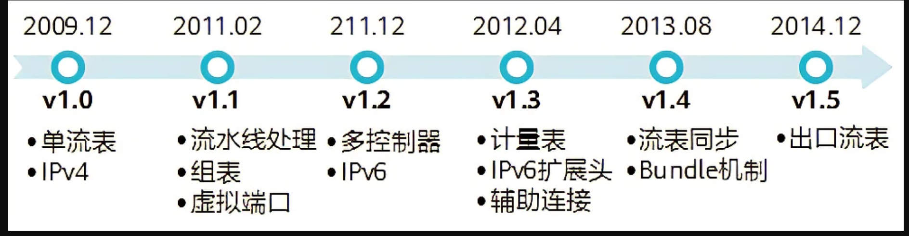
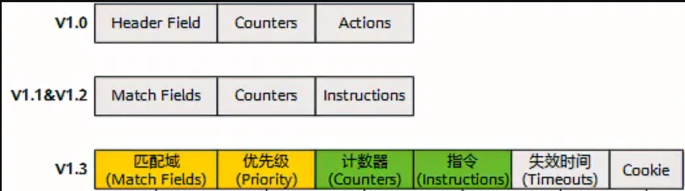
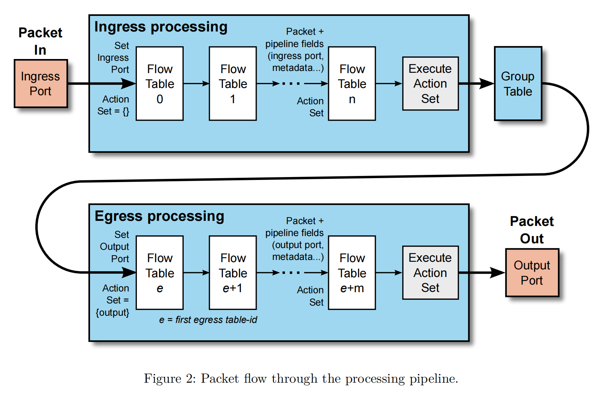

### OpenFlow 历史版本

OpenFlow v1.0协议规范中每个OpenFlow交换机中只有一张流表，用于数据包查找、处理、转发，并且只能同一台控制器进行通信，流表的维护也是通过控制器下发相应的OpenFlow消息来实现。流表由多个流表项组成，而每个流表项就是一个转发规则，流表项由匹配字段、计数器和动作组成，同时，OpenFlow v1.0只支持IPV4。

OpenFlow v1.1支持多级流表，形成流水线处理流表匹配架构，这一架构能避免单流表过度膨胀问题，也能更好地利用硬件内部固有的多级流表特性。OpenFlow v1.1版本和OpenFlow v1.0版本存在不兼容问题，而后续版本都是在v1.1版本基础上发展而来的。

OpenFlow v1.2版本的最大变化在于，下发的匹配字段不再采用固定长度的结构，而是采用TLV结构，称为OpenFlow 可扩展匹配(OpenFlow extensible match，OXM)，因此协议有更灵活的可扩展性，既能增加关键字匹配字段，也能节省流表空间，同时，该协议允许一套交换机与多台控制器连接以增强可靠性，通过控制器命令消息变换角色。更重要的是，从OpenFlow1.2开始支持IPV6协议。

OpenFlow v1.3版本成为长期支持的稳定版，支持的匹配关键字增加到40个，足以满足网络应用的需要，增加了计量表，以此控制关联流表的数据包传输效率，同时允许交换机和控制器根据自身需要协商所采用的OpenFlow版本。

OpenFlow v1.4版本是基于1.3版本的改进，主要是增加了流表同步机制，能让多个流表共享相同的匹配字段，而且可以定义不同的动作。此外，新增加了Bundle消息，确保控制器下发一组完整消息或同时向多个交换机下发消息的状态的一致性。

### 流表

OpenFlow交换机模型采用基于流的数据转发机制。在该机制中，每个数据分组都属于某个流。流是对同一网络中具有某种共同特征或数据分组所进行的抽象，指从一个网络端点向另一个网络端点传输的一组数据分组。例如，所有从端口1进入，并发往IP地址192.168.1.1/24的数据分组被认为是属于同一个流。流是单向的，两组端点相同、方向相反的分组属于不同的流。流在设备中以流表项的形式体现。

流表则是特定流转发策略表项的集合，是OpenFlow交换机中对数据转发逻辑的抽象，也是OpenFlow交换机的核心数据结构。简单来说，流表就是由一些具有优先级顺序的流表项构成的。流表与传统网络设备中的MAC地址表、路由表类似，但又有所不同，它可以包含更多层次与类型的网络特征信息，因为一个OpenFlow交换机可以集交换机、路由器、防火墙等功能于一身，以对上层应用于业务部署提供灵活的响应。因此，流表使得SDN网络设备变得更加通用，并且具有可编程性。

#### OpenFlow v1.0流表项

    

OpenFlow v1.0版本中，每个OpenFlow交换机仅有一张流表，每张流表存储着一系列的流表项，所有经过交换机的数据分组都要先匹配流表，如果找到匹配项，则根据流表项的动作实施相应的数据包处理；否则，通过安全通道转发给控制器。在OpenFlow v1.0版本中，刘表项由三部分组成，分别是包头域、计数器、动作表。

**包头域**：是用于交换机收到的数据包进行匹配的元组，包含12个字段，称为12元组，这些字段涵盖了OSI网络模型中第2-4层的网络特征。每一个元组中的数值可以是一个确定的值或者ANY，ANY表示支持匹配任意值。

| 字段          | 长度  | 说明       |
| ----------- | --- | -------- |
| in_port     | 未规定 |          |
| dl_src      | 48  | 以太网源地址   |
| dl_dst      | 48  | 以太网目的地址  |
| dl_type     | 16  | 以太网帧类型   |
| dl_vlan     | 12  | vlan标签   |
| dl_vlan_pcp | 3   | vlan优先级  |
| nw_src      | 32  | 源IP地址    |
| nw_dst      | 32  | 目的IP地址   |
| ip_protocol | 8   | IP分组类型   |
| nw_tos      | 6   | 服务类型     |
| tcp_src     | 16  | 传输层源端口号  |
| tcp_dst     | 16  | 传输层目的端口号 |

**计数器**：计数器主要对交换机中的每张流表、每个数据流、每个设备端口及每个转发队列进行维护，用于统计数据流量的相关信息。例如，针对每张流表，可统计当前活动的表项数、数据包查询次数、数据包匹配次数等；针对每个数据流，可统计接收的数据包数、字节数、数据流持续时间等；针对每个设备端口，除了统计接收的数据包数、发送数据包数、接收字节数，还可以对各种错误发生的次数进行统计；针对每个队列，可统计发送的数据包数和字节数，还有发送时的溢出错误次数等。

**动作表**：动作表用于指示交换机如何对接收到的匹配数据包进行处理。每个流表项关联了零到多个动作，如果流表项中没有关联转发动作，数据包默认将被丢弃；如果关联了转发动作，这些动作以清单的形式出现，交换机必须按照动作清单中出现的顺序来执行。

流表项的动作分为必备动作和可选动作两种类型，其中，必备动作是所有OpenFlow交换机默认支持的，而可选动作是交换机所能支持的可选动作种类（由交换机告知控制器）

| 动作类型 | 具体动作 | 动作说明                                        |
| ---- | ---- | ------------------------------------------- |
| 必备动作 | 转发   | 以下几类虚拟端口：LOCAL、ALL、CONTROLLER、IN_PORT、TABLE |
|      | 丢弃   | 丢弃                                          |
| 可选动作 | 转发   | 两类虚拟端口：NORMAL、FLOOD                         |
|      | 入队   | 转发数据包到端口绑定的队列，提供基本的Qos支持                    |
|      | 修改包头 | 修改数据包的包头                                    |

虚拟端口作用如下：

LOCAL：转发给本地的网络栈，LOCAL指明数据包应该被转发给交换机本地的OpenFlow软件进行处理

ALL：转发给所有的输出端口，但不包括输入端口。ALL用于将数据包从除输入端口之外的其他所有端口泛洪出去，为OpenFlow交换机提供了基本的广播功能。

CONTROLLER：封装数据包并转发给控制器，在需要将分组发送给控制器时，使用该端口进行转发。

IN_PORT：从输入端口发出

TABLE:该端口只适用于从控制器发到交换机的数据包，这些数据包通过控制器发送的Packet-OUT消息到达。

NORMAL：该端口如果接收到数据包，将按照传统交换机的转发逻辑进行处理。

FLOOD：该端口将数据包泛洪到生成树链路上，不包括输入端口

### 流表匹配

**包头解析**：包头解析是为了得到数据包的12元组。首先初始化包头，然后在根据以太网类型得到vlan或三层IP信息，再根据IP包头中的协议类型，确定是TCP还是UDP协议或者是ICMP协议，最后，得到TCP/UDP的源/目的端口号或者ICMP的类型和编码。

**多级流表匹配**：

OpenFlow v1.0的单流表模式简单、易实现，但在网络需求越来越复杂时，各种策略放在同一张表中就显得十分臃肿，而且影响查找与匹配效率。在多流表架构中，数据包在交换机中的匹配是以流水线的方式处理的。

#### 参考

https://classes.engineering.wustl.edu/~jain/tutorials/ftp/unsw14.pdf

https://opennetworking.org/wp-content/uploads/2014/10/openflow-switch-v1.5.1.pdf
