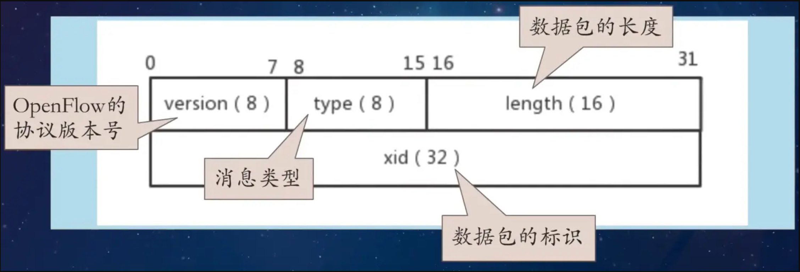
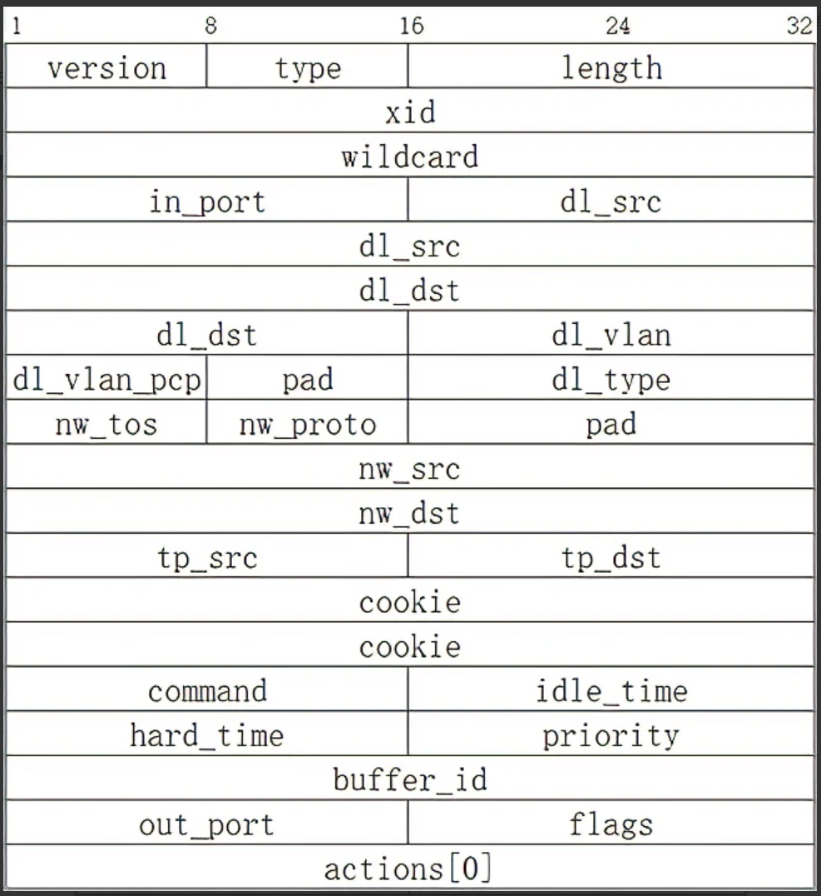
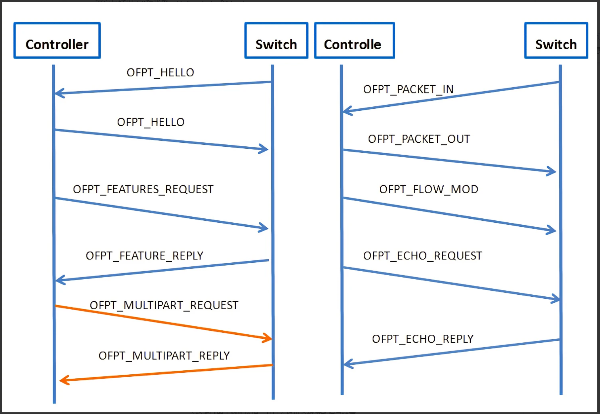

### 消息类型

OpenFlow协议支持三种消息类型，即controller-to-switch消息、asynchronous消息和symmetric消息。

每种消息类型都有多个子类型。controller-to-switch消息由控制器发起并用于直接管理或检查交换机的状态；Asynchronous消息由交换机发起，用于传递网络事件和交换机状态的变化更新。symmetric消息由交换机或控制器发起，而无须对方的许可或请求。

#### Controller-to-Switch

**Features**:控制器可以通过发送feature请求来获取交换机的特性或属性信息；交换机必须以指定交换机特性的feature reply进行响应。这通常会在建立OpenFlow channel时执行

**Configuration**:控制器能够在交换机中设置和查询交换机的配置参数。若是设置信息，交换机只需要执行信息；若是查询配置信息请求，交换机需给予应答。

**Modify-State**:modify-state息由控制器发送来管理交换机上的状态。它们的主要目的是添加、删除和修改Openflow表中的flow/group条目，并设置交换机端口属性。

**Read-State**:控制器使用read-state消息从交换机收集各种信息，如当前配置、统计信息和功能

**Packet-out**:控制器将数据包从交换机上的指定端口发送，并转发通过packet-in消息接收到的数据包。packet-out消息必须包含一个完整的数据包或一个引用存储在交换机中的数据包的buffer-id。packet-out消息还必须携带用于指导数据处理的动作集，若动作集为空，则丢弃数据包。

**Barrier**:用于保证消息执行的顺序。barrier消息会在所有的前置消息完成后才处理。

**Role-Request**:role-request消息被控制器用于设置其OpenFlow channel的role，或查询该role。当交换机连接到多个控制器时非常有用。

**Asynchronous-Configuration**:异步配置消息用于在其OpenFlow channel上接收的异步消息上设置额外的过滤器，或查询该过滤器。当交换机连接到多个控制器（见6.3.4），并且通常在建立openflow channel时执行时，这一点非常有用 。

#### Asynchronous

**Packet-in**:将数据包的控制传递给控制器。对于使用流条目转发到Controller或table-miss的所有包，packet-in事件总是发送到控制器。其他处理，如TTL检查，也可以使用packet-in事件将包发送到控制器。

packet-in事件可以配置为缓冲数据包。对于由flow entry或组桶中的output操作生成的packet-in，可以在ouput操作中单独指定（请参见A.2.5)，对于其他数据包，它可以配置在交换机配置中(参见A.3.2)。如果packet-in事件配置为缓冲包并且交换机有足够的内存来缓冲它们，则packet-in事件只包含包头的一部分和控制器在准备转发包时使用的bufferid。对于不支持内部缓冲的交换机 或者配置为不为packet-in事件缓存数据包，或者内部缓冲耗尽的交换机，则交换机必须将完整的包作为事件的一部分发送给控制器。缓冲的数据包通常通过控制器的packet-out消息进行处理，或者在一段时间后自动过期。

如果缓存数据包，可以配置包中的原始包的字节数。默认情况下，它是128字节。对于由流项或组桶中的output操作生成的packet-in，可以在输出操作中单独指定（请参见A.2.5)，对于其他数据包，它可以配置在交换机配置(参见A.3.2).

**Flow-Removed**:用于通知控制器流表被移除的信息。flow-removed消息只发送给设置了OFPFF_SEND_FLOW_REM标志的流条目。当其中一个流超时时，它们是作为控制器流删除请求或交换机流条目超时流程而产生的结果（见5.5）。

**Port-status**:用于通知控制器一个端口上状态变化的信息。该交换机应在端口配置或端口状态更改时，向控制器发送port-status消息。这些事件包括端口配置事件中的更改，例如如果它是由用户直接关闭的，以及端口状态更改事件，例如如果连接关闭了。

**Error**:用于交换机向控制器主动发送运行错误的信息。

#### Symmetric

**Hello**:在连接启动时，交换机和控制器之间交换Hello消息。

**Echo**:用于测量其延迟或带宽，或用于保持活动连接。双方均可主动发送Echo-Request消息给对方，接收者需要回复Echo-Reply消息。

**Experimenter**:experimenter消息为OpenFlow交换机提供了一种标准的方式，可以在OpenFlow消息类型空间中提供额外的功能。这是一个用于自定义消息扩展的功能。

### 消息格式

OpenFlow协议数据包由OpenFlow消息头和OpenFlow消息体组成。消息头的格式如下：

```go
/* Header on all OpenFlow packets. */
struct ofp_header {
uint8_t version; /* 协议版本号. */
uint8_t type; /* 消息类型 */
uint16_t length; /* 数据包的长度，包括消息头 */
uint32_t xid; /* 数据包的 Transaction id */
};
OFP_ASSERT(sizeof(struct ofp_header) == 8)
```



**Hello消息**

```go
struct ofp_hello {
struct ofp_header header;
/* Hello element list */
struct ofp_hello_elem_header elements[0]; /* List of elements - 0 or more */
};
OFP_ASSERT(sizeof(struct ofp_hello) == 8);
```

Hello消息是OFPT_HELLO类型的消息，version表示发送方所支持的OpenFlow协议的最高版本号，双方选取Hello消息中最低版本的协议作为通信协议。

**Features消息**

```go
/* Switch features. */
struct ofp_switch_features {
struct ofp_header header;
uint64_t datapath_id; /* Datapath unique ID. The lower 48-bits are for
a MAC address, while the upper 16-bits are
implementer-defined. 交换机id标识 */
uint32_t n_buffers; /* Max packets buffered at once.  交换机可以同时缓存的最大数据包个数*/
uint8_t n_tables; /* Number of tables supported by datapath.交换机的流表数量 */
uint8_t auxiliary_id; /* Identify auxiliary connections */
uint8_t pad[2]; /* Align to 64-bits. */
/* Features. */
uint32_t capabilities; /* Bitmap of support "ofp_capabilities". 交换机支持的特殊功能 */
uint32_t reserved;
};
OFP_ASSERT(sizeof(struct ofp_switch_features) == 32);


/* Capabilities supported by the datapath. 交换机支持的其他能力 */
enum ofp_capabilities {
OFPC_FLOW_STATS = 1 << 0, /* Flow statistics. 流统计 */
OFPC_TABLE_STATS = 1 << 1, /* Table statistics. 表统计  */
OFPC_PORT_STATS = 1 << 2, /* Port statistics. 端口统计 */
OFPC_GROUP_STATS = 1 << 3, /* Group statistics. 组表统计 */
OFPC_IP_REASM = 1 << 5, /* Can reassemble IP fragments. */
OFPC_QUEUE_STATS = 1 << 6, /* Queue statistics. 队列统计 */
OFPC_PORT_BLOCKED = 1 << 8, /* Switch will block looping ports. */
OFPC_BUNDLES = 1 << 9, /* Switch supports bundles. 是否支持bundle */
OFPC_FLOW_MONITORING = 1 << 10, /* Switch supports flow monitoring. 是否支持流监控*/
};
```

features消息用来请求获取交换机的特性信息，包括交换机的datapath_id，缓冲区数量、端口及端口属性等。feature消息的OpenFlow消息头是OFPT_FEATURES_REQUEST和OFPT_FEATURES_REPLY类型。

**Configuration消息**

```go
/* Switch configuration. */
struct ofp_switch_config {
struct ofp_header header;
uint16_t flags; /* Bitmap of OFPC_* flags. 指示交换机收到IP分片数据包的处理 */
uint16_t miss_send_len; /* Max bytes of packet that datapath
should send to the controller. See
ofp_controller_max_len for valid v
alues. 指的是交换机无法处理的数据包到达时，将数据包发送给控制器的最大字节数
*/
};
OFP_ASSERT(sizeof(struct ofp_switch_config) == 12);


enum ofp_config_flags {
/* Handling of IP fragments. */
OFPC_FRAG_NORMAL = 0, /* No special handling for fragments. */
OFPC_FRAG_DROP = 1 << 0, /* Drop fragments. 丢弃IP分片包 */
OFPC_FRAG_REASM = 1 << 1, /* Reassemble (only if OFPC_IP_REASM set). */
OFPC_FRAG_MASK = 3,
};
```

该消息有set-config，get-config-request，get-config-reply三种格式，分别通过在OpenFlow消息头字段Type中指定相应的消息类型来表示，分别为OFPT_SET_CONFIG、OFPT_GET_CONFIG_REQUEST和OFPT_GET_CONFIG_REPLY来表示。

**Packet-in消息**

type为OFPT_PACKET_IN

```go
/* Packet received on port (datapath -> controller). */
struct ofp_packet_in {
struct ofp_header header;
uint32_t buffer_id; /* ID assigned by datapath. 数据包缓冲id */
uint16_t total_len; /* Full length of frame. 数据部分的长度 */
uint8_t reason; /* Reason packet is being sent (one of OFPR_*) 触发packet-in事件的原因 */
uint8_t table_id; /* ID of the table that was looked up 表id */
uint64_t cookie; /* Cookie of the flow entry that was looked up. cookieid */
struct ofp_match match; /* Packet metadata. Variable size.  match条件 */
/* The variable size and padded match is always followed by:
* - Exactly 2 all-zero padding bytes, then
* - An Ethernet frame whose length is inferred from header.length.
* The padding bytes preceding the Ethernet frame ensure that the IP
* header (if any) following the Ethernet header is 32-bit aligned.
*/
//uint8_t pad[2]; /* Align to 64 bit + 16 bit */
//uint8_t data[0]; /* Ethernet frame */
};
OFP_ASSERT(sizeof(struct ofp_packet_in) == 32);


/* Why is this packet being sent to the controller? */
enum ofp_packet_in_reason {
OFPR_TABLE_MISS = 0, /* No matching flow (table-miss flow entry). */
OFPR_APPLY_ACTION = 1, /* Output to controller in apply-actions. */
OFPR_INVALID_TTL = 2, /* Packet has invalid TTL */
OFPR_ACTION_SET = 3, /* Output to controller in action set. */
OFPR_GROUP = 4, /* Output to controller in group bucket. */
OFPR_PACKET_OUT = 5, /* Output to controller in packet-out. */
};
```

**modify-state消息**

modify-state消息可以配置流表，配置流表条目，配置组表，配置meter表，当配置流条目时，消息的type为OFPT_FLOW_MOD

```go
/* Flow setup and teardown (controller -> datapath). */
struct ofp_flow_mod {
struct ofp_header header;
uint64_t cookie; /* Opaque controller-issued identifier. */
uint64_t cookie_mask; /* Mask used to restrict the cookie bits
that must match when the command is
OFPFC_MODIFY* or OFPFC_DELETE*. A value
of 0 indicates no restriction. */
uint8_t table_id; /* ID of the table to put the flow in.
For OFPFC_DELETE_* commands, OFPTT_ALL
can also be used to delete matching
flows from all tables. */
uint8_t command; /* One of OFPFC_*. */
uint16_t idle_timeout; /* Idle time before discarding (seconds). */
uint16_t hard_timeout; /* Max time before discarding (seconds). */
uint16_t priority; /* Priority level of flow entry. */
uint32_t buffer_id; /* Buffered packet to apply to, or
OFP_NO_BUFFER.
Not meaningful for OFPFC_DELETE*. */
uint32_t out_port; /* For OFPFC_DELETE* commands, require
matching entries to include this as an
output port. A value of OFPP_ANY
indicates no restriction. */
uint32_t out_group; /* For OFPFC_DELETE* commands, require
matching entries to include this as an
output group. A value of OFPG_ANY
indicates no restriction. */
uint16_t flags; /* Bitmap of OFPFF_* flags. */
uint16_t importance; /* Eviction precedence (optional). */
struct ofp_match match; /* Fields to match. Variable size. */
/* The variable size and padded match is always followed by instructions. */
//struct ofp_instruction_header instructions[0];
/* Instruction set - 0 or more. The length
of the instruction set is inferred from
the length field in the header. */
};
OFP_ASSERT(sizeof(struct ofp_flow_mod) == 56);
```



**packet-out消息**

type为OFPT_PACKET_OUT类型

```go
/* Send packet (controller -> datapath). */
struct ofp_packet_out {
struct ofp_header header;
uint32_t buffer_id; /* ID assigned by datapath (OFP_NO_BUFFER
if none). 交换机缓冲区 */
uint16_t actions_len; /* Size of action array in bytes.  action列表的长度 */
uint8_t pad[2]; /* Align to 64 bits. */
struct ofp_match match; /* Packet pipeline fields. Variable size. */
/* The variable size and padded match is followed by the list of actions. */
/* struct ofp_action_header actions[0]; *//* Action list - 0 or more. */
/* The variable size action list is optionally followed by packet data.
* This data is only present and meaningful if buffer_id == -1. */
/* uint8_t data[0]; */ /* Packet data. The length is inferred
from the length field in the header. */
};
OFP_ASSERT(sizeof(struct ofp_packet_out) == 24);
```

### 通信流程



连接建立后，双方必须首先发送Hello消息给对方，该消息携带本方支持的最高协议版本号，接收方将采用双方都支持的最低协议版本进行通信，一旦发现双方有共同支持的协议版本，则连接建立，否则发送Error消息，说明失败原因，并终止连接。

控制器向交换机发送feature-request消息，请求交换机上传自己的详细参数，openflow交换机收到请求后，向控制器发送features-reply消息，详细汇报自身参数，包括支持的buffer数目，流表数以及actions等。

控制器通过setconfig消息下发配置参数，由于交换机的配置管理也可以通过OF-config协议来实现，因此这里的set-config是可选操作。配置后，控制器可通过get-config-request消息请求获取openflow交换机修改后的配置信息。openflow交换机通过get-config-reply消息向控制器发送当前的配置信息。

交换机配置完成后，进入正常的通信状态。如果openflow版本支持多级流表，控制器还需要下发table-miss流表项到交换机，当数据包匹配流表出现失败或匹配到table-miss时，交换机将发送packet-in消息到控制器，控制器可通过回复packet-out或flow-mod消息知道交换机对相关数据流的处理。

#### 参考

https://opennetworking.org/wp-content/uploads/2014/10/openflow-switch-v1.5.1.pdf
