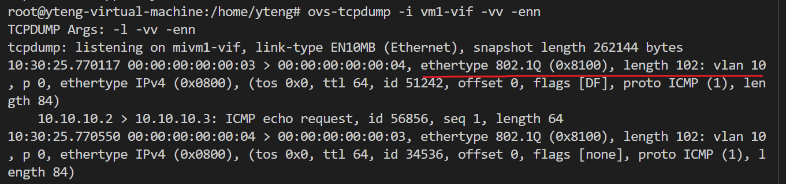

## vlan 模式

access、trunk、native-tagged、native-untagged

### 收发包行为

vlanid为0和没有vlan tag一样的处理。
native-tagged端口和native-untagged端口的native vlan即为port的tag值

  
- OVS vlan属性收发包
  - access
    - 收
      - 没有vlan tag，接收，并打上端口vlan(tag=0不生效)
      - 有vlan tag且vlanid非0，丢弃
    - 发
      - 发出去的报文不带vlan
  - trunk
    - 收
      - trunk为空收：
        - 报文带vlan，允许进入
        - 报文不带vlan，允许进入
      - trunk不为空收
        - 报文带vlan tag，vlan id是否在允许之列，收
        - 报文不带vlan tag，丢弃
    - 发
      - 带着原始vlan发出
  - native-tagged
    - 收
      - 报文带vlan tag，vlan id是否在允许之列，收
      - 报文不带vlan tag，接收，并打上端口的native vlan
    - 发
      - 带着原始vlan发出
  - native-untagged
    - 收
      - 报文带vlan tag，vlan id是否在允许之列，收
      - 报文不带vlan tag，接收，并打上端口的native vlan
    - 发
      - vid == native vlan，不带vlan，发出
      - vid != native vlan，带原始vlan发出



当端口vlan_mode为native-tagged或native-untagged时，native vlan也在其对应的广播域中

## 实验过程

### 创建两个vm

```
ip netns add vm1
ip link add vm1-vif type veth peer name vm1
ip link set vm1 netns vm1
ip netns exec vm1 ip link set vm1 address 00:00:00:00:00:03
ip netns exec vm1 ip addr add 10.10.10.2/24 dev vm1
ip netns exec vm1 ip link set vm1 up
ip link set vm1-vif up

ip netns add vm2
ip link add vm2-vif type veth peer name vm2
ip link set vm2 netns vm2
ip netns exec vm2 ip link set vm2 address 00:00:00:00:00:04
ip netns exec vm2 ip addr add 10.10.10.3/24 dev vm2
ip netns exec vm2 ip link set vm2 up
ip link set vm2-vif up
```

### 连接vm网卡和网桥

```
ovs-vsctl add-br -br-int
ovs-vsctl add-port br-int vm1-vif
ovs-vsctl add-port br-int vm2-vif
```

效果如图


### 测试

#### 抓包工具

tcpdump和ovs-tcpdump工具可以抓到一路上OVS对vlan的处理。

如果使用ovs-tcpdump，ovs-tcpdump在守护程序中创建交换机镜像端口，并执行以侦听这些端口。当实例退出时，它会清理它创建的镜像端口。

如果用系统tcpdump抓包，抓的是经过vm网卡veth pair的流量。

抓包点如下

```
vm1-eth0-(tcpdump)vm1-vif(ovs-tcpdump)-OVS Bridge-vm2-vif-vm2-eth0
```

### access模式
收包：收包不带vlan/vlan为0，则打上tag，带vlan，则丢弃
发包：只会发vlan为端口vlan的包，发包不带vlan

#### tag=0

tag=0时不生效，抓到的包并没有打上vlanid为0的tag(处理收包时也类似，vlan_id为0则表示当作没有vlan处理)

```
ovs-vsctl set Port vm1-vif vlan_mode=access
ovs-vsctl set Port vm2-vif vlan_mode=access
ovs-vsctl set Port vm1-vif tag=0
ovs-vsctl set Port vm2-vif tag=0
```


**收包 不带vlan**
- vm1发出不带vlan的包，vm1-vif port access tag=0处理后还是不带vlan


**收包 带vlan 0**
- vm1发出带vlan0的包, vm1-vif处理后不带vlan


**收包 带vlan 11**
- vm1 发出带vlan 11的包，vm1-vif port access tag=0处理后丢弃


**发包 不带vlan**
- vm2-vif通过不带vlan的包，以不带vlan转发


**发包 带vlan 0**
带vlan 0的数据包无法进入


**发包 带vlan 11**
- 设置vm1-vif access模式tag为11，，vm2-vif access模式保持tag=0
- 带vlan 11的数据包不会被转发到vm2-vif口


#### tag!=0

```
ovs-vsctl set Port vm1-vif vlan_mode=access
ovs-vsctl set Port vm2-vif vlan_mode=access
ovs-vsctl set Port vm1-vif tag=10
ovs-vsctl set Port vm2-vif tag=10
```


**收包 不带vlan**
- vm1发出不带vlan的包，vm1-vif port access tag=10处理后，带上vlan 10



**收包 带vlan 0**
设置linux 子接口
```
ip netns exec vm1 vconfig add vm1 0
ip netns exec vm1 ifconfig vm1 0.0.0.0
ip netns exec vm1 ifconfig vm1.0 10.10.10.2
```
- vm1 发出vlan 0的数据包，vm1-vif port access 处理后，带上vlan 10


**收包带vlan 10**
设置linux 子接口
```
ip netns exec vm1 vconfig add vm1 10
ip netns exec vm1 ifconfig vm1 0.0.0.0
ip netns exec vm1 ifconfig vm1.10 10.10.10.2
```
- vm1发出带vlan 10的包，vm1-vif port access 处理后，被丢弃


**收包 带vlan11**
```
ip netns exec vm1 vconfig add vm1 11
ip netns exec vm1 ifconfig vm1 0.0.0.0
ip netns exec vm1 ifconfig vm1.11 10.10.10.2
```
- vm1发出带vlan 11的数据包，vm1-vif port处理后，被丢弃


**发包 不带vlan**
- vm1-vif设置trunk模式且trunks为空，vm2-vif设置access模式tag=10，vm1-vif接收不带vlan的包后没有被转发到vm2-vif


**发包 带vlan 0**
带vlan 0的数据包无法进入


**发包 带vlan 10**
- vm1-vif设置access模式tag=10，vm2-vif设置access模式tag=10
- vm1-vif port将vlan 10的数据包转发到vm2-vif，vm2-vif处理后以不带vlan转发


**发包 带vlan 11**
- vm1-vif设置access模式tag=11， vm2-vif设置access模式tag=10
- vm1-vif port收到vlan 11的数据包后没有转发到vm2-vif


### trunk模式
trunks为空
收包：收包不带vlan或者带vlan或者vlanid为0(进入后不带vlan)，允许进入
发包：带着原始vlan转发
trunks不为空
收包：带vlan且在vlan_range中，才允许进入
发包：在vlan_range中，会带着原始vlan转发

##### trunks为空
在不配置vlan时，ovs port默认是trunk all的，可以抓包看到对应的数据包没有带vlan，也都被允许通过了。

```
ovs-vsctl set Port vm1-vif vlan_mode=trunk
ovs-vsctl set Port vm2-vif vlan_mode=trunk
ovs-vsctl set Port vm1-vif trunks=[]
ovs-vsctl set Port vm2-vif trunks=[]
```


**收到不带vlan的包**
- vm1发出不带vlan的数据包，vm1-vif处理后继续不带vlan


**收到带vlan 0的包**
- vm1 发出带vlan 0的包，vm1-vif处理后不带vlan，且允许通过。


**收到带vlan 10的包**
- vm1发出带vlan 10的包，vm1-vif 处理后带着原vlan转发，


**发包 不带vlan**
- vm1-vif转发不带vlan的包到vm2-vif
- vm2-vif继续以不带vlan转发vm2


**发包 带vlan 0**
带vlan 0的数据包无法进入


**发包 带vlan 10**
- 设置vm1-vif 为access模式tag=10
- vm1-vif收到vlan 10的数据包转发到vm2-vif， vm2-vif以原vlan转发到vm2


##### trunks不为空
在配置vlan后，ovs port只能收在trunk范围的包
```
ovs-vsctl set Port vm1-vif vlan_mode=trunk
ovs-vsctl set Port vm1-vif vlan_mode=trunk
ovs-vsctl set Port vm1-vif trunks=[10]
ovs-vsctl set Port vm2-vif trunks=[10]
```


**收到不带vlan的包**
- vm1 发出不带vlan的包，vm1-vif处理后，被丢弃


**收到带vlan 0的包**
- vm1 发出带vlan 0的包，vm1-vif处理后不在允许范围内被丢弃


**收到带vlan 10的包**
- vm1 发出带vlan10的包，vm1-vif处理后允许通过，vm2-vif允许通过，vm2收到带vlan10的包后丢弃


**收到带vlan 11的包**
- vm1 发出带vlan 0的包，vm1-vif处理后不在允许范围内被丢弃


**发包 不带vlan**
- 设置vm1-vif trunk模式，trunks=[]
- vm1-vif处理不带vlan的数据包不会转发到vm2-vif


**发包 带vlan 0**
带vlan 0的数据包无法进入


**发包 带vlan 10**
- 设置vm1-vif access模式，tag=10
- vm1-vif处理vlan 10的数据包转发到vm2-vif，vm2-vif以vlan 10转发


**发包 带vlan 11**
- 设置vm1-vif access模式，tag=10
- vm1-vif处理vlan 11的数据包不会转发到vm2-vif


### native-tagged模式
native-vlan设置即tag列
收包：报文不带vlan，则打上native vlan进入，报文带vlan且在允许之列，则进入
发包：带着原始vlan发出


#### native vlan和trunks重合
```
ovs-vsctl set Port vm1-vif vlan_mode=native-tagged
ovs-vsctl set Port vm2-vif vlan_mode=native-tagged
ovs-vsctl set Port vm1-vif trunks=[10]
ovs-vsctl set Port vm1-vif tag=10
ovs-vsctl set Port vm2-vif trunks=[10]
ovs-vsctl set Port vm2-vif tag=10
```


**收包 不带vlan**
- vm1发出不带vlan的数据包，vm1-vif处理后带上native vlan 10


**收包 带vlan 0**
- vm1发出带vlan 0的数据包，vm1-vif处理后带上native vlan 10


**收包 带vlan 10**
- vm1发出带vlan 10的数据包，vm1-vif允许带着原始vlan进入


**收包 带vlan 11**
- vm1 发出带vlan 11的数据包，不在允许之列，vm1-vif丢弃


**发包 不带vlan**
- vm1-vif设置trunk模式，trunks=[]
- vm1-vif收到不带vlan的数据包后没有向vm2-vif转发


**发包 带vlan 0**
带vlan 0的数据包无法进入


**发包 带vlan 10**
- 设置vm1-vif access模式，tag=10
- vm1-vif收到vlan 10的数据包转发到vm2-vif，vm2-vif处理后以原始vlan转发


**发包 带vlan 11**
- 设置vm1-vif access模式，tag=11
- vm1-vif收到vlan 11的数据包没有转发到vm2-vif


#### native vlan和trunks不重合
```
ovs-vsctl set Port vm1-vif vlan_mode=native-tagged
ovs-vsctl set Port vm2-vif vlan_mode=native-tagged
ovs-vsctl set Port vm1-vif trunks=[10]
ovs-vsctl set Port vm1-vif tag=11
ovs-vsctl set Port vm2-vif trunks=[10]
ovs-vsctl set Port vm2-vif tag=11
```


**收包 不带vlan**
- vm1发出不带vlan的数据包，vm1-vif处理后带vlan 11


**收包 带vlan 0**
- vm1发出带vlan 0的数据包，vm1-vif处理后带vlan 11


**收包 带vlan 10**
- vm1 发出带vlan 10的数据包，vm1-vif处理后带着原始vlan进入


**收包 带vlan 11**
- vm1 发出带vlan 11的数据包，vm1-vif处理后带着原始vlan进入


**发包 带vlan 12**
- vm1 发出带vlan 12的数据包，vm1-vif处理不在允许之列丢弃


**发包 不带vlan**
- vm1设置trunk模式，trunks=[]
- vm1收到不带vlan的数据包，没有向vm2-vif转发


**发包 带vlan 0**
带vlan 0的数据包无法进入

**发包 带vlan 10**
- vm1设置access模式，tag=10
- vm1-vif 收到带vlan 10的数据包，转发到vm2-vif，vm2-vif以原始vlan转发


**发包 带vlan 11**
- vm1设置access模式，tag=11
- vm1-vif收到带vlan 11的数据包，转发到vm2-vif，vm2-vif以原始vlan转发


**发包 带vlan 12**
- vm1设置access模式，tag=12
- vm1-vif收到带vlan 12的数据包，没有转发到vm2-vif


### native-untagged模式
native vlan即tag列
收包：收包不带vlan，则打上native vlan进入，收包带vlan且在允许之列，则进入
发包：发包和native vlan相同，则去掉vlan转发，否则带着原始vlan转发

#### native vlan和trunks重合
```
ovs-vsctl set Port vm1-vif vlan_mode=native-untagged
ovs-vsctl set Port vm2-vif vlan_mode=native-untagged
ovs-vsctl set Port vm1-vif trunks=[10]
ovs-vsctl set Port vm1-vif tag=10
ovs-vsctl set Port vm2-vif trunks=[10]
ovs-vsctl set Port vm2-vif tag=10
```


**收包 不带vlan**
- vm1发出不带vlan的数据包，vm1-vif处理后带vlan 10


**收包 带vlan 0**
- vm1发出带vlan 0的数据包，vm1-vif处理后带vlan 10


**收包 带vlan 10**
- vm1 发出带vlan 10的数据包，vm1-vif处理后带原始vlan 进入


**收包 带vlan 11**
- vm1 发出带vlan 11的数据包，vm1-vif处理后不在允许之列，丢弃


**发包 不带vlan**
- 设置vm1-vif trunk模式，trunks=[]
- vm1-vif收到不带vlan的数据包后不会转发到vm2-vif


**发包 带vlan 0**
带vlan 0的数据包无法进入

**发包 带vlan 10**
- 设置vm1-vif access模式，tag=10
- vm1-vif收到带vlan 10的数据包转发到vm2-vif,vm2-vif处理后去掉vlan转发到vm2


**发包 带vlan 11**
- 设置vm1-vif access模式，tag=11
- vm1-vif收到带vlan 11的数据包不会转发到vm2-vif


#### native vlan和trunks不重合
```
ovs-vsctl set Port vm1-vif vlan_mode=native-untagged
ovs-vsctl set Port vm2-vif vlan_mode=native-untagged
ovs-vsctl set Port vm1-vif trunks=[10]
ovs-vsctl set Port vm1-vif tag=11
ovs-vsctl set Port vm2-vif trunks=[10]
ovs-vsctl set Port vm2-vif tag=11
```


**收包 不带vlan**
- vm1发出不带vlan的数据包，vm1-vif处理后打上vlan 11


**收包 带vlan 0**
- vm1发出带vlan 0的数据包，vm1-vif处理后打上vlan 11


**收包 带vlan 10**
- vm1发出带vlan 10的数据包，vm1-vif处理后带着原始vlan 进入


**收包 带vlan 11**
- vm1发出带vlan 11的数据包，vm1-vif处理后带着原始vlan 进入


**发包 带vlan 12**
- vm1发出带vlan 11的数据包，vm1-vif处理后不在允许范围内丢弃


**发包 不带vlan**
- vm1-vif设置trunk模式 trunks=0
- vm1-vif收到不带vlan的数据包，不会向vm2-vif转发


**发包 带vlan 0**
带vlan 0的数据包无法进入

**发包 带vlan 10**
- vm1-vif设置access模式 tag=10
- vm1-vif收到带vlan 10的数据包转发到vm2-vif，vm2-vif处理后带着原始vlan转发到vm2


**发包 带vlan 11**
- vm1-vif设置access模式 tag=11
- vm1-vif收到带vlan 11的数据包转发到vm2-vif，vm2-vif处理后去掉vlan转发到vm2


**发包 带vlan 12**
- vm1-vif设置access模式 tag=12
- vm1-vif收到带vlan 12的数据包不会转发到vm2-vif


**参考：**
思维导插件`npm install hexo-simple-mindmap`
ovs-tcpdump `https://docs.openvswitch.org/en/latest/ref/ovs-tcpdump.8/`