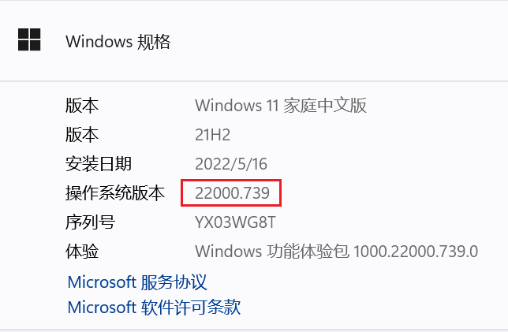
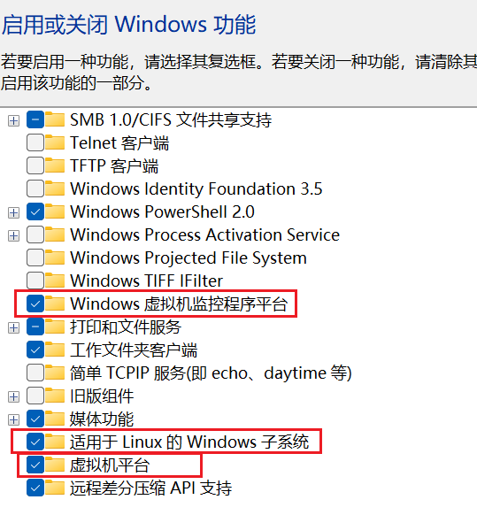
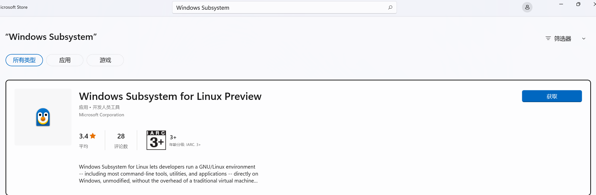
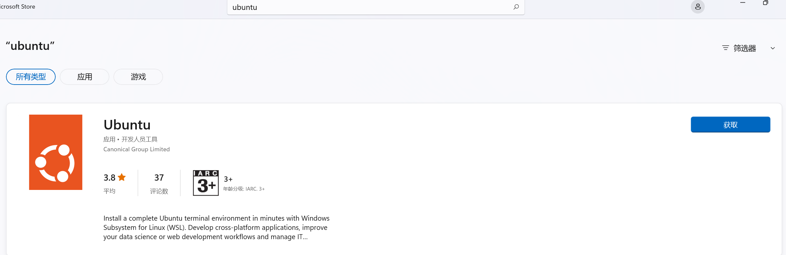
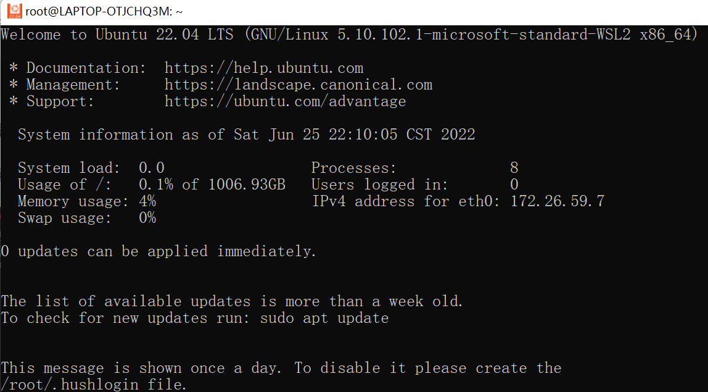

参考链接：https://ubuntu.com/tutorials/install-ubuntu-on-wsl2-on-windows-11-with-gui-support#1-overview

# 确认环境

- 确认操作系统版本
windows搜索 关于你的电脑 -> 操作系统版本
操作系统版本需要大于22000

- 确认开启虚拟化功能
windows搜索 windows功能 - 虚拟机平台
适用于linux的windows子系统和windows虚拟机监控程序平台也最好勾选，需要**重启生效**。

# 安装wsl和ubuntu

- 在windows应用商店搜索`Windows Subsystem`，获取并且安装
也可以使用其他方式下载wsl并安装。

- 使用wsl2
执行`wsl --set-default-version 2`

- 在windows应用商店搜索`ubuntu`，安装linux发行版
也可以自己选择其他发行版安装。

- 最终可以使用

# 常用命令

列出已安装wsl信息
`wsl -l -v`

启动wsl
`wsl -d <自定义的系统名>`

设置wsl版本为2
`wsl --set-version <自定义的系统名> 2`

关闭系统
`wsl --shutdown -n <自定义的系统名>`

# 常见问题

- linux发行版启动时遇到报错`占位程序接收到错误数据`
通过执行`netsh winsock reset`解决
